# Regularization for Wasserstein DRO

参考Jie Wang, Rui Gao, 对Wasserstein Distance进行Regularization：Sinkhorn Distance

**将Robust Learning推广到Robust PTO 加上优化问题**；

- **Variation Regularization**: Wasserstein Distributionally Robust Optimization and Variation Regularization *控制相对变化尺度*
  $$
  \min_{f\in\mathcal{F}}\mathbb{E}_{z\sim\mathbb{P}_n}[f(z)]+\rho |\mathcal{V}_{\mathbb{P}_{global}}(f)-\mathcal{V}_{\mathbb{P}_{n}}(f)|
  $$

- **KL-divergence Regularization**:  [Regularization for Adversarial Robust Learning](https://arxiv.org/abs/2408.09672)

- **Phi-divergence Regularization**: [Sinkhorn Distributionally Robust Optimization](https://arxiv.org/abs/2109.11926) 
- **f-divergence** 和上文一样：Nested Stochastic Algorithm for Generalized Sinkhorn distance-Regularized Distributionally Robust Optimization

与Variation Regularization类似的还有Variance-based regularization, 其统一形式是ERM+Regularization。应该探究**是否有DRO+Regularization**; 那就是双重DRO，Conditional Stochastic Optimization.

## Variation Regularization

**核心思想：ERM+Regularization = Wassertein DRO (以Empirical Distribution)为中心**

Wasserstein DRO的形式：其中 $\mathbb{P}_n$ 是empirical distribution

WDRO能提高Robustness，与Effect of Regularization有关。之前的论文假设太严格，本文不需要loss function的convex或smooth。

WDRO实际上和 *variation regularization* problem 密切相关，**两个问题在$p$-th Wasserstein距离上渐进等价**（$p\in(1,\infty]$）： 

这里$\mathcal{V}(f)$是variation loss，控制**分布不同时，expected loss的变化幅度**; 当$\mathcal{V}(f)$被控制时，即使expected loss出现偏移，也不会对结果造成太大影响。可以说

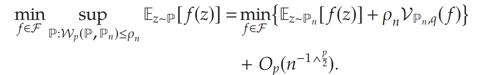

---

**Wasserstein Regularizer** $\mathcal{R}$: 

**WDRO的loss和Nominal loss的差值**，即Price of Robustness
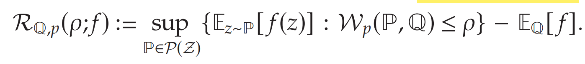

- 当选择Empirical distribution作为Reference，即$\mathbb{Q}=\mathbb{P}_n$，对应的Wasserstein Regularizer $\mathcal{R}_{\mathbb{P}_n,p}(\rho;f)$ 依赖于数据 $\mathbb{P}_n$，是$f$的函数。

- 在growth condition条件下，可以证明WDRO**收敛**到true stochastic program的目标函数值。

- 反过来说

$$
\mathbb{E}_\mathbb{Q}[f] + \mathcal{R}_{\mathbb{Q},p}(\rho;f):= \min_{f\in\mathcal{F}}\sup_{
\begin{array}
{c}\mathbb{P}:\mathcal{W}_p(\mathbb{P},\mathbb{P}_n)\leq\rho
\end{array}}\mathbb{E}_{z\sim\mathbb{P}}[f(z)],
$$

​	**也就是说限制$\mathcal{R}_{\mathbb{Q},p}(\rho;f)$**的大小，即可限制WDRO的loss; 
$$
\mathcal{R}_{\mathbb{Q},p}(\rho;f) \leq \mathcal{V}_{\mathbb{Q},q}(f)
$$

### **Variation of a function**

**Slope**

基于Slope的概念，**衡量函数$f$的变化大小**，某个连续函数的local/global slope定义为:

这两个概念是函数没有导数时的推广，当$f$可微时，**slope是导数取正**；
$$
|\partial f|(z)=|f^{\prime}(z)|
$$

- **local slope** $|\partial f|(z)$ 控制在$z$附近函数$f$正增长率，衡量的是当在点 $z$ 附近作**局部扰动**时，损失函数变化的大小；

- 而 **global slope** $\mathfrak{l}_f(z)$ 控制整个$f$上的增长率，衡量的是当把 $z$ 扰动到集合 $Z$ 中**任意一点**时，损失函数变化的**最大幅度**。

  若$\mathfrak{l}_f(z) \leq L$，则为 $L$-Lipschitz，给出**变化率上界**:
  $$
  |\partial f|(z)\leq \mathfrak{l}_f(z)\leq\|f\|_\mathrm{Lip}
  $$

---

**Variation of function $f$  with respect to a distribution $\mathbb{Q}$**:

这里Notation $\| |\partial f| \|_{\mathbb{Q},p}$ 指的是
$$
\|h\|_{\mathbb{Q},p}:=\left(\int_{\mathcal{Z}}h^pd\mathbb{Q}\right)^{1/p}
$$
代表可测函数$h$在$\mathbb{Q}$上的$\mathcal{L}^p(\mathbb{Q})\mathrm{-}$ norm，是对概率分布$\mathbb{Q}$的积分；

- 因此$\| |\partial f| \|_{\mathbb{Q},p}$代表对$z\in\mathrm{supp~}\mathbb{Q}$的Local slope进行积分，是**local slope的weighted average**，weight由$\mathbb{Q}$给出；当$q=1$，且函数$f$是单变量可微分时，这就是**total variation**的定义：
  $$
  \int_{\mathbb{R}}|f^{\prime}(z)|dz
  $$

- $\| |\partial f| \|_{\mathbb{Q},p}$是total variation在$\mathcal{L}^p(\mathbb{Q})\mathrm{-}$ norm的推广，其中$||\mathfrak{I}_f||_{\mathbb{Q},\infty}$找的是在 $\mathbb Q$ 几乎所有点上不超过的**largest slope**：
  $$
  \|\mathrm{I}_f\|_{\mathbb{Q},\infty}=\mathbb{Q}-\underset{z\in\mathcal{Z}}{\operatorname*{\operatorname*{ess}}}\sup_{z\in\mathcal{Z}}\mathfrak{l}_f(z)
  $$
  ess sup指的是**忽略测度为0的异常点**；

  当$f$是Lipschitz continuous, 则$\mathcal{V}_{\mathbb{Q},\infty}(f)\leq\|f\|_\mathrm{Lip}$，如果还有$\mathrm{supp~}\mathbb{Q}=\mathcal{Z},$ 那么$\mathcal{V}_{\mathbb{Q},\infty}(f)=\|f\|_{\mathrm{Lip}}$。

总之，$\mathcal{V}_{\mathbb{Q},q}(f)$ 代表**在分布 $\mathbb Q$ 下，函数 $f$ 的variation magnitude变化尺度**。

接下来通过bound $\mathcal{V}_{\mathbb{Q},q}(f)$ 来限制$\mathcal{R}_{\mathbb{Q},p}(\rho;f)$，则可以限制

### Variation Regularization Effect of p-Wasserstein DRO

首先考虑$p\in(1,\infty]$的情况，首先假设$f$是

- **分段光滑**：即$f$在每一段$\operatorname{int}(\mathcal{Z}_{f,k}),1\leq k\leq K_f.$上可微分，且不同段之间最大的Lipschitz常数不超过$H(z)+\epsilon.$

- **梯度增长限制**：对梯度的growth以及jump跳跃进行限制：

  - Growth: 

    

  - Jump: 阶跃后导数变化不超过$M$

  

**分段光滑**是使用Taylor Expansion的基本条件，证明核心思想：**Taylor Expansions** of $f(z)$ on each data point；

用**dual norm**是因为$\langle \nabla f(\tilde{z}) - \nabla f(z),\tilde{z} - z\rangle$是$f(\tilde{z})-f(z)$的近似，而限制函数变化率，等价于限制对偶范数 $\|\nabla f(\tilde{z})-\nabla f(z)\|_*$。

**Smooth Loss** 

考虑Smooth Loss function的情况，令Regularization coefficient（Redius）的选择为$\rho_n=\rho_0/\sqrt{n}$，那么存在常数$\bar{\rho},C>0$使得所有$\rho_0<\bar{\rho}$和$^{\prime}f\in\mathcal{F}$都存在

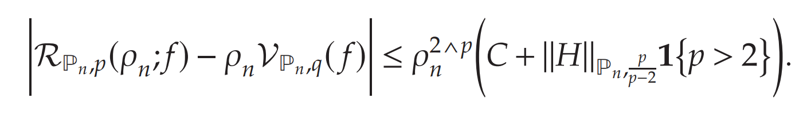

也就是说，$\mathcal{R}_{\mathbb{Q},p}(\rho;f)$和 $\rho_n \mathcal{V}_{\mathbb{Q},q}(f)$ 的差距，可以被bounded；而且后一项是$O_p(n^{-1/2})$。

当$\rho_n=O(n^{-1/2})$，此时该不等式，**给出$\mathcal{R}_{\mathbb{P}_n,p}(\rho;f)$的First-order Taylor Expansion**，余项的order是$O_p(n^{-1})$

**Non-smooth Loss**

考虑分段函数$f_\theta(z)=\theta z\wedge1,\mathrm{where~}\theta\geq0,$，下图给出3个例子

在转折点$\frac{1}{\theta}$之前，斜率均为$\theta$；而在转折点$\frac{1}{\theta}$之后，斜率为0.

那么关于分布$\mathbb{P}_n$，variation loss计算公式为：
$$
\mathcal{V}_{\mathbb{P}_n,1}(f_\theta)= \int_{0}^{\frac{1}{\theta}} \theta d \mathbb{P}_n(z) =\theta \mathbb{E}_{\mathbb{P}_n}[\mathbf{1}\{z<1/\theta\}].
$$
**由于存在jump点，需要计算$\infin$-norm，**可以得到
$$
\rho_n\mathcal{V}_{\mathbb{P}_n,\infty}(f_\theta)-\mathcal{R}_{\mathbb{P}_n,\infty}(\rho_n;f_\theta) = O_p(n^{-1}).
$$
即**$\mathcal{R}_{\mathbb{P}_n,p}(\rho;f)$的First-order Taylor Expansion**，余项的order是$O_p(n^{-1})$

最后，给出Wasserstein regularizer $\mathcal{R}_{\mathbb{Q},p}(\rho;f)$和variation regularizer $\mathcal{V}_{\mathbb{Q},q}(f)$  在不同范数下的gap差距。

这里可以看到，$\infin$-Wasserstein DRO的假设更少，而且不用对radius $\rho_n$进行约束。**p decreases, 则assumption要增多**；这是因为不同p-norm对扰动的限制能力不同，p阶数越高，则扰动被bounded；而当$p\in(1,2)$，这种

相比于smooth case，non-smooth case会多一项：

该项为$O_p(1/n)$，只要the Rademacher complexity 控制在一定范围。

**Multi-Newsvendor Example**

Loss function是一个以$z$为间断点的分段线性函数；
$$
f_\theta(z)=\sum h_j(\theta_j-z_j)_++b_j(z_j-\theta_j)_+.
$$
根据定理1，由至少$1-\exp{-t}$的概率可以保证

---

**最终结论**：p-Wasserstein DRO和the empirical variation regularization problem**是渐进等价的** the asymptotic equivalence

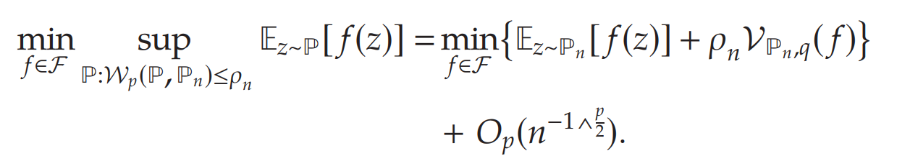

## Sinkhorn DRO

### Sinkhorn DRO优点：连续平滑

Wasserstein  DRO的两个缺点：

- **Compuational challenge**: 对loss function $f_\theta(z)$ 的限制很多，需要convex in $\theta$，而且求解方法往往是离散化取值；或者 $f_\theta(z)$ 是the generalized linear model，选择很限制。
  $$
  \min_{\theta\in\Theta}\max_{\mathbb{P}\in\mathfrak{M}}\mathbb{E}_{z\sim\mathbb{P}}[f_\theta(z)]
  $$

- **Modeling limitation**: 如果Wasserstein DRO的reference distribution是empirical distribution，则常常是finite support的，这样**worst-case distribution是离散的**。想要continuous分布；

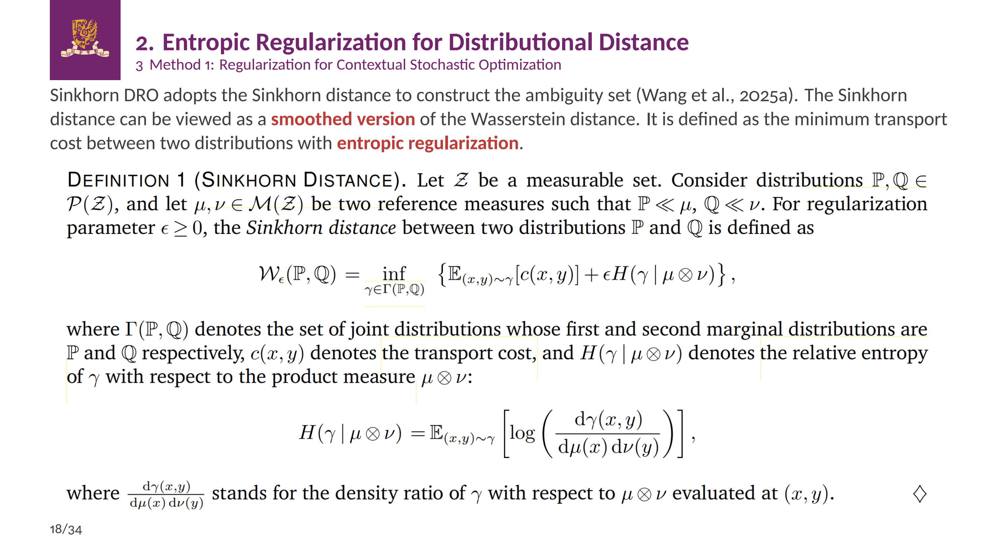

- **Entropic Regularization使分布更分散平滑**： 但原问题引入Entropy Regularization是为了使整个分布更平滑，而不是为了本文的$\mathbb{P}_{\text{local}}$和$$\mathbb{P}_{\text{global}}$$更近；可以扩展到Phi-divergence。

  注意，当$\epsilon$增大，联合分布$\gamma(x,y)$**变得更加分散**；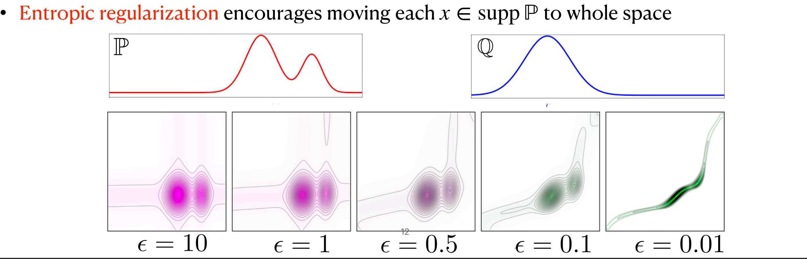

  **并且，可以使离散分布变得接近连续分布**：可以generalize to the  unseen

  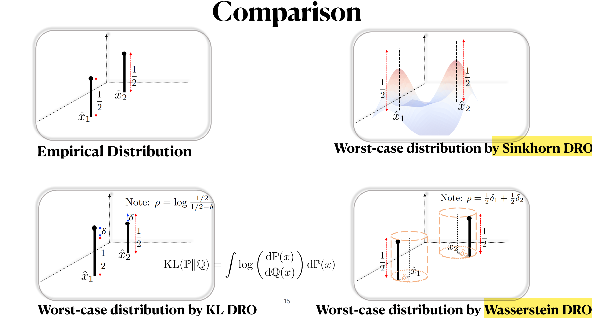

### Sinkhorn Distance定义

Sinkhorn Distance相当于在Wasserstein Distance的定义里，**加入Entropic Regularization.** 
$$
\mathcal{W}_\epsilon(\mathbb{P},\mathbb{Q})=\inf_{\gamma\in\Gamma(\mathbb{P},\mathbb{Q})}\left\{\mathbb{E}_{(x,y)\sim\gamma}[c(x,y)]+\epsilon H(\gamma\mid\mu\otimes\nu)\right\} \\
\begin{aligned}
H(\gamma\mid\mu\otimes\nu)=\mathbb{E}_{(x,y)\thicksim\gamma}\left[\log\left(\frac{\mathrm{d}\gamma(x,y)}{\mathrm{d}\mu(x)\mathrm{d}\nu(y)}\right)\right],
\end{aligned}
$$

**假如$$\left(\mathbb{P},\mathbb{Q}\right)$$ 均为给定分布**，根据不同的**choice of reference measure**，选择允许的分布类别，Sinkhorn Distance不同：

（参考2021-Siams on Opt重要数学原理-Mathematical foundations of distributionally robust multistage optimization. **Ch 3.6**）

- 假如reference measure为**Lebesgue measure**，那么Regularization为
  $$
  \begin{aligned}
  & \mathbb{E}_{(x,y)\thicksim\gamma}\left[\log\left(\frac{\mathrm{d}\gamma(x,y)}{\mathrm{d}\mu(x)\mathrm{d}\nu(y)}\right) + \log\left(\frac{\mathrm{d}\mu(x)\mathrm{d}\nu(y)}{\mathrm{d}x\mathrm{d}y}\right)\right] \\
   & =H(\gamma\mid\mu\otimes\nu)+\mathbb{E}_{(x,y)\sim\gamma}\left[\log\left(\frac{\mathrm{d}\mu(x)\mathrm{d}\nu(y)}{\mathrm{d}x\mathrm{d}y}\right)\right] \\
   & = H(\gamma\mid\mu\otimes\nu)+\mathbb{E}_{x\sim\mathbb{P}}\left[\operatorname{log}\left(\frac{\mathrm{d}\mu(x)}{\mathrm{d}x}\right)\right]+\mathbb{E}_{y\sim\mathbb{Q}}\left[\operatorname{log}\left(\frac{\mathrm{d}\nu(y)}{\mathrm{d}y}\right)\right].
  \end{aligned}
  $$
  对应Sinkhorn Distance为
  $$
  \begin{aligned}
  \mathcal{W}_\epsilon^{\text{Ent}}(\mathbb{P},\mathbb{Q})
  =\mathcal{W}_\epsilon(\mathbb{P},\mathbb{Q})+\mathbb{E}_{x\sim\mathbb{P}}\left[\log\left(\frac{\mathrm{d}\mu(x)}{\mathrm{d}x}\right)\right]+\mathbb{E}_{y\sim\mathbb{Q}}\left[\log\left(\frac{\mathrm{d}\nu(y)}{\mathrm{d}y}\right)\right].
  \end{aligned}
  $$
  

- **假如reference measure为$\left(\mathbb{P},\mathbb{Q}\right)$自身，即不允许偏离$\left(\mathbb{P},\mathbb{Q}\right)$太远**：那么等价于Wassertein距离，加上 the relative entropy regularization，以约束形式存在：$R$即为$\gamma$允许偏离$\mathbb{P}\otimes\mathbb{Q}$上限

  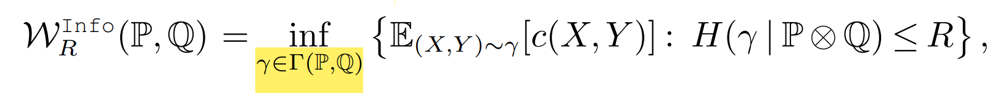

- **Idea: 修改reference measure为$\left(\hat{\mathbb{P}}_{\text{local}},\hat{\mathbb{P}}_{\text{global}}\right)$，即$H(\gamma\mid \hat{\mathbb{P}}_{\text{local}}\otimes \hat{\mathbb{P}}_{\text{global}})$**: 我们研究$\mathcal{W}_\epsilon(\widehat{\mathbb{P}},\mathbb{P})$，**并且要求$\mathbb{P} << \hat{\mathbb{P}}_{\text{global}}$**（需要解释这个假设），此时Regularization为：（反过来也成立）
  $$
  \begin{aligned}
  H(\gamma\mid \hat{\mathbb{P}}_{\text{local}}\otimes \hat{\mathbb{P}}_{\text{global}})   = &H(\gamma\mid\mu\otimes\nu) \\ & +\mathbb{E}_{x\sim\hat{\mathbb{P}}}\left[\operatorname{log}\left(\frac{\mathrm{d}\mu(x)}{\mathrm{d}\hat{\mathbb{P}}_{\text{local}}(x)}\right)\right]+\mathbb{E}_{y\sim\mathbb{P}}\left[\operatorname{log}\left(\frac{\mathrm{d}\nu(y)}{\mathrm{d} \hat{\mathbb{P}}_{\text{global}}(y)}\right)\right].
  \end{aligned}
  $$
  此时后两项应该相当于常数，注意需要满足$\hat{\mathbb{P}}_{\text{local}} \ll\mu$ 且 $\hat{\mathbb{P}}_{\text{global}} \ll\nu$ ，可以选择足够广的$\mu$和$\nu$使之成立.
  $$
  \begin{aligned}
  H(\gamma\mid\mu\otimes\nu) = & \mathbb{E}_{(x,y)\thicksim\gamma}\left[\log\left(\frac{\mathrm{d}\gamma(x,y)}{\mathrm{d} \hat{\mathbb{P}}_{\text{local}}(x)\mathrm{d} \hat{\mathbb{P}}_{\text{global}}(y)}\right)\right] \\
  & +\mathbb{E}_{x\sim\hat{\mathbb{P}}}\left[\operatorname{log}\left(\frac{\mathrm{d}\hat{\mathbb{P}}_{\text{local}}(x)}{\mathrm{d}\mu(x)}\right)\right]
  +\mathbb{E}_{y\sim\mathbb{P}}\left[\operatorname{log}\left(\frac{\mathrm{d}\hat{\mathbb{P}}_{\text{global}}(y)}{\mathrm{d}\nu(y)}\right)\right].
  \end{aligned}
  $$

  ---

  于是采用$H(\gamma\mid \hat{\mathbb{P}}_{\text{local}}\otimes \hat{\mathbb{P}}_{\text{global}}) $的Sinkhorn Distance为：
  $$
  \mathcal{W}_R\left(\widehat{\mathbb{P}}_{\text{local}},\mathbb{P}\right)=\inf_{\gamma\in\Gamma(\mathbb{P},\mathbb{Q})}\left\{\mathbb{E}_{(X,Y)\sim\gamma}[c(X,Y)]+ \epsilon H(\gamma\mid \hat{\mathbb{P}}_{\text{local}}\otimes \hat{\mathbb{P}}_{\text{global}}) \right\}
  $$
  对应的Hard Constraint Version为：
  $$
  \mathcal{W}_R  \left(\widehat{\mathbb{P}}_{\text{local}},\mathbb{P}\right)=\inf_{\gamma\in\Gamma(\mathbb{P},\mathbb{Q})}\left\{\mathbb{E}_{(X,Y)\sim\gamma}[c(X,Y)]:    
  H(\gamma\mid \hat{\mathbb{P}}_{\text{local}}\otimes \hat{\mathbb{P}}_{\text{global}}) \leq R\right\},
  $$
  **疑问：当reference measure是discrete的时候，最后的worst-case distribution是否会连续 - 应该不会。**

### Sinhorn DRO model

采用Sinkhorn Distance建立primal problem

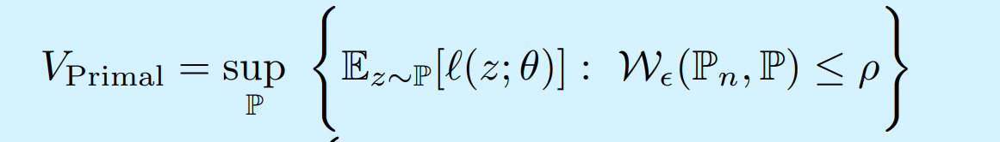

$\mathcal{W}_\epsilon(\widehat{\mathbb{P}},\mathbb{P})$ 是关于$\mathbb{P}$的凸函数，因此Sinkhorn ball是convex set, 原问题是求概率分布的infinite-dimensional convex program。

**Strong Duality Formulation**

首先注意到，要求transport cost有限 $0\leq c(x,z)< \infin$，则Sinkhorn Distance可以写成**等价形式**

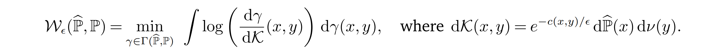

**$\mathcal{K}(x,y)$即为等价的reference measure**，令$\mathcal{K}(x,y)$关于$\widehat{\mathbb{P}}$绝对连续；并要求expected loss $\mathbb{E}_{z\sim\mathbb{P}}[f(z)]$ 定义良好，注意此时$z\sim\mathbb{P}$；最后，要求给定$x$时，边缘分布$\gamma_{x}$存在，则$\mathrm{d}\gamma(x,z)=\mathrm{d}\widehat{\mathbb{P}}(x)\mathrm{d}\gamma_x(z)$

Dual formulation如下：

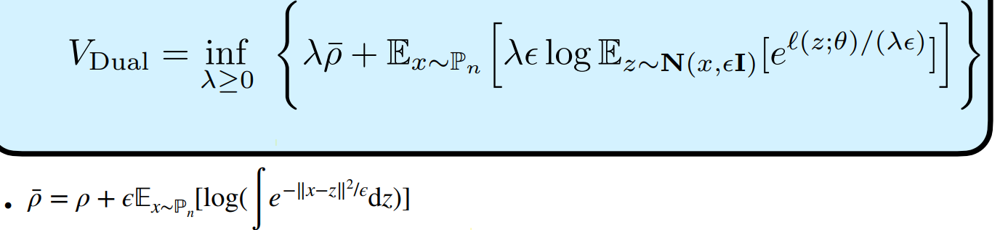

这里采用**Gaussian kernel**，可以看到dual problem是 **一维凸优化问题**，并且**是conditional stochastic optimization**；并且expectation里是**log-sum-exp 函数**。

---

**识别Worst-case Distribution**

由于strong duality成立，而且可以求出dual optimal solution $\lambda^{*}>0$，因此可以还原出原问题的worst-case distribution. PDF为：

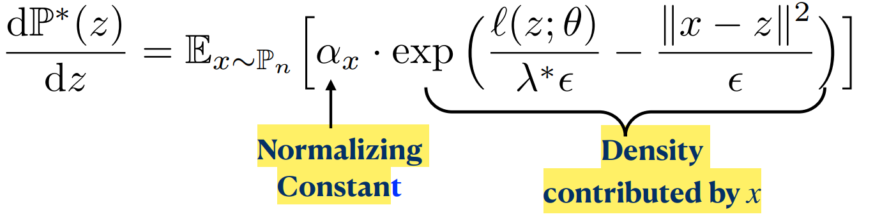

$\alpha_{x}$确保概率分布正确定义；此时worst-case distribution $\mathbb{P}_*(z)$ 和measure $\nu$的support是一致的。

当$\widehat{\mathbb{P}}$是离散的empirical distribution，最左边是Wasserstein DRO的求解结果，worst-case distribution是finitely supported的；而右边是不同的Sinkhorn DRO，结果**显示$\epsilon$ 越大，最终的分布越分散，而且分布在整个$\mathbb{R}^{d}$上**。

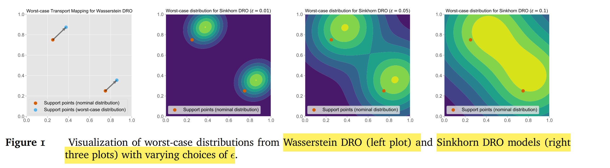

---

**和Wassertein DRO的关系**

**当$\epsilon\to0$**，Dual problem收敛至
$$
\lambda\rho+\mathbb{E}_{x\sim\widehat{\mathbb{P}}}\left[\sup_{z\in\operatorname{supp}\nu}\left\{f(z)-\lambda c(x,z)\right\}\right],
$$
当$\operatorname{supp}\nu=\mathcal{Z},$ **此时Sinkhorn DRO的dual problem和Wassertein DRO的dual problem一致**；**Sinkhorn DRO相当于用log-sum-exp近似Wasserstein DRO的sup问题**

Wassertein DRO的求解难点在于求Expectation中的sup函数，然而sinkhorn DRO不需要，因此对$f(\cdot)$限制不强。当Wassertein DRO对$f(\cdot)$限制的限制条件满足时，求解可能比Sinkhorn DRO快一些。

---

**和KL-divergence DRO的关系**

根据Jensen’s Inequality，Sinkhorn DRO的dual objective上限为
$$
\lambda\overline{\rho}+\lambda\epsilon\log\left(\mathbb{E}_{x\sim\widehat{\mathbb{P}}}\mathbb{E}_{z\sim\mathbb{Q}_{x,\epsilon}}\left[e^{f(z)/(\lambda\epsilon)}\right]\right),
$$
对应着KL-divergence DRO的dual objective:

当$\widehat{\mathbb{P}}=\frac{1}{n}\sum_{i=1}^{n}\delta_{\hat{x}_i},\mathcal{Z}=\mathbb{R}^d$，且$\begin{aligned} c(x,y)=\|x-y\|_2^2 \end{aligned}$，则$\mathbb{P}^{0}$相当于$\widehat{\mathbb{P}}$的 **kernel density estimator** with Gaussian kernel and bandwidth ϵ.

因此，当$\overline{\rho}=0$时，Sinkhorn DRO相当于关于**kernel density  estimator $\mathbb{P}^{0}$ 的SAA**；$\mathbb{Q}_{x,\epsilon}=\mathcal{N}(x,\epsilon I)$即为Gaussian Smoothing

当$\bar{\rho}>0,$ 则相当于**关于$\mathbb{P}_{0}$的KL-DRO问题**。KL-DRO比Sinkhorn DRO求解更简单。
