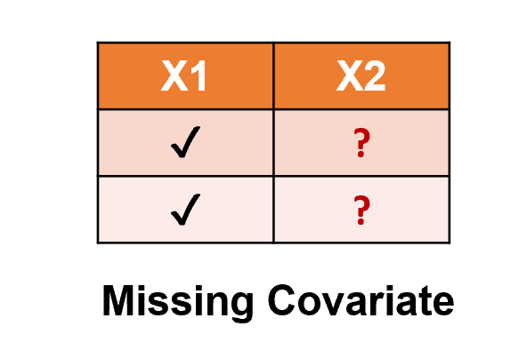
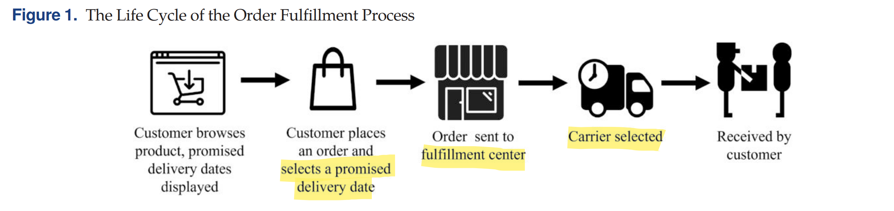
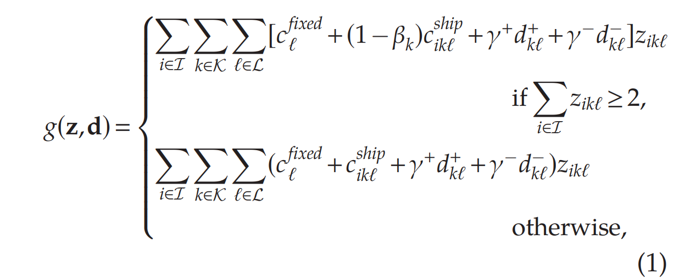
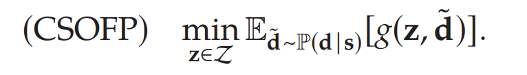

# CSO for Omnichannel Multicourier Order Fulfillment Under Delivery Time Uncertainty

**摘要**：本文首次从Contextual Stochastic Optimization的视角，研究电商订单履行问题。问题是从大规模的商店和仓库网络订单中，选择合适的配送中心（distribution centers， DC）和配送骑手（shipping carriers ）履行订单。企业现有策略主要依赖于heuristic，选择成本最低的订单满足配送策略，而未考虑订单batching和骑手及时配送的reliability。

**方法论**：本文**首次提出一个Data-driven CSO框架**，结合分布预测delivery time deviation，以及order fulfillment的stochastic/robust optimization model。在考虑**item consolidation**和**delivery time uncertainty**的条件下，优化配送中心和骑手的选择。经过实验验证，相比现存策略，CSO框架可以大幅提高及时配送的效率。两个挑战

- **Delivery Time Uncertainty**：本文不考虑需求不确定性，研究单周期已知订单的分配问题；

- **Observational Data/Partially Observed Data/Missing Response**: $\{(\mathbf{x}_i,y_i,z_i)\}_{i=1}^n$ 包含feature $\mathbf{x}$，prescription $z_i$以及random response/outcome $y$；

  只有可观测的数据（选择的履行方式和对应配送时间偏差），例如**Decision-dependent uncertainty**；而未选择的**counterfactual deviation**永远无法观测；（counterfactual data也算一类missing data). 

**Contribution**:

- **A modular and scalable CSO framework for observational data**. 模块化、可扩展的CSO框架，可应用于observational data. 将missing-counterfactual observational data转化为可行问题；用SAA和RO两种方法求解
- **Calibrated contextual distribution learned from e-commerce delivery time deviation**. 为了从电商配送数据中学习数据的离散、有序性，采用**probabilistic multiclass classification** and **tree-based quantile regression** (QR) 学习分布contextual  distribution oracle.
- **Data-driven MILP**: 首次提出对于omnichannel multi courier fulfilment的MILP，并且考虑了CSO
- **Industry-scale real-world validation**: 相比于基线模型，可以大幅降低期望成本，并提高准时配送率

---

**Motivation**

- **Omnichannel approach **: 传统电商零售将线上和线下销售渠道分开，线上订单用仓库配送，线下订单由门店满足。全渠道零售综合利用仓库和门店，更高效履行订单

- **Crowd shipping: Crowdsourcing** 众包配送，聘用非专职骑手进行配送，可以减轻全职骑手负担。

- **Item Consolidation/Batching**: 订单合并，将同一个客户订单的多个包裹合并，实现碳减排

- **Uncertainty in delivery time**: 送达时间与约定时间不匹配overpromising or underpromising

  **问题：**本文研究订单履行时，选择**何种渠道**（DC or stores)，以及**哪种骑手**（dedicated or crowdsourcing），以及如何订单合并（multi-item order consolidation），可以保证及时送达。不确定性源于delivery time

  

## 启发

- 未考虑配送地点对配送时间影响；

## Problem Setting

- **Online Retail**：顾客下达订单，每个订单包含多个SKU（即多个子订单），每个订单线都可以用不同配送渠道满足。渠道包含实体店和区域物流中心，每个中心配有多种骑手，每种骑手对应服务水平不同（当日达、即使配送、隔日达）。

- **Data**: 公司有Transactional Data和Network Status Data；前者包含交易时间、地点、订单构成和预订配送地点、日期；后者包含各种SKU库存状况，和各个中心库存
- **问题**：确定配送中心和骑手（location-carrier pair)以履行订单，在成本最小化同时保证在顾客预订时间内送达

- **Greedy Algorithm**: 当前策略是将可行location-carrier pair按照期望成本和配送时间排序，选出成本最低、配送时间最短的决策。**缺点**：1. 没有考虑item batching  2.配送时间非静态，实际可能有**随机偏差**（如极端情况，骑手未到达，仓库配送慢等）

---

- **一个订单可以拆分成不同SKU**，假设一共有$\mathcal{I}$种SKU，对应骑手和配送中心组合为$\mathcal{K}\times\mathcal{L}$。每个订单需要为每种SKU求解一个独立优化问题，即确定$\mathbf{z}=(z_{ik\ell})_{i\in\mathcal{I},k\in\mathcal{K},\ell\in\mathcal{L}}$，每种SKU $i$从$l$地点由骑手$k$配送的数量，为整数$z_{ik\ell}\in\mathbb{Z}$。

- **Deviation**：配送时间存在偏差，$\mathbf{d}=(d_{k\ell})_{k\in\mathcal{K},\ell\in\mathcal{L}}$是已实现的偏差，代表每个location-carrier pair $(k,l)$和期望配送时间的偏差。deviation为正 $d_{k\ell}^+=\max\{0,d_{k\ell}\}$代表正偏差，为0是准时配送。

  **Asymmetric Penalty Cost**: 迟到比早到的惩罚成本高很多$\gamma^+\gg\gamma^-.$

- **目标函数**：最小化总成本，考虑fixed cost ${c}_\ell^{\mathrm{fixed}}>0$和unit shipping cost ${c}_{ik\ell}^{ship}>0$。考虑**consolidation discount**，即同一个骑手运送多个不同SKU，折扣比例 $\beta_k\in(0,1)$。如果订单迟到或早到，都需要有惩罚成本$\gamma^{+}\geq0$，$\gamma^{+}\geq0$

  

  其中item consolidation折扣是指一个订单的骑手配送超过2件SKU，可以有折扣

- **现实约束**：假设$\mathrm{inv}_{i\ell}\geq0$是仓库$\ell$对SKU $i$的库存水平，assignment $\mathbf{z}$必须满足约束：

  - 每单位SKU必须从1个地点和1个骑手配送
    $$
    \sum_{k\in\mathcal{K}}\sum_{\ell\in\mathcal{L}}z_{ik\ell}=q_i,\quad\forall i\in\mathcal{I}.
    $$

  - 只有eligible pair可以配送，取决于骑手背包容量。$e_{ik\ell}$是指示变量，为1则可以配送，否则不可以；
    $$
    z_{ik\ell}\leq q_i e_{ik\ell},\quad\forall i\in\mathcal{I},k\in\mathcal{K},\ell\in\mathcal{L}.
    $$

  - 每种SKU在每个地点配送量不大于库存
    $$
    \sum_{k\in\mathcal{K}}z_{ik\ell}\leq\mathrm{inv}_{i\ell},\quad\forall i\in\mathcal{I},\ell\in\mathcal{L}.
    $$

  - 每个地点配送量不大于处理容量
    $$
    \sum_{i\in\mathcal{I}}\sum_{k\in\mathcal{K}}z_{ik\ell}\leq\operatorname{cap}_{\ell},\quad\forall\ell\in\mathcal{L}.
    $$

### CSO formulation

- 假设delivery deviation是随机变量，$\tilde{\mathbf{d}}=(\tilde{d}_{k\ell})_{k\in\mathcal{K},\ell\in\mathcal{L}}\sim\mathbb{P}$；只和各个location-carrier pair相关，而且$\tilde{d}_{k\ell}$是dicrete的，$d_{k\ell}\in\{\xi_{1},\xi_{2},\ldots,\xi_{C}\}$，并且$\xi_1<\xi_2<\cdotp\cdotp\cdotp<\xi_C$。

- **Covariate/State**：假设履行订单前，已经知道$\mathbf{s}=(\mathbf{s}_{k\ell})_{k\in\mathcal{K},\ell\in\mathcal{L}}$各个location-carrier pair的covariate，包括订单信息和网络状态。则contextual distribution of deviation为$\mathbb{P}(\mathbf{d|s})$，对每个location-carrier pair $(k,l)$ $\mathbb{P}_{k\ell}(d_{k\ell}|\mathbf{s}_{k\ell})$

  

- **Observational Data**: 假设有$\mathcal{O}$个历史订单，严格来讲，数据总和为$\{(\mathbf{s}_o,\mathbf{z}_o,\mathbf{d}_o)\}_{o=1}^{|\mathcal{O}|}$,并非所有数据都被观测到，只有确定的decision和对应的deviation被观测到。

  每个订单对应的决策是$\mathbf{z}_o=(z_{ik\ell,o})_{i\in\mathcal{I},k\in\mathcal{K},\ell\in\mathcal{L}}$，并非每个$z_{ik\ell,o}$对应的deviation $\mathbf{d}_o=(d_{k\ell,0})_{k\in\mathcal{K},\ell\in\mathcal{L}}$都已知。 已知的deviation集合为：
  $$
  \mathbf{D}_{o}:=\left\{d_{k\ell,o}\left|\sum_{i\in\mathcal{I}}z_{ik\ell,o}>0,k\in\mathcal{K},\ell\in\mathcal{L}\right.\right\}.
  $$
  因此最后可行的数据为$\mathbb{D}=\{(\mathbf{s}_o,\mathbf{D}_o)\}_{o=1}^{|\mathcal{O}|}.$ 空白数据为$\{(\mathbf{s}_o,0,\empty)\}_{o=1}^{|\mathcal{O}|}$; 依赖于decision的data missingness

## Quantile Regression

**参考文献**: 与本文最接近

- Salari N, Liu S, Shen ZJM (2022) Real-time delivery time forecasting  and promising in online retailing: When will your package  arrive? Manufacturing Service Oper. Management 24(3):1421–1436.

  采用Quantile Regression+Decision Rule，decision rule平衡了asymmetric costs of early and late deliveries；本文是拓展，首先考虑了CSO框架，第二是

- 2021-MS-Max分位数预测-distributionally-robust-conditional-quantile-prediction-with-fixed-design

- 2018-OR-决策规则学习The Big Data Newsvendor- Practical Insights from Machine Learning 

本文在QR之后不采用Decision Rule