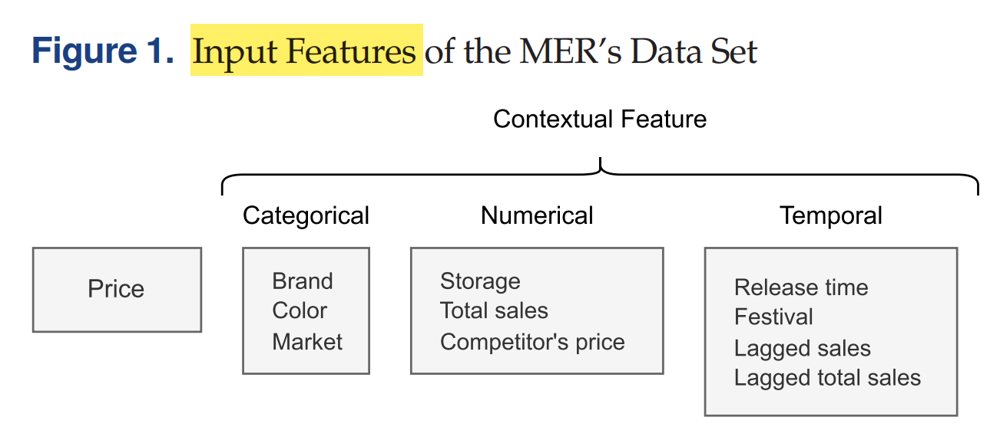
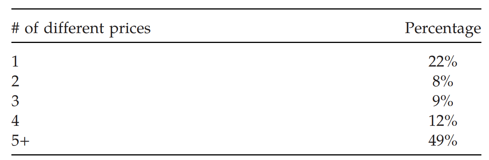
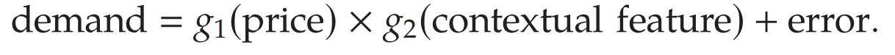
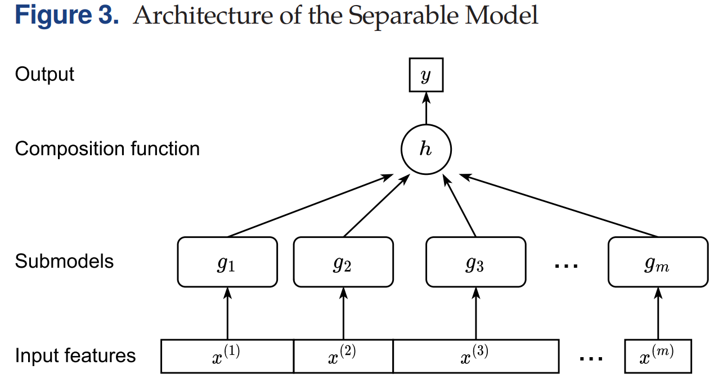
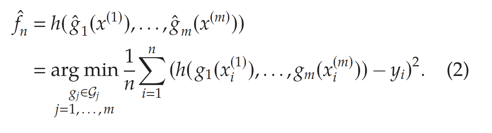
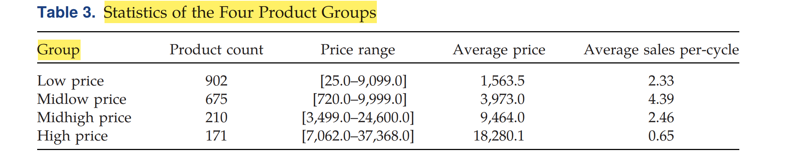
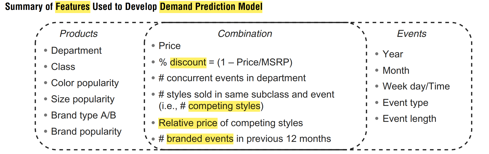
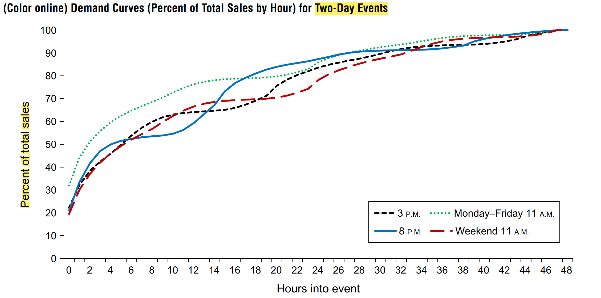
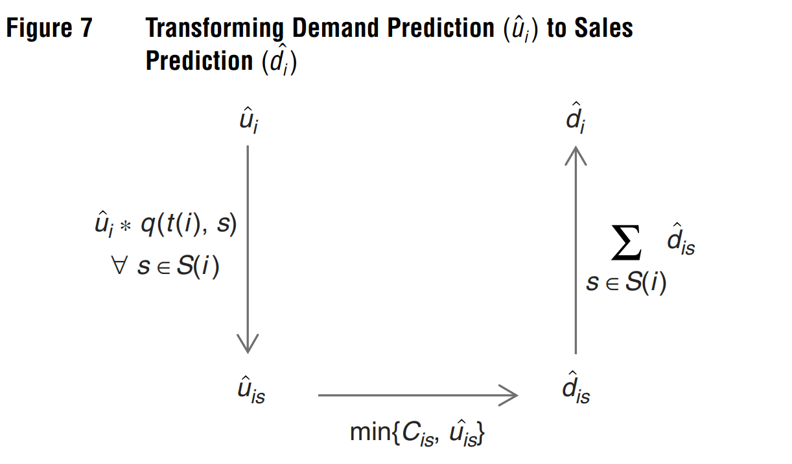
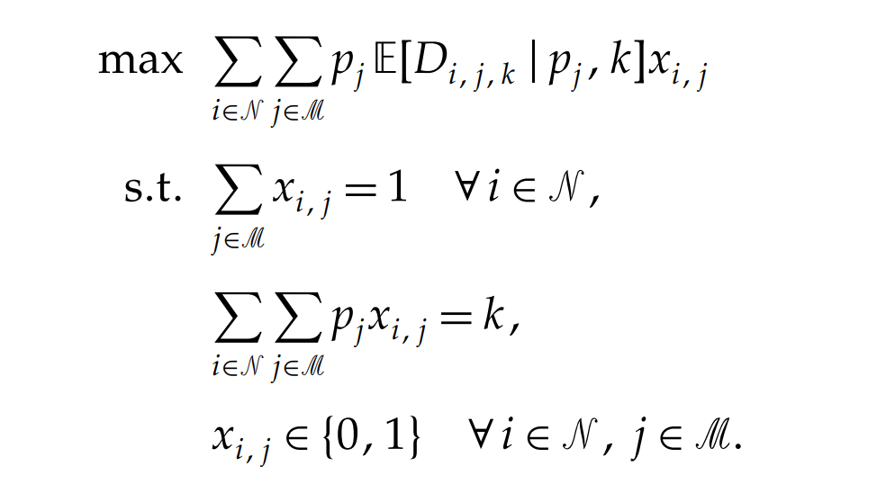

# Contextual offline-demand learning and pricing with separable-models

- **Predicting the demand**: 使用High dimensional data预测需求信息，用于Pricing decision；

- **Data Scarcity/Partially Observed**: 以手机的2000个SKU为例：价格/需求信息少，导致price elasticity无法预测

  - **Infrequency in price changes 价格变动少-> 数据观测不全，某些价格对应的需求没有观测到**；Price变动少，20%产品仅有1次变动，超过一半产品价格变动不超过5次；

  - **Limited sales volume 需求幅度小**：部分产品销量不到1个，83%少于5个，数据不足；参考[Simchi先聚类后预测](C:\Users\lipei\Desktop\Missing Data\1-Missing Data\2016-MSOM Simchi聚类并预测lost sale-Analytics for an Online Retailer Demand Forecasting and Pricing.pdf)：

    

- **Clustering**：为处理**Data Scarcity**的问题，本文首先尝试Clustering聚类，根据价格高低分成四类产品：参考[需求聚类定价](C:\Users\lipei\Desktop\Missing Data\1-Missing Data\2022-POMS Low sales聚类定价-Context-based dynamic pricing with online clustering.pdf)，从同一cluster中学习需求：

- **Separable Model**: 将Price和Feature对需求的影响分开来，即将模型分成两个submodel；每个submodel可加入domain knowledge，例如$g_1$ decreasing function. 

  **Motivation**: Data multimodality，不同feature可能有不同子模型；

  - **Additive Separable Model**: 

    

  - **Multiplicative Separable Model**:

    

  - **Challenge**: 无法识别sub model各自的影响，并且可能存在*risk of model mis-specification*的影响

  

## Problem Definition

- **Data Set** $\{(x_1,y_1),\ldots,(x_n,y_n)\}.x_i\in\mathcal{X}\subseteq\mathbb{R}^d$ is feature; $y_i\in\mathcal{Y}\subseteq\mathbb{R}$ is sales volume, which follows a conditional probability measure $\mathbb{P}_{Y|X}$

- $\mathcal{F}$：**model class** maps $\mathcal{X}$  to $\mathcal{Y}$， $f \in \mathcal{F}$

- $\ell$: **loss function**, $\mathcal{L}(f)=\mathbb{E}[\ell(f(x),y)]$ is expected loss, with respect to all the randomness. Find the $\tilde{f}$:
  $$
  \tilde{f} = \textrm{argmin}_{f \in \mathcal{F}}\mathbb{E}[\ell(f(x),y)]**
  $$

- **Squared loss function and Empirical Rick Minimization (ERM)**： Finite Data Setting
  $$
  \hat{f}_n=\arg\min_{f\in\mathcal{F}}\hat{\mathcal{L}}(f)=\arg\min_{f\in\mathcal{F}}\frac{1}{n}\sum_{i=1}^n\left(y_i-f(x_i)\right)^2
  $$

- **Model Selection**: which class $\mathcal{F}$ to use, such as linear function, boosting trees and neural networks. 需要平衡好interpretability和predictive capabilities; 

  本文的model selection都是domain specific的,retailers can **start with a richer composite functions** and use the classical validation methods  such as cross-validation to select the best one. 先设定多一些，再用CV不断减少

- **Separable Model**: 将特征空间分成disjoint
  $$
  x=(x^{(1)},x^{(2)},\ldots,x^{(m)}).
  $$
  那么对应的separable model 为
  $$
  \mathcal{F}=\{h(g_1(x^{(1)}),\ldots,g_m(x^{(m)}))|g_j\in\mathcal{G}_j,j=1,\ldots,m\},
  $$
   $\mathcal{G}_{j}$包含所有将context $x^{(j)}$映射为实数的函数，即submodel，$h:\mathbb{R}^m\to\mathbb{R}$将所有submodel结果输入，得到最终prediction；最终loss function写作；

  

- **怎么选择separable mode**l: 根据问题背景选择，本文研究pricing problem，因此分成两类$x_i= (p_i,z_i)$；如果关心categorical product，可以将categorical feature分开。

  本文选择两种model: 对于$g_1(p_i)=\mathrm{Iso}(p_i)$ 价格函数选择**isotonic  regression**，对于其他特征选择$g_2(z_i)=\mathrm{Tree}(z_i)$ **boosting decision trees**

  - **Additive model**:  Instance如linear demand model
    $$
    \mathcal{F}_{\mathrm{add}}=\{\mathrm{Iso}(p_{i})+\mathrm{Tree}(z_i) \}
    $$

  - **Multiplicative separable model**
    $$
    \mathcal{F}_{\mathrm{multip}}=\{\mathrm{Iso}(p_{i}) \times \mathrm{Tree}(z_i) \}
    $$
    

## **Clustering具体做法**

具体做法是，**$Q(p)$为价格需求CDF**，即价格不大于$p$时的需求；根据$Q(p)$的变化，可以知道商品需求对价格的敏感度。设定$k$个固定价格$p_1\leq p_2\leq\cdots\leq p_k$，将$[Q(p_1),Q(p_2),\ldots,Q(p_k)]$作为每个商品的feature进行聚类。使用需求CDF/价格需求CDF分类而不用特定feature分类的理由：

1. 避免出现特征相似，需求完全不同的情况；
2. 在可分模型中，价格相似的产品有类似demand pattern; price是主导因素
3. 在可分模型中，价格相近的产品有相同模型；
4. 只用Categorical分类，不够精确；
5. 价格需求CDF同时包含price/demand信息

实验验证直接用nonparametric regression-tree-based model**效果很差**，价格上升需求上升；因此要**加入business领域知识**；

---

**Example 2 ： Predict  future demand for new products**
参考：Kris Johnson Ferreira, Bin Hong Alex Lee, David Simchi-Levi (2015) Analytics for an Online Retailer: Demand Forecasting and Price Optimization. Manufacturing & Service Operations Management

- **Two challenges**: Estimate lost sales. and predict demand for new products.
- **Censored Demand** $d_{is}\leq\ u_{is}.$ : Newsvendor demand, each item with style $i$ and size $j$，demand $d_{is}=\min\{C_{is},\mathcal{U}_{is}\}$, where $u_{is}$ is real demand, and $C_{is}$ is inventory

- **Demand Prediction**: **First estimate past demand** $u_{is}$ based on past sales $d_{is}$ , then **predict future demand of new styles** $\hat{u}_i,\hat{d}_i$. 两阶段任务，先估计数据，再预测需求。

- **Data Set**: Style -> subclass  -> Class  -> Department 颗粒度

  **Sales data (Temporal)**: sales quantity, price, event date/time, initial inventory, event length

  **Product data**: brand, size, color, MSRP  (manufacturer’s suggested retail price), style classification

  最终使用特征如下：

  

**如何从low sale data中estimate lost sales?**

- **利用no lost sale data** $\mathcal{U}_{is}=\mathcal{d}_{is}$: 将没有断货的items，根据不同event length，按照event start time等聚类，将hourly sales绘制成demand curve。

  例如：2天event的累计demand;

- **估计lost sale商品的需求**：按照lost sale商品未售完时的demand curve，**找到对应的demand curve**，估计真实需求

**如何预估未来需求和销量？**

- **首先预估某个style的销量$\hat{\mathcal{U}}_i$**： 利用多个Regression模型

- **利用历史数据预估每个size的销量**$\hat{\mathcal{U}}_{is}$: 即size的占比；

- **与库存对比，得到预测销量$d_{i}$** ： regression trees with bagging， 其中bagging指的是从training data中重抽样$N$个样本，形成tree；重复100次，取平均预测结果

  

**如何确定最优定价？**- Regression Tree 非凸非凹

一共有$N$ styles，和$M$种可能定价，$p_j$为第$j$种价格，需要选择价格$x_{i,j}$最大化收益。**$k$是competing style价格之和**，例如$\{\$24.90,\$29.90,\$39.90\}$的$k=\$94.7$, 第一个商品对应的relative price是$\$24.90/(k/3)=0.79$。一共有
$$
K\triangleq|\mathscr{K}|=N*(M-1)+1.
$$
这样问题就变成了选择何种$k$，以及对应的产品定价。$\mathbb{E}[D_{i,j,k}\mid p_j,k].$是第一步的需求预测，给定$k$和产品定价$p_j$可得

这里目标函数并非凸的，因此需要设计算法迭代解决。求解所有$k\in\mathscr{K}$对应的$IP_k$，并得到$(IP)=\max_k(IP_k)$。该问题等价于multiple-choice knapsack problem (MCKP) 背包问题