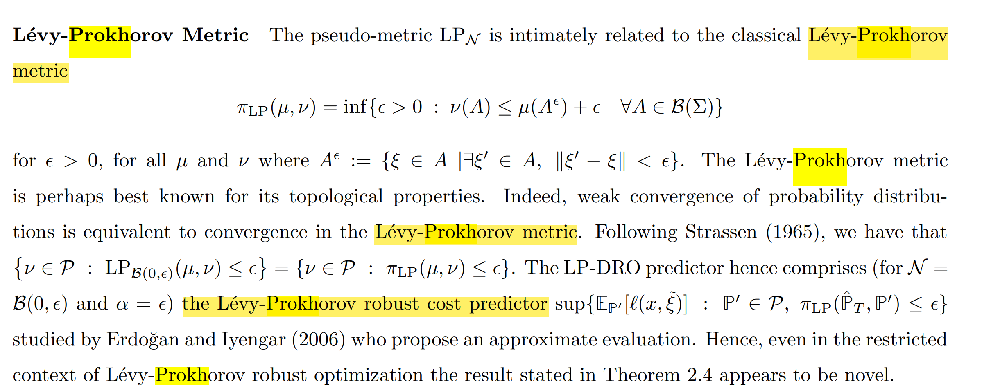

# Noisy Data DRO

参考：Efficient data-driven optimization with noisy data-Van Parys

随机优化的核心问题是找到以下问题的最优解:
$$
z(P)\in\arg_\epsilon\inf_{z\in Z}\{\mathbf{E}_P\left[\ell(z,\xi)\right]=\int_\Xi\ell(z,\xi)\operatorname{d}P(\xi)\}
$$
然而真实分布往往不可知，实际上我们可以抽样数据
$$
\xi_i\sim \mathbb{P}\quad\forall i\in[1,\ldots,N],
$$
用经验分布${\mathbb{P}}_N:=\sum_{i=1}^N\delta_{\xi_i}/N.$代替真实分布. 这种数据称为**noiseless  data**，即关心分布$\mathbb{P}$的uncorrupted independent samples.  对应SAA问题：
$$
z(\mathbb{P}_N)\in\arg_\epsilon\inf_{z\in Z}\mathbb{E}_{\mathbb{P}_N}\left[\ell(z,\xi)\right]
$$
SAA问题的robust counterpart是用经验分布${\mathbb{P}}_N$构建模糊集$\mathcal{A}_N(P_N)\subseteq\mathcal{P}$：
$$
z_\mathcal{A}({\mathbb{P}}_N)\in\arg_\epsilon\inf_{z\in\mathbb{Z}}\sup_{z\in\mathbb{Z}}\{\mathbf{E}_{\mathbb{P}}[\ell(z,\xi)]:{\mathbb{P}}\in\mathcal{A}_N({\mathbb{P}}_N)\}
$$
常用的模糊集为Optimal transport distance (Wasserstein-distance)以及KL-divergence: 

- **Optimal Transport Distance**: Probability measure $\mu$ on $\Xi$,  $\nu$ on $\Xi’$
  $$
  W_0(\mu,\nu):=\inf_{T\in\mathcal{T}(\mu,\nu)}\int_{
  \begin{array}
  {c}\Xi\times\Xi^{\prime}
  \end{array}}d(\xi,\xi^{\prime})\mathrm{d}T(\xi,\xi^{\prime})
  $$
  可以看作将泥土从$\mu$搬运到$\nu$的最小运输成本，又称earth mover’s distance。联合分布transport polytope包含所有边缘分布为$\mu,\nu$的分布。
  $$
  \mathcal{T}(\mu,\nu):=\left\{T\in\mathcal{P}(\Xi\times\Xi^{\prime}):\Pi_{\Xi^{\prime}}T=\mu,\Pi_{\Xi}T=\nu\right\}
  $$
  假设$d(\xi,\xi^\prime)=\left\|\xi-\xi^\prime\right\|_2$，则为经典的Wasserstein distance，对应的DRO问题概率保证：真实成本超过worst-case cost的概率随样本数量指数衰减。Optimal Transport的问题在于计算困难。

- **Entropic divergence**: 两个measure $\mu,\nu$ on the same space之间的KL-divergence定义为:
  $$
  \mathrm{KL}(\mu,\nu)=c\int\log\left(\frac{\mathrm{d}\mu}{\mathrm{d}\nu}\right)\mathrm{d}\mu-\int\mathrm{d}\mu+\int\mathrm{d}\nu
  $$
  其中$\mathrm{d}\mu/\mathrm{d}\nu$代表the Radon-Nikodym derivative，$\mu,\nu$是绝对连续的，对应的DRO问题可以写作：
  $$
  \small
  z_{\mathrm{KL},r}(P_N)\in\min_{z\in Z}\{c_{\mathrm{KL},r}(z,P_N):=\max\left\{\mathbf{E}_P\left[\ell(z,\xi)\right]\right.:\mathrm{~KL}(P_N,P)\leq r \}\}
  $$
  KL-divergence的真实成本超过worst-case成本的概率，随样本数量以及ambiguity set的大小$r$指数衰减。

**Efficient DRO**: 由于SAA，Optimal Transport DRO以及Entropic Divergence DRO的out-of-sample guarantee都是指数级别的
$$
\overline{\lim}_{N\to\infty}\frac{1}{N}\log\Pr\left[\mathbf{E}_P\left[\ell(z_N(P_N),\xi)\right]>\tilde{c}_r(\tilde{z}_r(P_N),P_N)\right]\leq-r
$$
因此重点在于比较预测期望成本$\tilde{C}_r(\tilde{Z}_r(P_N),P_N)$以及真实成本$\mathbf{E}_{P}\left[\ell(z_{N}(P_{N}),\xi)\right]$的差值。**可以证明，KL-divergence DRO是最有效的，即期望成本最小**：
$$
\tilde{C}_r(\tilde{Z}_r(P_N),P_N)\leq C_{\mathrm{KL},r}(Z_{\mathrm{KL},r}(P_N),P_N)
$$

## Noisy Data

有时我们只能测量 **Noisy data**: 
$$
\xi_i^{\prime}=\xi_i+n_i\quad\forall i\in[1,\ldots,N]
$$
此处$n_i$是独立的，并且服从某个已知的分布。假设支撑集为$\Xi'$，则
$$
\xi_i^{\prime}\sim\mathcal{O}_{\xi_i}\quad\forall i\in[1,\ldots,N].
$$
每个noisy data point都是从$\mathcal{O}_{\xi_i}\in\dot{\mathcal{P}}(\Xi^{\prime})$中独立取样，其中$\mathcal{O}_{\xi_i}$是给定noiseless observation $\xi_i$之后，加上noise mapping $O:\Xi\to\mathcal{P}(\Xi^{\prime})$得到的。

- **Noise Mapping/Kernel $O$**: **在两篇文章中都假设已知**，即影响数据的噪声函数是已知的，因此可以求image和inverse image。满足假设

$$
O_\xi\ll m^{\prime}\text{ for all }\xi\in\Xi.
$$

​	即measure $O_\xi$是关于$m^{\prime}$绝对连续的。$O$可以将$P$ push forward.

- **Noisy distribution的模糊集**：$\mathbb{P}'$ noisy data的distribution可视作$\mathbb{P}$的convolution: $P^{\prime}(B)=(O\star P)(B)$，$B$是measurable set $B\in\mathcal{B}(\Xi^{\prime}).$
  $$
  P^{\prime}(B)=(O\star P)(B):=\int_{\xi \in \Xi} O_\xi(B)\mathrm{d}P(\xi)\\
  P'(B)=\int_{\xi \in \Xi} P'(B\mid X=\xi)dP(\xi).
  $$
  则$P'$对应的模糊集可以写作：$\mathcal{P}^{\prime}:=\left\{O\star P\in\mathcal{P}(\Xi^{\prime})\mathrm{~:~P}\in\mathcal{P}\right\}$, $O$可以将$\xi$映射成一个概率测度$O_{\xi}$，是Markov Kernel Function，可视为条件概率分布.

常见的noisy data形式：

- **Additive Noise**: 测量误差$e_i \sim E \in \mathcal{P}(\Xi^{\prime})$ ，可观测的noisy data
  $$
  \xi_i^{\prime}=\xi_i+e_i
  $$
  那么对应的noisy kernel function定义为$\mathcal{O}^{AE}:\xi\mapsto E(\xi)$
  $$
  E(\xi)[B]=\int\mathbb{1}\left\{\xi+e\in B\right\}\mathrm{d}E(e)
  $$
  对于每个可测集合$B \in \Xi'$

- **Gaussian Noise**: 即Additive Noise的测量误差是噪声服从正态分布，$z_i$对应方差为$\sigma^2I$。$O^{GN}:\xi\mapsto N(\xi,\sigma^2I)$即对每个$\xi$对应一个正态分布$N(\xi,\sigma^2I)$。

- **Clipping Noise即Data Censoring**: 观测工具有上下界$\Xi^{\prime}=[a,b]$，因此输出的全是censored data $\xi_i^{\prime\prime}=\max(\min(\xi_i^{\prime},b),a)$，而不是真实噪声。

## Inverse Image Construction

由于已知**Noise Mapping/Kernel $O$**，可以先建立noisy empirical distribution, 再利用$O$的inverse-image得到clean data space的分布。

假设只有random vector $X \in \R^n$，对应的support set为$\mathcal{X}$；真实分布（latent distribution)为$\mathbb{P}$，假设有$N$个i.i.d. random examples from $\mathbb{P}$ $\widehat{X}_1,\ldots,\widehat{X}_N\in\mathbb{R}^n$，对应经验分布为$\widehat{\mathbb{P}}:=\frac{1}{N}\sum_{j=1}^N\delta_{\widehat{X}_j}$。

**Noisy Data**: 真实数据$\widehat{X}_j\sim\mathbb{P}$不可观测，只能观测到i.i.d. samples from noisy distribution，即noisy samples $\widehat{X}_j^{\prime} \in \mathcal{X}^{\prime}$，并且满足$\mathcal{X} \subseteq\mathcal{X}^{\prime}$
$$
\widehat{X}_j\sim\mathbb{P}; \quad
\widehat{X}_j^\prime\sim\mathbb{O}(\cdot\mid\widehat{X}_j)
$$
此时可以建立noisy empirical distribution $\widehat{\mathbb{P}}^\prime:=\frac{1}{N}\sum_{j=1}^{N}\delta_{\widehat{X}_j^\prime}.$

噪声分布是从conditional distribution $\mathbb{O}(\cdot\mid\widehat{X}_j)$中抽样的。那么对于任意$A\subseteq\mathcal{X}^\prime$，对应的噪声分布用the law of total probability可以计算为
$$
\begin{aligned}
\mathbb{P}^{\prime}(A)& =\int_{x \in \mathcal{X}} \mathbb{P}^{\prime}(A\mid X=x ) d \mathbb{P}(x) \\
& = \int_{x \in \mathcal{X}} \mathbb{O}_x(A) d \mathbb{P}(x)
\end{aligned}
$$
即真实分布经过convolution，得到噪声分布。

假设使用**Additive Noise** $\begin{aligned} X^\prime:=X+E\end{aligned}$，其中noise $E \in \mathcal{E}$，对应分布为$\mathbb{F}_E$
$$
\mathbb{O}_x(A)=\mathbb{P}(x+E \in A)=\mathbb{P}(E \in A-x) = \mathbb{F}_E(A-x)
$$
因此最终卷积公式为
$$
\begin{aligned}
\mathbb{P}^{\prime}(A)& =\int_{x \in \mathcal{X}} \mathbb{F}_E(A-x) d \mathbb{P}(x) \\
& = (\mathbb{F}_E \star \mathbb{P})(A)
\end{aligned}
$$

---

**Noisy Wasserstein Ball**: 以noisy empirical distribution为中心建立模糊集
$$
\mathcal{B}_\varepsilon^\prime(\widehat{\mathbb{P}}^\prime):=\left\{\mathbb{P}^\prime\in\mathcal{M}(\mathcal{X}^\star):d(\mathbb{P}^\prime,\widehat{\mathbb{P}}^\prime)\leq\varepsilon\right\}.
$$
为了得到真实分布$\mathbb{P}$，记noisy kernel $T_{\mathbb{O}}:\mathcal{M}(\mathcal{X})\to\mathcal{M}(\mathcal{X}^{\prime})$
$$
\begin{aligned}
(T_{\mathbb{O}}(\mathbb{P}))(A) & :=\int_{x\in\mathcal{X}}\mathbb{O}(A\mid x)d\mathbb{P}(x)
\end{aligned}
$$
则$\mathbb{P}^\prime=T_{\mathbb{O}}(\mathbb{P}).$ 如果有noisy ambiguity set，可以用**inverse image of $\mathcal{B}_\varepsilon^\prime(\widehat{\mathbb{P}}^\prime)$**得到原来的分布$\mathbb{P}$，**即当noisy distribution处于模糊集中，对应的真实分布集合为：**
$$
\begin{aligned}
\mathcal{B}_{\varepsilon,\mathbb{O}}(\widehat{\mathbb{P}}^{\prime}) & :=T_{\mathbb{O}}^{-1}(\mathcal{B}_\varepsilon^\prime(\widehat{\mathbb{P}}^\prime)) \\
 & =\left\{\mathbb{P}\in\mathcal{M}(\mathcal{X}):\mathbb{P}^\prime\in\mathcal{B}_\varepsilon^\prime(\widehat{\mathbb{P}}^\prime)\right\}. \\
 & =\left\{\mathbb{P}\in\mathcal{M}(\mathcal{X}):d(T_{\mathbb{O}}(\mathbb{P}),\widehat{\mathbb{P}}^\prime)\leq\varepsilon\right\}.
\end{aligned}
$$
该分布集合包含了所有latent distribution $\mathbb{P}$，对应的noisy distribution处于模糊集$\mathcal{B}_\varepsilon^\prime(\widehat{\mathbb{P}}^\prime)$中。对应的Noisy Data DRO问题为：
$$
g_{\mathrm{noise}}^*(\varepsilon):=\sup_{
\begin{array}
{c}w\in\mathcal{W}
\end{array}}\inf_{
\begin{array}
{c}\mathbb{P}\in\mathcal{B}_{\varepsilon,\mathbb{O}}(\widehat{\mathbb{P}}^\prime)
\end{array}}\mathbb{E}_{\mathbb{P}}\left[U\left(\langle w,X\rangle\right)\right],
$$
这里$\varepsilon>0$是Wasserstein radius，考虑noisy data建立的ambiguity set。可以证明小样本性能保证和渐进性能保证，其中目标函数对$\varepsilon$灵敏度为：
$$
\frac{dg_{\mathrm{noise}}^*(\varepsilon)}{d\varepsilon}=-\lambda^*(\varepsilon).
$$
即增加一单位robustness，需要减少$\lambda^*(\varepsilon)$的utility，这个对偶变量是对偶问题的最优解；可以认为是shadow price of robustness. 

并且可以证明，当$\varepsilon>0$相同时，**使用noisy DRO总是比直接用DRO性能好**：
$$
g_{\mathrm{noise}}^*(\varepsilon)\geq g^*(\varepsilon), \forall \varepsilon>0
$$
考虑Noisy data $X'$的bias，其中$\|b(x)\|\leq\delta,\delta>0$
$$
\mathbb{E}^{\mathbb{O}(\cdot|x)}[X^{\prime}]=x+b(x)
$$
那么noisy DRO和对应的direct DRO结果为
$$
g_{noise,\delta}^*(\varepsilon)\geq g^*(\varepsilon)-\lambda^*\delta,
$$
这里说明noise的variance信息量必须足够大，否则bias过大，也会让noisy DRO过于保守。可见在robustness设置一样的情况下，noisy data可以产生更高的目标函数值，因此noise反而可以增加模型的性能。

##  Lévy-Prokhorov metric ball

参考：

- [2024-OR letter Van Pary噪声数据-Efficient Data-Driven Optimization with Noisy Data](C:\Users\lipei\Downloads\2024-OR letter Van Pary噪声数据-Efficient Data-Driven Optimization with Noisy Data.pdf)

- [2020-MS Kuhn-KL-divergence最优From Data to Decisions Distributionally Robust Optimization is Optimal](C:\Users\lipei\Desktop\Robust Optimization\DRO\2020-MS Kuhn-KL-divergence最优From Data to Decisions Distributionally Robust Optimization is Optimal.pdf)

这里简要概述B.P.G. Van Parys的方法，和Holistic Robust抵御噪声的方法一致。假设我们要**从noisy data中解决随机优化问题**，data-driven 问题的$0<\epsilon$-suboptimal solution记作（min无法取到）
$$
z(P_{N}^{\mathrm{ml}})\in\arg_{\epsilon}\inf_{z\in Z}\mathbf{E}_{P_{N}^{\mathrm{ml}}}\left[\ell(z,\xi)\right].
$$
$P_{N}^{\mathrm{ml}}$是利用MLE得到的分布估计，定义cost predictor为$\mathbf{E}_{P_N^{\mathrm{ml}}}\left[\ell(z,\xi)\right]$；记录prescriptor为$$\mathbf{E}_{P_N^{\mathrm{ml}}}\left[\ell(z,\xi)\right]$$. 由于$P_{N}^{\mathrm{ml}}$同样也是真实分布的点估计，可能overfitting。

记某一对predictor-prescriptor $(\tilde{c},\tilde{z})$，out-of-sample真实期望成本超过预期成本为disappoint event:
$$
P_N^{\prime}\in\mathcal{D}(\tilde{c},\tilde{z};P):=\left\{\hat{P}^{\prime}\in\mathcal{P}(\Xi^{\prime}):c(\tilde{z}(\hat{P}^{\prime}),P)>\tilde{c}(\tilde{z}(\hat{P}^{\prime}),\hat{P}^{\prime})\right\}
$$
因此，希望选出令disappoint event出现概率最小的predictor-prescriptor，即
$$
\min \lim_{N\to\infty}\frac{1}{N}\log\Pr[P_N^{\prime}\in\mathcal{D}(\tilde{c},\tilde{z};P)], \forall P \in \mathcal{P}
$$
可以证明**以下the family of robust formulation是最有效的**，类比于KL-DRO的概念，期望成本增加的最少，
$$
\tilde{z}^\delta(P_N^{\prime})\in\arg_\epsilon\inf_{z\in\mathbb{Z}}\sup\left\{\mathbf{E}_Q\left[\ell(z,\xi)\right]:\mathbb{Q}\in\mathcal{P},I^\delta(P_N^{\prime},\mathbb{Q})\leq r\right\}
$$
这里的$I^\delta(\mu,\nu)$ 是large deviation rate function $I(\upsilon,\nu)$的 $\delta$-smoothed counterpart记为：
$$
I^\delta(\mu,\nu):=\inf\left\{I(\upsilon,\nu):\upsilon\in\mathcal{P}(\Xi^{\prime}),\mathrm{~LP}(\upsilon,\nu)\leq\delta\right\}
$$
这里使用**Lévy-Prokhorov metric ball**; the rate function is
$$
I(\hat{P}^{\prime},P)=\inf_{\mathcal{Q}\in\mathcal{P}(\Xi)}\mathrm{KL}(Q,P)+\mathrm{KL}(\hat{P}^{\prime},m^{\prime})+W_1(\hat{P}^{\prime},Q)\geq0.\quad
$$

