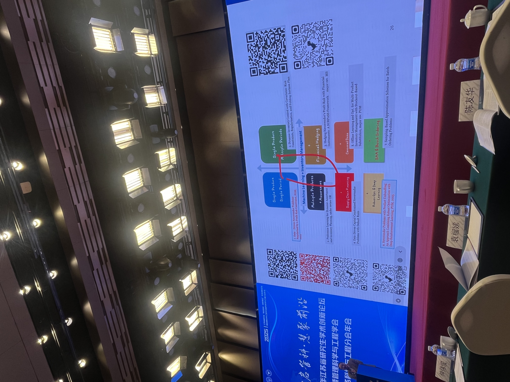

# 10.20 会议纪要

- **新故事+方法论**：最好可以讲好故事，并提出新的方法论，例如MS的**Robust Combination Testing**；模型简单，但是问题背景非常吸引人。**只有复杂方法论容易被challenge**；
- **MS背景延伸**：可以找一些Covid Test相关文章，尽可能不要做incremental的事情；
- **General case和Specific的关系**：两个方向都可以
  - General case --> Specific Case： 由于general case太困难，因此不停加约束，直到收敛到一个确切问题；
  - Specific Case --> General Case: 从一个简单案例出发，扩展到大范围，看看能否有新的见解；

- **背景文献**：广泛多看，不需要都看完再汇报；Frank Chen的Data-driven Inventory Management，画出定位gap的象限图

  

  

## Multi-location Inventory Management

补充之前[9.29会议记录](C:\Users\lipei\Desktop\Missing Data\Idea梳理\9.29 Missing Data Inventory Management.md)，根据Fashion goods的背景，时装一年可以分为上百个micro-seasons, 不同season之间的**sales data可以互相借鉴**。

- Suppose a fast fashion company aims to **forecast sales of a new product** based on **historical observations of other products**. 利用其他商品销售数据预测新商品的补货；

- 同理，可以 **forecast sales of a store** based on **historical observations of other stores**.  通过其他公司的销售数据，推测本公司的销售数据，从而补货. 

  Transfer learning;

- **Multilocation Inventory**: 对不同地区的store同时补货，不同warehouse的数据信息不同，missing data