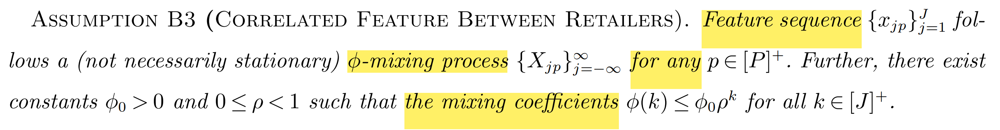

# 10.31 Modelling and Assumption

参考[需求定价可分模型](C:\Users\lipei\Desktop\Missing Data\2-Problem Setting\需求定价可分模型.md)； One-Warehouse,  Multi-Retailer Systems

**背景**：**A central warehouse** responsible for inventory replenishment for **multiple retailers** stores in the city. For example, fresh food in Fresh Hema, usually arrive at the warehouse in the early morning, and are immediately loaded to trucks that  deliver the products to the retail store by 6:00 am on the same day. 

To stay competitive, the company has started to **collect feature information for retail stores** (past sales, demographics, and page views). The feature information can help predict the next day’s demand for the retail store. The company aims to seek a simple and implementable inventory policy that **utilizes the feature data**.

**Fresh Hema’s current policy**:  First use **machine learning** methods to estimate the demand function of features based on historical features. At the beginning of the day, the retailer **observes the features**, calculates the order quantity  based on the demand function according to **the newsvendor solution**, and **places an order** with the warehouse, which ships the ordered inventory to the retailer the following day. 将warehouse作为一个cross-docking location, 解决Newsvendor Problem，将ML估计和优化分开; 现行策略只使用past features，假如使用c**urrent feature**效果可能更好.

## Problem Statement

**Data-driven Multilocation Inventory**

We consider a **one-warehouse, multi-retailer system** in which a central warehouse orders from an outside **unlimited source** and allocates inventory to $J$ **nonidentical retailers** which face random demands.  A central planner decides all the  ordering quantities and the inventories are allocated to each retailer (**system C**).

**Lead time**: Consider the period of one day, then lead time for warehouse is one day and zero lead time for retailers (same-day).

Demand for each retailer $j$ is correlated with **exogenous  features** and a random shock. Unfilled demand is lost and excess inventory is disposed of (or preserved if not perishable). There are linear holding costs and lost-sale costs evaluated at the end of the day. (shipment, holding, lost-sales, and end-of-horizon disposal costs)

Objective: to obtain a data-driven, contextual replenishment and allocation policy such  that **the long-run average cost per period** is minimized. 平均成本最小化(Infinite Horizon), 总期望成本最小化（Finite Horizon).

---

**Assumption**: 

- No transshipment/inventory sharing is allowed.

- No new product; each product is on sale.

- Demand is independent over periods.

- Cost Parameter assumption: $\underline{h}\triangleq\min_jh_j^{\prime}$, $\bar{h} = \max_jh_j$, $\overline{b}\triangleq\max_jb_j$
  $$
  0\leq h_0\leq\underline{h}\leq\bar{h_j}\leq\overline{h} \leq b_j\leq\overline{b}<\infty
  $$

**Multiproduct problem** 考虑$k$种产品；则所有指标都加上$j -> (j,k)$，将$(j,k)$重新编号，用Single Product仍可解决. Multi-retailer 等价于Multi-product；或者假设某种产品的占比为$w_k$，则$\omega_k \mathbf{x}_j^\top\beta$ 即为某种产品的需求。

### Basic Model (Single Product)

Consider a **centralized inventory system** composed of one warehouse and $J$ non-identical retailers over a finite horizon $t\in[T]$ periods. We use $[J]=\{1,\dots, J \}$  and $[J]^+=\{ 0, 1,\dots, J \}$ to denote a set of locations, where $j \in [J]$ denote a retailer and $j=0$ denote the warehouse. 

The warehouse **replenishes** from **outside supplier** with sufficient supply. A central planner **allocates** inventory for each retailer. 

- At the beginning of selling season, the decision maker determines the inventory level $z_0$ for warehouse. 
- The decision maker then observes **covariate** $\boldsymbol{x} = (\boldsymbol{x}_1, \boldsymbol{x}_2,\ldots,\boldsymbol{x}_J) $, which affect the demand during the season. Let $\tilde{\boldsymbol{d}} = (\tilde{d}_j)_{\forall j \in [J]}$ denote the  random demand in retailers. The covariate and demand $(\tilde{\boldsymbol{x}},\tilde{\boldsymbol{d}})$ is governed by a joint probability distribution $\mathbb{P}$.
- The decision maker allocate $z_j$ for each retailer $j$ with unit shipping cost $c_j$. The excess inventory at warehouse incurs holding cost $h_0$  per-unit. 
- The demand $\boldsymbol{d}=(d_j)_{\forall j \in [J]}$ realizes and is fulfilled at each retailer $j$. The unmet demand incurs lost-sale penalty $b_j$ for each unit demand, while the unsold inventory incurs **holding cost** $h_j$. 
- At the end of selling season, the leftover inventory at all locations are disposed. The disposal cost is assumed to be 0, without loss of generality (which can be aggregated to holding cost). 

The expected cost is calculated as:
$$
h_0(z_0 - \sum_{j\in [J]} z_j) + \mathbb{E}_\mathbb{P} \left [ \sum_{j\in [J]} h_j \cdot (z_j - d_j)^+ + b_j \cdot (d_j - z_j)^+ \right ]
$$
The expectation is taken with respect to $\mathbb{P}$. In practice, $\tilde{\boldsymbol{d}}  \sim \mathbb{P}$ is not observable, however, the central planner can leverage the observed covariate $\boldsymbol{x}$ to estimate the conditional distribution $\mathbb{P}(\boldsymbol{d} \mid \boldsymbol{x}) $. Hence, the expected cost is expressed in a more compact form:
$$
h_0 z_0 + \mathbb{E}_{\mathbb{P}(\boldsymbol{d} \mid \boldsymbol{x})} [C(z_0 \mid \boldsymbol{x} )]
$$
where 
$$
C(z_0 \mid \boldsymbol{x} ) = \sum_{j\in [J]} - h_0 \cdot z_j +  h_j \cdot (z_j - d_j)^+ + b_j \cdot (d_j - z_j)^+
$$
Since $(z_j -d_j)^+ = (d_j - z_j)^+ + (z_j - d_j)$,  $h_j \geq h_0$ thus
$$
\begin{aligned}
C(z_0 \mid \boldsymbol{x} ) & = \sum_{j\in [J]} - h_0 \cdot z_j + h_j\cdot( z_j-d_j) +(h_j + b_j) \cdot (d_j - z_j)^+  \\
& =  \sum_{j\in [J]} -h_0 \cdot d_j + (h_j -h_0) \cdot( z_j-d_j) +(h_j + b_j) \cdot (d_j - z_j)^+
\end{aligned}
$$
令$h_j ’ = h_j-h_0, b_j'=h_j+b_j$，则
$$
C(z_0 \mid \boldsymbol{x} ) = \sum_{j\in [J]} -h_0 d_j + h_j'( z_j-d_j) + b_j' \cdot (d_j - z_j)^+
$$
The problem can be formulated as a **two-stage stochastic program**: the decision maker first determines **the replenishment quantity** $z_0$ and then **makes allocation decision** $z_j$ **after observing realized covariates** $\boldsymbol{x} = (\boldsymbol{x}_1, \boldsymbol{x}_2,\ldots,\boldsymbol{x}_J)  $. 
$$
\begin{aligned}
\textrm{Stage 1:} & \quad \min_{z_0 \geq 0} \quad h_0 \cdot z_0 + \mathbb{E}_{\mathbb{P}(\boldsymbol{d} \mid \boldsymbol{x})} [G(z_0 \mid \boldsymbol{x} )] \\
\textrm{Stage 2:} & \quad G(z_0 \mid \boldsymbol{x} ) =\min \ C(z_0 \mid \boldsymbol{x} ) \\
& \qquad \qquad \qquad \ \text{s.t.} 
\ \sum_{j \in [J]} z_j \leq z_0 \\
& \qquad \qquad \qquad \quad
\ z_j \geq 0, \forall j \in [J]

\end{aligned}
$$
The true underlying conditional distribution $\mathbb{P}(\boldsymbol{d} \mid \boldsymbol{x})$ is unknown. A natural way is to replace  the unknown underlying distribution of demands and features with its empirical counterpart.

如果加上以下约束，则没有overage cost:
$$
z_j \leq d_j , \quad \forall j \in [J]
$$
如果考虑的是Multilocation Newsvendor with Inventory Pooling，则该问题可细化为
$$
\begin{aligned}
\textrm{Stage 1:} & \quad \min_{z_0 \geq 0} \quad h_0 \cdot \sum_{j} {y_j} + \mathbb{E}_{\mathbb{P}(\boldsymbol{d} \mid \boldsymbol{x})} [G(\boldsymbol{y} \mid \boldsymbol{x} )] \\
\textrm{Stage 2:} & \quad G(\boldsymbol{y} \mid \boldsymbol{x} ) =\min \ C(\boldsymbol{y} \mid \boldsymbol{x} ) \\
& \qquad \qquad \qquad \ \text{s.t.} 
\ \sum_{i \in [J]} z_{ij} \leq y_j \\
& \qquad \qquad \qquad \quad
\ z_{ij} \geq 0, \forall i,j \in [J]

\end{aligned}
$$
这个建模方式比原问题约束更紧，Cost 2 >= Cost 1. Problem 1是2的一个Relaxation，可以定量分析两个问题

1. **Why one-warehouse, multi-retailer?** $z_0$为什么不等于$\sum_j z_j$? 和Multi-location的区别

   - **OWMR相当于可以库存分享，而且提前订货到仓库；根据当天需求信息重新分配库存，更具有灵活性，而Multi-location不行**。归根到底，是每天需求不确定，而订货有lead time。

     假如订货都是当天到，且需求确定，则无需中心仓库； 

     **OWMR =  Multi-location Newsvendor + Inventory Sharing**

     - Physical pooling: Warehouse; Virtual Pooling: Transshipment

   - 若$z_0 = \sum_j z_j$，则该问题等价于multilocation newsvendor: 
     $$
     \min_{\mathbf{z}\geq0}\mathbb{E}[C(\mathbf{z},\tilde{\mathbf{D}})],
     $$
     在完全信息条件下，应该是$z_0 = \sum_j z_j$的，订货和分配同步确认，无需仓库；

     假如满足balance assumption，每个retailer可以得到ample supply，每个retailer求解一个newsvendor解$z_j$，然后$z_0=\sum_j z_j$。如果warehouse不能满足库存需求，则需要加收penalty；如果能满足，则相当于warehouse只是cross-docking，不需要allocation。

   - 若$z_0 \geq \sum_j z_j$，则为OWMR问题，**两阶段决策**；

     **存在Lead time**: $z_0$到达有延迟，第二阶段需求分布未知，若$z_0$多则避免缺货损失，但是订货增多；若$z_0$少则避免库存成本，但可能造成缺货。

     $z_0$和$\sum z_j$是否相等，关键在于两个决策是否同步:
     - 如果$z_0$和$z_j$同时决策，那么$z_0 = \sum_j z_j$，决策者不会多订货；
     - 如果$z_0$先决策，$z_j$后决策，那么这是两阶段决策two-stage stochastic optimization，由于第二阶段需求/Covariate分布未知，$z_0$不一定等于$\sum_j z_j$。

2. Covariate是在$z_0$之前before还是之后实现after？这影响建模

   - 若在$z_0$之前实现，相当于观察past feature后做出所有订货分配决策，将观察的feature作为真实分布，应当有$z_0 = \sum_j z_j$； 

   - 但是若是观察了current feature，两个决策不同步，即在$z_0$之后实现，则需求可能变化，allocation不一定等于$z_0$。

     DM makes allocation decision after observing the covariates; OWRS等价于Multi-location Newsvendor + Inventory Sharing

   

## **Data Aggregation Model**

Suppose we have access to $J$ **separate data sets** collected by each retailer $j$.  Each retailer $j$ keeps tracks of sales on a periodic basis, forming an data set  $\mathbb{D}_j$ consisting of $N_j$ data points $\{(\boldsymbol{x}^{(1)}_j,d^{(1)}_j),\ldots,(\boldsymbol{x}^{(N_j)}_j,d^{(N_j)}_{j}) \}$ . 

- **Covariate**  $\boldsymbol{x}_j \in\mathcal{X}\subseteq\mathbb{R}^p$: records the contextual features including *product features* (size, color, brand, price, etc.), *temporal features* (date, week day/Time, festival, event type, etc),  *demographics*. $p$ is dimension of covariate. (不同于Lou，Lou假设各数据)

  Feature matrix $\boldsymbol{X}_j = (\boldsymbol{x}^{(1)}_j, \boldsymbol{x}^{(2)}_j, \ldots, \boldsymbol{x}^{(N_j)}_j) \in \R^{N_j \times p}$ . Stacking all the feature $\boldsymbol{X}=(\boldsymbol{X}_1,\ldots,\boldsymbol{X}_J) \in \R^{N\times p}$ where $N = \sum_{j\in [J] N_j}$.

  - **Fixed-Design Feature** $\boldsymbol{x}_j^f \in \R^{p_1}$: **deterministic**, predefined by planners, product features and temporal features. 假设一定能记录；可作为auxiliary covariate.

  - **Random design feature $\boldsymbol{x}_j^r  \in \R^{p_2}$ **: **random**,  *demographics* , price, storage, lagged sales.

    $p_1+p_2=p$, then according to linear demand function:
    $$
    d_j = \alpha_j+(\boldsymbol{x}_j^{f})^{\top} \boldsymbol{\beta_j}^f+(\boldsymbol{x}_j^{r})^{\top} \boldsymbol{\beta_j}^r+ \tilde{\varepsilon}_j
    $$
    where $\boldsymbol{\beta_j}^f$ and $\boldsymbol{\beta_j}^r$ are linear coefficients in the right dimension.

- **Demand $  d_j \in  \R $ ** : suppose there is no censoring (can be relaxed later).  Sales matrix $\boldsymbol{D}_j  = ({d}^{(1)}_j, {d}^{(2)}_j, \ldots, d^{(N_j)}_j) \in \R^{N_j } $, $\boldsymbol{D}=(\boldsymbol{D}_1,\ldots,\boldsymbol{D}_J) \in \R^{N}$. 这里可能需要矩阵大小方正。

  假如被censored，可以Recover the demand: With the sales amount in the in-stock period,  Hema can **calculate the hourly demand rate**. Then, the  lost sales can be estimated as the **hourly demand rate  times the out-of-stock period**.  

We assume the demand model follows **linear demand function**:

- **Assumption 1: Linear Demand function**: 
  $$
  d_j = \alpha_j+\boldsymbol{x}_j^\top \boldsymbol{\beta_j}+ \tilde{\varepsilon}_j
  $$
  where $\alpha_j$ is constant, $\boldsymbol{\beta_j} =( {\beta_{j1},\ldots,\beta_{jp}})$ is the nonzero linear coefficient vector with $ \|\beta_{jp} \|_{\infin}\leq \bar{B}$, and $\tilde{\varepsilon}_j$ is bounded random noise with mean zero, independent of $\boldsymbol{x}_j$.

- **Assumption 2: Are these distributions independent?** 

  - 如果**independent**, 如何能用$j$的信息，预测$j+1$的分布？

    If so, then $\mathbb{P}(\boldsymbol{x}) = \Pi_{j \in [J]} \mathbb{P}_{\boldsymbol{x}_j} $ and $\mathbb{P}(\boldsymbol{d} \mid \boldsymbol{x}) = \Pi_{j \in [J]} \mathbb{P}_{(\boldsymbol{d}_j \mid \boldsymbol{x}_j)} $ ，那么 $\tilde{\varepsilon}_j$ are independent over retailers. 

  - 如果**不是independent**，demand features of different retailers are **correlated**; 效果未知

    Any pair of $(\tilde{\varepsilon}_{j},\tilde{\varepsilon}_{k}), \forall j,k\in[J]$ may be correlated; Each feature $x_{jp}$ of any retailer $j_1,j_2 \in [J]$ can be correlated, $\mathrm{Cov}(x_{jp},x_{kp}) \geq 0, \forall j,k\in[J]$.

    

**Independent Case**

 We use $\mathbb{P}_{\boldsymbol{x}_j}$ and  $\mathbb{P}_{d_j \mid \boldsymbol{x}_j}$  [5]:  这些分布是从数据$\mathbb{D}_j$估计出的，
$$
\boldsymbol{x}^{(i)}_j \sim^{i.i.d}\mathbb{P}_{\boldsymbol{x}_j}, d_j^{(i)} \mid \boldsymbol{x}_j   \sim^{i.i.d} \mathbb{P}_{d_j \mid \boldsymbol{x}_j}, \forall i \in [N_j], j \in [J]
$$
where $\mathbb{P}_{\boldsymbol{x}}^{(j)}$ denote the distribution function of $\boldsymbol{x}^{(i)}_j\in\mathcal{X}\subseteq\mathbb{R}^p$ , and $\mathbb{P}_{(\boldsymbol{d} \mid \boldsymbol{x})}^{(j)}$ denotes the conditional distribution of the response $  d_i \in  \R $ given $\boldsymbol{x}^{(j)}_i$.  

- **Assumption 3: Can these distributions be different?** 

  If covariate $\mathbb{P}_{\boldsymbol{x}_j}$ can be all different -> *Covariate shift*;

  If response $\mathbb{P}_{d_j \mid \boldsymbol{x}_j}$ different -> *Response drift*. 

Our goal is to estimate $\boldsymbol{\beta}_j,\forall j \in [J]$ accurately in order to make replenishment decisions based on the predicted response: 
$$
\textrm{Gold Model}: d_j = \alpha_j+\boldsymbol{x}_j^\top \boldsymbol{\beta_j}+ \tilde{\varepsilon}_j
$$
In practice, we often have very limited **gold data**, leading to high-variance erroneous estimates. We can **pool the data aggregated from each retailer** $j$. Hence, we have $\mathbb{D} = \cup_{j \in [J]} \mathbb{D}_j$.  The reason why we employ data aggregation is to utilize information from all the data. [6,7] The proxy  demands often follow similar temporal patterns as the  original demands.

We use **Aggregated Data** to predict a proxy model:
$$
\textrm{Proxy Model: } d_0 = \alpha_0 + \boldsymbol{x}_0 ^\top \boldsymbol{\beta} + \tilde{\varepsilon}_{0}
$$
We have to make assumptions on the relationships on $\boldsymbol{\beta}$ and $$\boldsymbol{\beta}_j, \forall j \in [J]$$ to enable transfer learning.  **介绍Bostani的Proxy Model**：

- **Assumption A: The proxy predictive task is closely related to the true predictive task.  **即$\boldsymbol{\beta}^* \approx \boldsymbol{\beta}_j^*$ .
  $$
  \boldsymbol{\beta}^* = \boldsymbol{\beta}_j^*+ \delta_j^* , \forall j \in [J]
  $$
  where $\delta_j^*$ denote the proxy estimator's bias with respect to the gold estimator. $|\delta^*||_0=s$

  不一定是所有店，可以根据市场知识得到一类接近的店面

  Bastani: Predicting with Proxies: Transfer Learning in High Dimension

- **Assumption B: Suppose all coefficients are the same， **$\beta = \beta_j, \forall j \in [J]$. 假设一致，先加总后

  Lei et al.: Pooling and Boosting for Demand Prediction in Retail

由于很多特征是共享的，例如$\boldsymbol{x}_j^f$; 可以假设random design的维度较小

### Missing Data Setting

However,  **the data may be incomplete**, some entries of data may be lost.  

- **Missing data/Partially Observed Data **: Some entries of data are lost or not observed (**features or sales**).  Such a setting is prevalent in reality:
  - Example 1 **Observational Data**:  Some products are never sold in some retailer $j$，we have not observed the counterfactual outcomes that never occurred.
  - Example 2  **Record Failure**: Each retailer $j$ has different systems,  some features may fail to be completely recorded.
  - Example 3 **Fragmented Data**： Some entries of data is polluted, which is pathological .

The missing data render the ERM problem ill-posed, lacking key information potentially leads to **biased estimation** and **inferior prescriptive performance**. Simply discarding the incomplete data will harm the data availability, especially when data is scarce (low sale).

- **Gold Data**: Complete and good data for retailer $j$; 
- **Proxy Data**: The aggregated data with **missing entries**.

Impute->Aggregation->Predicting:

## Multi-period, Single Product

 The sequence of events are as follows: 多考虑一个Inventory Position

- At the beginning of period $t$，the planner observes the initial on-hand inventory levels $I_j^t, j \in [J]^+$ at all locations. The planner  determines the inventory level of warehouse  $z_0^t$ after delivery, which will be received at the beginning of period $t+1$ (lead time = 1 period). Assume the warehouse start replenishing at period 0 (before the horizon).

- At the beginning of period $t+1$, the planner determines the inventory level after allocation, $z_j^{t+1},j\in[J]$. The delivery is instantaneous (same-day delivery), and incurs shipping cost $c_j (z_j^{t+1}-I_j^{t+1})$. The holding cost $h_0$ is incurred for excess inventory at the warehouse. 

- During period $t+1$,  the planner observes **covariate** $\boldsymbol{x}_j^{t+1}$ of retailer $j$, which affect the random demand $D_j^t(\boldsymbol{x}_j^{t+1})$ during period $t+1$.  After demand realizes, the unit holding cost $h_j$ is charged for excess inventory and unit lost-sale penalty cost $b_j$ for lost sales.
  $$
  I_0^{t+1}= z_0^t - \sum_{j \in [J]} z_j^t \\
  I_{j}^{t+1}=\left(z_{j}^t-D_{j}^t\right)^+, t \in [T], j \in [J] \\
  z_0^t \geq 0, z_j^t \geq 0,I_0^{t+1} \geq 0
  $$
  Demand $\tilde{\boldsymbol{D}} \sim \mathbb{P} $ is unobservable, all we know is covariate $\boldsymbol{x}$; the contextual distribution $\mathbb{P}(\boldsymbol{D} \mid \boldsymbol{x})$ .

- At the end of time horizon, the leftover inventory at all locations incurs disposal cost $w$. The multiperiod stochastic

## 参考文献

[1] Jingkai Huang, Kevin Shang, Yi Yang, Weihua Zhou, Yuan Li (2025) Taylor Approximation of Inventory Policies for One-Warehouse, Multi-Retailer Systems with Demand Feature Information. Management Science 71(1):879-897.

- Data is assumed to be complete; **Demand features are  independent between retailers** and **i.i.d. between time  periods.** 假设需求数据均已知，并且特征完全独立，这不符合实际。

[2] Zhang, L., Yang, J., & Gao, R. (2024). Optimal robust policy for feature-based newsvendor. *Management Science*, *70*(4), 2315-2329.

- **Feature-Based Newsvendor using DRO**

[3] Ferreira, K. J., Lee, B. H. A., & Simchi-Levi, D. (2016). Analytics for an online retailer: Demand forecasting and price optimization. *Manufacturing & service operations management*, *18*(1), 69-88.

[4] Li, M., Simchi-Levi, D., Tan, R., Wang, C., & Wu, M. X. (2025). Contextual offline demand learning and pricing with separable models. *Management Science*.

[5] Ban GY, Rudin C (2019) The big data newsvendor: Practical insights  from machine learning. Oper. Res. 67(1):90–108.

[6] Dazhou Lei, Yongzhi Qi, Sheng Liu, Dongyang Geng, Jianshen Zhang, Hao Hu, Zuo-Jun Max Shen (2024) Pooling and Boosting for Demand Prediction in Retail: A Transfer Learning Approach. Manufacturing & Service Operations Management

[7] [Hamsa Bastani](https://pubsonline.informs.org/action/doSearch?text1=Bastani%2C+Hamsa&field1=Contrib) (2020) Predicting with Proxies: Transfer Learning in High Dimension. Management Science 67(5):2964-2984.