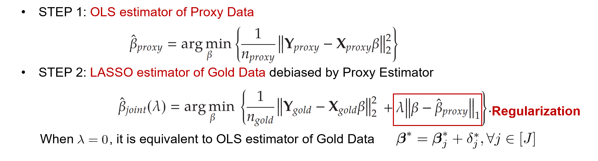
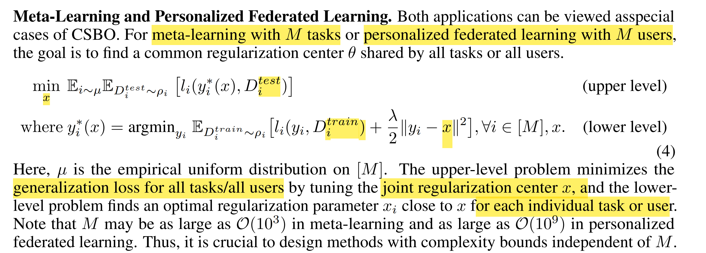
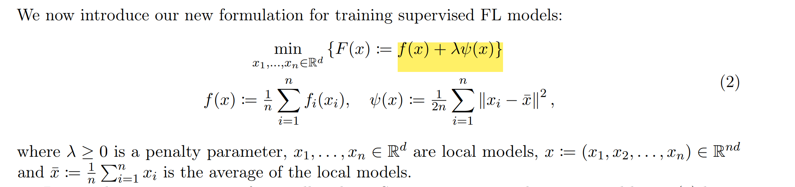
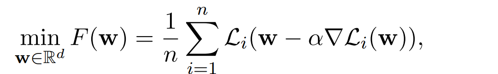
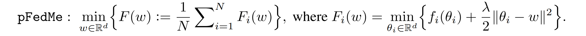
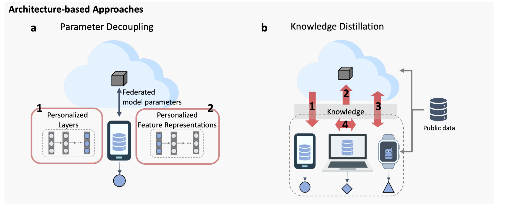

# 11.25 Transfer Learning方式

- 两种思路：Regualarization+DRO, 一定可行；Mixture Distribution

Multi-Retailer: 牵涉到Meta-Learning, Personalized Federated Learning 联合学习，相当于transfer learning的泛化版本。

区别在于

1. Transfer learning 只调优一个任务的weight，注重常规参数; 
2. **meta-learning adapts to many new tasks efficiently** 快速迁移，而且更注重宏观模型meta model; 
3. PFL额外关注**privacy**，每个user只接收其他模型的weight，而非整体data

- **Transfer Learning**: 以Proxy为样本，对Gold Data调优，**适用范围：只考虑整体对局部的要求，而局部不影响整体。**

  同时对多个任务进行Regularized local loss，则为meta learning.

  

- **Personalized Federate Learning （PFL)/Meta Learning**: 在上述基础上，第一步的proxy优化是知道第二步的优化参数$y_i$，最优化整体的loss。**优点：整体影响局部，而局部又影响整体**

  - Personalized Federated Learning with Moreau Envelopes

  

  - **Bi-level Optimization**: The upper level problem minimizes **the generalization loss for all tasks/all users** by **tuning the joint regularization center x** ；

    and the lower level problem finds an optimal regularization parameter $x_i$ close to $x$ for each individual task or user.

  - PFL对$n$个客户协同训练不同的模型，**每个retailer只保留自己的数据**，对应参数为$\theta_i$，总的目标是最小化总loss function:
    

    每个loss function定义为：
    

- 处理PFL的几种方式：重点参考mixing model, regularization和local fine tuning

  1. **Mixing models /Model interpolation** 将local model和global model混合：local data数量少，希望利用global model的泛化性，同时降低heterogeneity造成性能下降；

     *Adaptive Personalized Federated Learning*

     - Global model: $\bar{h}^*=\arg\min_{h\in\mathcal{H}}\hat{\mathcal{L}}_{\bar{\mathcal{D}}}(h),$  其中$\bar{\mathcal{D}}=(1/n)\sum_{i=1}^n\mathcal{D}_i$，平均成本最低；

     - Local model: 考虑部分global model； 这里结合使用了Weighted Loss Estimator

     

     - 最终estimator为global和local的**凸组合**,  Model Averaging Estimator已被证明效果不好

     

     ---

     *Federated Learning of a Mixture of Global and Local Models*
     **另一种方法**：类似于Regularization，只不过一次优化，只考虑训练一个FL模型，联合优化所有local参数。Bastani考虑的也是一个mixed model，只不过分成两部。
  
     
  
     **启发：**假设global model的residual distribution为$\mathbb{P}$, local model的是$\mathbb{P}_i$，mixture distribution对应的集合为分布凸组合，在此基础上增加robust；mixture的程度影响personalization效果
  
  2. **Meta-learning / Local fine-tuning:**通过Model-Agnostic Meta-Learning (MAML)， 先学一个global model再fine tune，目标函数是最小化fast adaption，有梯度；
  
     *Personalized Federated Learning: A Meta-Learning Approach*
  
     *Improving federated learning personalization via model agnostic meta learning*
  
     
  
     **Bilevel Optimization**: 其中$\boldsymbol{w}$是meta-model，而gradient代表从meta-model进行adaptation，更改梯度
  
     **启发**：类似于Transfer learning，局部调优，建立集合；这种方法缺点是overfit，应该考虑泛化性能
  
  3. **Model Regularization**: 对local model采取regularized loss，对global和local之间的距离采用regularization
  
     *Personalized Federated Learning with Moreau Envelopes*
     $$
     f_i(\theta_i)+\frac{\lambda}{2}\|\theta_i-w\|^2,
     $$
     与Bastani不同的是，总目标采用Bilevel Problem，上层问题考虑下层问题影响：
  
     
  
     **启发**：用global和local的远近，对模型进行regularize；是否加入bilevel optimization
  
  4. **Clustering** 先将相似user聚类，再对每个group训练一个model，只有相似的subset有共同模型.
  
     *Personalized federated learning with first order model optimization.*
  
      *Three approaches for personalization with applications to federated learning.*
  
  5. **Multi-task Relationship learning**: 和Meta learning类似，训练一个模型可以在多个任务表现优良，然后根据不同task的pair-wise Relationship区别（例如Covariance Matrix)，进一步对问题调优。

     - **STEP 1**： global model是**linear combination of local model**，和single global model不同
       $$
       u_c=\xi_{c,1}\theta_1+...+\xi_{c,m}\theta_r
       $$
  
     - **STEP 2**: Personalized model进行调优
  
       
  
  6. **Separable Model / Parameter Decoupling**：将模型的parameter做切分，global model只关注自己部分的训练，local model训练personalized。类似于[需求定价可分模型](C:\Users\lipei\Desktop\Missing Data\2-Problem Setting\需求定价可分模型.md)；Split learning, 其中feature可以切分，每种feature选择不同模型，相当于训练不同部分，再组合起来。
  
  7. **Knowledge Distillation**：知识蒸馏，将现存模型的知识进行浓缩，然后传递；根据方向不同，可分为4类
  
     