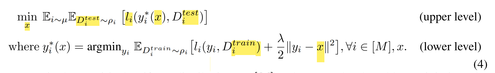
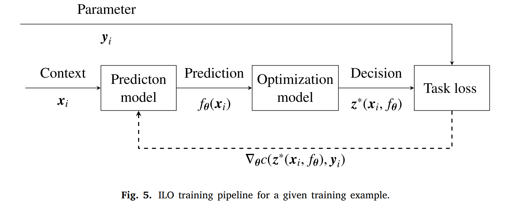

# Multi-source Contextual DRO

参考[Entropic Regularization for Wasserstein DRO](C:\Users\lipei\Desktop\Robust Optimization\RO研讨会\2- Entropic Regularization of WDRO.md)，这里在

- **Idea 1 Two Step Optimization：Estimate and Regularized DRO** : Regularized Regression + Residual-DRO；这里的regularization是加在OLS回归里的，**是否可以在Contextual Robust Optimization里加Regularization.**

  

  借用Transfer Learning中的Regularization，不对OLS回归函数regularize; 而是**将Global Residual Distribution做Reference进行Regularization**。有如下几种方法：

  - **对分布距离Regularize**，采用Sinkhorn Discrepancy
    $$
    \mathcal{W}_\epsilon(\mathbb{P},\mathbb{Q})=\inf_{\gamma\in\Gamma(\mathbb{P},\mathbb{Q})}\left\{\mathbb{E}_{(x,y)\thicksim\gamma}[\|x-y\|^2]+\epsilon\mathbb{E}_{(x,y)\thicksim\gamma}\left[\log\left(\frac{\mathsf{d}\gamma(x,y)}{\mathsf{d}\gamma(x)\mathsf{d}y}\right)\right]\right\}
    $$
    **缺陷：KL-divergence只对连续分布有效，而对离散分布无效**；It is the difference between **cross-entropy and (true) entropy of the same distribution**.

    可以扩展到Phi-divergence，同样只针对连续分布；
    
    可以考虑加入$\text{global distribution}$的Regularization; 
    $$
    f(\boldsymbol{x},\boldsymbol{z})-\tau\leq\kappa(\Delta(\mathbb{P},\hat{\mathbb{P}}_{{local}})-\Gamma)^++\hat{\kappa}(\Delta({\mathbb{P}},\hat{\mathbb{P}}_{global})-\hat{\Gamma})^+ \\
    \qquad \qquad \qquad \qquad \qquad \forall\mathbb{P}\in\mathcal{P}_{0}\left(\mathcal{Z}\right)\quad (3)
    $$
    
  - **对分布距离Regularize**，但是考虑Wasserstein Distance, 只不过要考虑的不是$x,y$分布之间距离，而是$x$与固定分布$\hat{\mathbb{P}}_{\text{global}}$的距离
    $$
    \mathcal{W}_\epsilon(\mathbb{P},\mathbb{Q})=\inf_{\gamma\in\Gamma(\mathbb{P},\mathbb{Q})}\left\{\mathbb{E}_{(x,y)\thicksim\gamma}[\|x-y\|^2]+\epsilon\mathbb{E}_{(x,z)\thicksim \Gamma(\mathbb{P}, \hat{\mathbb{P}}_{\text{global}})}\left[\left(\|x-z\|^2\right)\right]\right\}
    $$
    即随机变量$x$的分布，既要考虑和$\mathbb{Q}$的距离，又要考虑和global distribution的距离；由于这是residual function，考虑和global residual的距离，则相当于一种Regularization; 

    **缺陷：Tractability很差，加入这一项可能不可解**

  - 对目标函数Regularize, 目标函数不是最小化某个$j$的cost，而且要考虑Regularization，即和global estimator的差值; 即**决策变量存在regularization**
    $$
    \min_{z_j} \mathbb{E}_{d \sim \mathbb{P}_j} [C(z_j,d)] + \lambda \|z_j-z_{\text{global}}\|^2
    $$
    where 
    $$
    z_{\text{global}} =\min_z \mathbb{E}_{d \sim \mathbb{P}_{\text{global}}} [C(z,d)]
    $$
    **缺陷：可能存在量纲不同的情况，$\lambda$不好确定**

  - **重点考虑**：对目标函数Regularize，不用决策变量，而**用cost difference进行Regularize**：（Fairness)
    $$
    \min_{z_j} \mathbb{E}_{d \sim \mathbb{P}_j} [C(z_j,d) + \lambda (C(z_j,d) - \hat{C}(z_j) ]
    \\
    \Rightarrow \min_{z_j} \mathbb{E}_{d \sim \mathbb{P}_j} [C(z_j,d)  ] - \lambda^\prime \hat{C}(z_j)
    \\
    \Rightarrow \min_{z_j} \mathbb{E}_{d \sim \mathbb{P}_j} [C(z_j,d)  ] - \rho(\hat{C}(z_j))
    $$
    where 等式是根据Regularized cost变换scale得到
    $$
    \hat{C}(z_j) = \mathbb{E}_{d \sim \mathbb{P}_{\text{global}}} [C(z_j,d)]
    $$
    即目标函数用和global cost的差值进行Regularize；

    **优点是量纲相同，意义明确**

    **缺陷：不太出彩，也许可以推广成Multi-source PTO+Regularization的问题**；即有reference cost的PTO
    
  - **现在思路**：考虑ETO类似的**decision-aware regularization，** -- 类似于 Gao Rui的

    

- **Idea 2: Bilevel Optimization: Optimization+Optimization, Estimation+Estimation, Estimation+Optimization** 由于需要两层优化，可以将local estimation/optimization作为second level; **和Idea 1区别在于，Idea 2需要Bilevel Optimization**, 上层考虑下层，下层又考虑上层. 这只是方法论层面的内容

  - *Optimization + Optimization:* **Upper level是global cost by global estimator，而lower level是local cost by local estimator**.  这里最小化

    Upper level: 选择择joint regularization center $x$，最小化所有task的total costs；

    Lower level: 在已知global decision  $x$的情况下，最小化local cost;

  $$
  \text{Upper Level:} \min_x
  $$

  - *Estimation + Etsimation*: **Upper level是Global loss，Lower level是local loss**，local loss采用对第一阶段的regularization.  这里最小化**Estimation Loss**

    **Upper level**: 通过选择joint regularization center $x$，最小化所有task的generalization loss；

    **Lower Level**: Find $y_i$ close to $x$ for each individual task

    

  - *Estimation+Optimization*: 先Estimate, 再Optimize, 但是estimator考虑optimizer；

    **Upper level**: Estimation:  seeks the best estimator 找最佳Estimator $x$

    **Lower Level**: Optimization: 在每个Estimator $x$和contexts $\xi$下最小化total cost

    