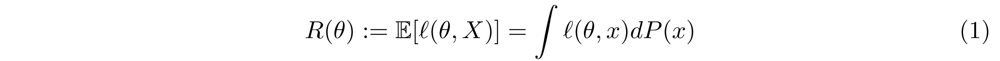
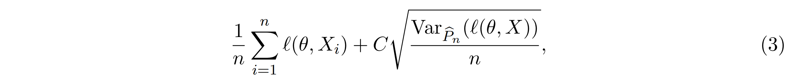
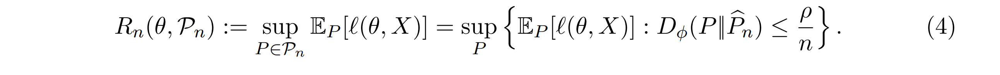
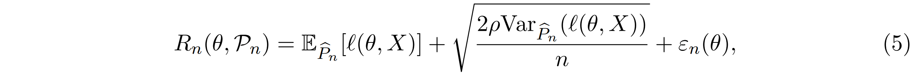
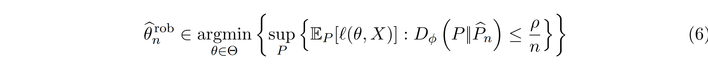
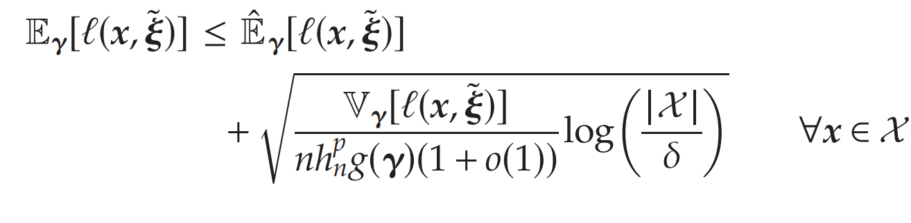
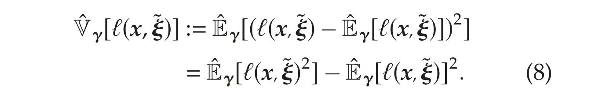
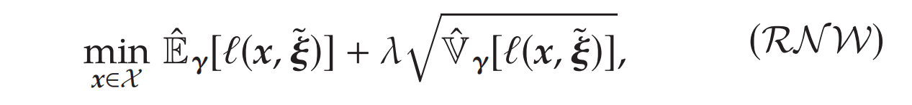
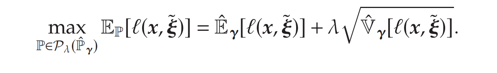
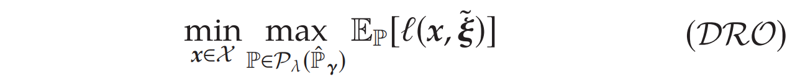

# Variance-based regularization

参考：

- **Variance-based Regularization** with Convex Objectives
- On Data-Driven Prescriptive Analytics with Side Information: A **Regularized Nadaraya-Watson Approach** 推广到CSO问题

## **Variance-based Regularization** 

**核心思想**：真实SO和ERM解存在Performance guarantee, 即SO解不超过ERM+Variance+constant，因此通过求解**ERM+Variance of loss function**，得到真实SO的渐进最优解。

已知真实SO为

其中$\ell$是loss function, $\Theta$是parameter space，而$X$是random variable

真实和ERM的**概率保证**为

即$R(\theta)$和ERM最优值；其中第一项$\frac{1}{n}\sum_{i=1}^n\ell(\theta,X_i)$代表估计的bias，而第二项是variance。

**从Bound直接最小化bias-variance**：即从bound中看出，要控制$R(\theta)$，只需控制上界，即最小化**variance-regularized ERM**:

其中$\operatorname{Var}\widehat{P}_n$代表loss function在Empirical distribution下的variance。然而该方法通常是intractable的，即使在$\ell$对$\theta$是凸函数的情况下。

---

**本文方法 - Phi-divergence based DRO**

本文采用基于Phi-divergence的分布集合，进行Regularization; 首先定义Phi-divergence，两个分布测度$P,Q$之间的Discrepancy差距：
$$
\begin{aligned}
D_\phi\left(P\|Q\right)=\int\phi\left(\frac{dP}{dQ}\right)dQ=\int_{\mathcal{X}}\phi\left(\frac{p(x)}{q(x)}\right)q(x)d\mu(x),
\end{aligned}
$$
其中$\phi:\mathbb{R}_+\to\mathbb{R}$是convex function，满足$\phi(1)=0$; 而$P, Q$满足$P,Q\ll\mu,\mathrm{~and~}p=\frac{dP}{d\mu},q=\frac{dQ}{d\mu}$，即对测度$\mu$绝对连续。

这里采用$\phi(t)=\frac{1}{2}(t-1)^2$，即$\chi^{2}$-divergence. 定义Phi-divergence based ambiguity set，以Empirical Distribution为中心的邻域：

那么此时$\mathcal{P}_n$包含support为$\left\{X_i\right\}_{i=1}^n$的离散分布；

**Robustly Regularized Risk/Robust Learning**: 即采robust empirical risk

可以从概率性质证明，Robust ER $R_n(\theta,\mathcal{P}_n)$和Variance-regularized ERM**渐进等价**:

$\varepsilon_n(\theta)\leq0$且order为$O_P(1/n)$，因此DRO和Regularized ERM可以互相近似。

**DRO比Regularized ERM提供了真实SO更紧的上界**；

当$\ell$ convex且$\theta$是convex set，最终问题是个convex optimization problem

## Nadaraya–Watson kernel regression

假如随机变量的联合分布已知，则真实的**Contextual Stochastic Optimization**问题如下，最小化loss function的conditional expectation.

$\ell(\boldsymbol{x},\tilde{\boldsymbol{\xi}})$是loss function，其中$\boldsymbol{x}\in\mathbb{R}^d$是决策变量，而$\tilde{\boldsymbol{\gamma}}:=(\tilde{\gamma}_1,\ldots,\tilde{\gamma}_p)$是exogeneous covariate, $\tilde{\boldsymbol{\xi}}:=(\tilde{\xi}_1,\ldots,\tilde{\xi}_q)$是random outcome.

The value of the side information γ is revealed before the decision is made. 提前已知side information，以及$(\tilde{\boldsymbol{\gamma}}, \tilde{\boldsymbol{\xi}})$**回归关系**的情况下，决策可以大幅提高。
$$
\left.\tilde{\xi}_i(\tilde{\gamma})=
\begin{array}
{ll}0.5-\tilde{\gamma}^2+0.1\cdot\tilde{\epsilon}_i & \forall i=1,2, \\
\end{array}\right.
$$
本文在Contextual Stochastic Optimization的情景下，引入了上述Variance-based Regularization

##  NW kernel regression estimator

为了近似SO，采用NW kernel regression近似loss function的conditional expectation:

其中$\mathcal{K}$是Kernel function，而$h>0$是bandwidth parameter。本文采用

这里$Z=\int_{\mathbb{R}^p}\exp(-\|\theta\|_2)\mathrm{d}\theta$是normalization常数。显然Kernel函数反应，当两点$\gamma-\gamma^i$差值越大，对应Kernel函数值越小，反之则越大。因此Kernel函数鼓励距离近的点，进行加总。

NW-estimator $(\mathcal{N}\mathcal{W}_{\mathrm{est}})$ **是**SAA的推广，可以叫**weighted SAA**：

- 当bandwidth parameter $h$很大时， $(\mathcal{N}\mathcal{W}_{\mathrm{est}})$ 退化为普通的SAA$\frac{1}{n}\sum_{i=1}^n\ell(x,\xi^i)$；
- 当bandwidth parameter $h$很小时，大多数权重都放在了距离$\gamma$最近的点；
- 选择$h=O(1/n^{1/(p+4)})$可以达到一个bias-variance的平衡。

**采用NW-estimator就可以得到SO的近似问题**：

---

**本文首次得到CSO的NW-近似问题的 Generalization Bounds.** 

以下是Finite-Sample Guarantee, **Convergence rate**为指数级别：

 指的是在真实分布下，当样本量增长时，NW-estimator和真实conditional expectation偏差超过$\epsilon$的概率，**随$nh_n^p$指数衰减**。**管理启示**：

- $g(\boldsymbol{\gamma})$ 是scaled marginal density function of $\gamma$，即side information的边缘分布；当$g(\boldsymbol{\gamma})$取值很小，error就大，说明现有side information数据量很小，需要收集更多数据提高精度。当$g(\boldsymbol{\gamma})$较大，则该side information附近数据密集，所需的相关数据较少就可以预测得准、
- $\mathbb{V}_\boldsymbol{\gamma}[\ell(x,\tilde{\xi})]$是已知$\boldsymbol{\gamma}$的情况下，**loss function的conditional variance**。当$\mathbb{V}_\boldsymbol{\gamma}[\ell(x,\tilde{\xi})]$条件方差大，则预测的精度较低，需要更多的历史样本；**这说明要控制conditional variance**，以减少预测误差

将RHS设定为$\delta$，固定一个解$\boldsymbol{x} \in \mathcal{X}$，可求出偏差以至少$1-\delta$的概率满足**generalization bound**：

可以立刻得到对所有$\boldsymbol{x} \in \mathcal{X}$都是用的**uniform generalization bound**:

可以看到，bound随the feasible set $\mathcal{X}$的维度，**呈对数上升**；因此最多和decision vector $\boldsymbol{x}$的维度**呈线性上升**。

- Generalization bound依赖于维度$p$，当维度很大时，存在 curse of dimensionality，因此以下会提出主成分分析法，降低维度 dimensionality reduction scheme

### Variation Regularization in NW-Estimator

从以上分析可知，当Conditional  variance $\sqrt{\mathbb{V}_\gamma[\ell(x,\tilde{\xi})]}$很小的时候，此时Estimation的偏差很小；因此令Conditional  variance很小，将保证solution有很强的generalization.

为了控制Conditional  variance $\sqrt{\mathbb{V}_\gamma[\ell(x,\tilde{\xi})]}$，采用**Empirical版本**：

这时，控制NW-近似问题+$\hat{\mathbb{V}}_\gamma[\ell(x,\tilde{\xi})]$，即可保证generalization bound: 这就是**variance-regularized NW  approximation**：注意这个问题实际上等价于**Phi-divergence DRO**.

**不同点：之前的Regularization都研究的是Unconditional Setting，我们研究的是Conditional Setting.**

注意该问题的Regularization term是Nonconvex的，因此不可解；当loss function是一个分段线性函数$\ell(x,\tilde{\xi})=\max_{j\in[m]}\boldsymbol{a}_j(\boldsymbol{x})^\top\tilde{\boldsymbol{\xi}}+b_j$，原文将不可解的项转化成一个 **mixed-integer SOCP formulation**

---

**Sub-Optimality分析**：主要分析$(\mathcal{R}\mathcal{N}\mathcal{W})$和$(\mathcal{S}\mathcal{O})$的差值

首先考虑将Conditional  variance $\sqrt{\mathbb{V}_\gamma[\ell(x,\tilde{\xi})]}$和对应Empirical variance $\sqrt{\hat{\mathbb{V}}_\gamma[\ell(x,\tilde{\xi})]}$的差值：

对于tolerance level $\tau > 0$，可以调整，使后面的根号项不太大，因此这个替换不会引起太大的suboptimality。

接下来，分析$(\mathcal{R}\mathcal{N}\mathcal{W})$和$(\mathcal{S}\mathcal{O})$的Suboptimality bound；其中$\hat{\boldsymbol{x}}$是$(\mathcal{R}\mathcal{N}\mathcal{W})$的minimizer，而$\boldsymbol{x}^*$是$(\mathcal{S}\mathcal{O})$的minimizer。

该bound说明，当Conditional  variance $\sqrt{\mathbb{V}_\gamma[\ell(x,\tilde{\xi})]}$足够小时，$(\mathcal{R}\mathcal{N}\mathcal{W})$ 的$\hat{\boldsymbol{x}}$converges to $(\mathcal{S}\mathcal{O})$的minimizer $\boldsymbol{x}^*$；收敛速率是$O(1/(nh_n^p)).$ 

### Standard Deviation Regularization = DRO

当考虑loss function $\ell(x,\xi)$是关于$x$的convex function, $\xi\in\Xi$; standard deviation regularization and DRO可以联系起来

类似Duchi，本文提出对应的DRO问题：

1. **NW构建预测经验分布**：相当于Reweighted SAA

   权重：$\overline{w}_i=K_h(\boldsymbol{\gamma}-\boldsymbol{\gamma}^i)/\sum_{j=1}^nK_h(\boldsymbol{\gamma}-\boldsymbol{\gamma}^j),$

   Empirical Conditional Distribution: $\hat{\mathbb{P}}_\gamma=\sum_{i=1}^n\overline{w}_i\delta_{\boldsymbol{\xi}^i}$

2. **构建模糊集**：

   

   这里$\mathcal{P}_\lambda(\hat{\mathbb{P}}_{\boldsymbol{\gamma}})$是以$\hat{\mathbb{P}}_{\boldsymbol{\gamma}}$为中心的$\chi^2-$ambiguity set，权重$w\in\Delta^n$；

   当$\hat{\mathbb{V}}_\gamma[\ell(\boldsymbol{x},\tilde{\boldsymbol{\xi}})]\geq\lambda^2$，此时**standard deviation regularization and DRO等价**：

   

   此时，求解DRO问题即可：

   

   该问题可以等价转化为SOCP问题；该问题是Convex Problem，比DRO更好解。