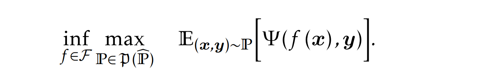
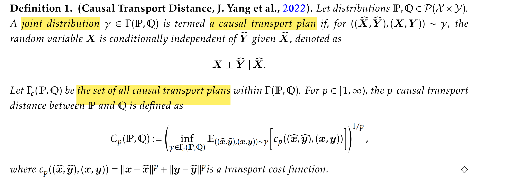
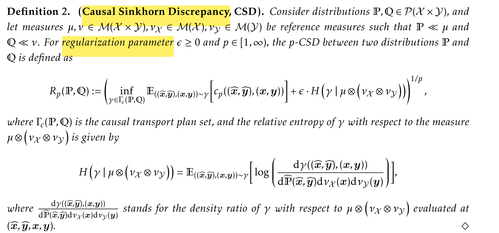
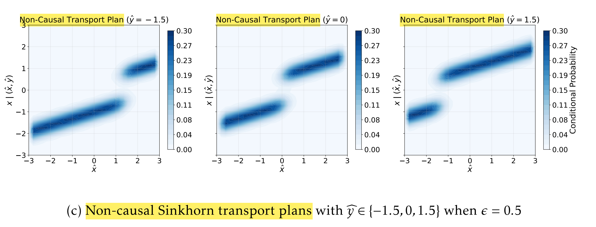
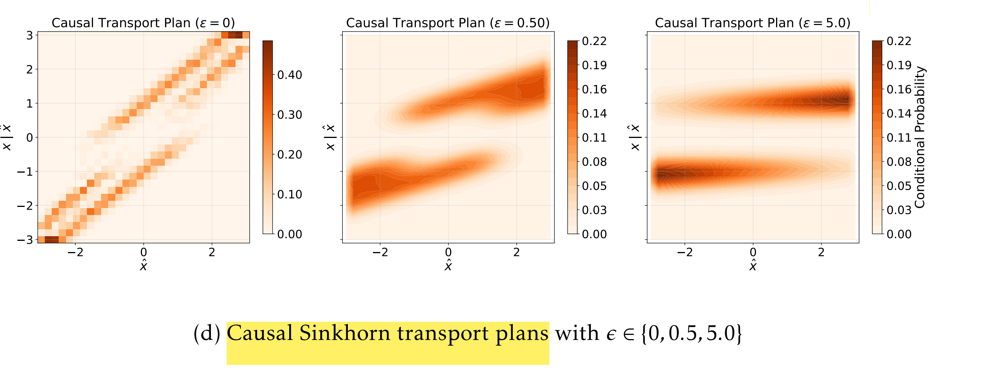
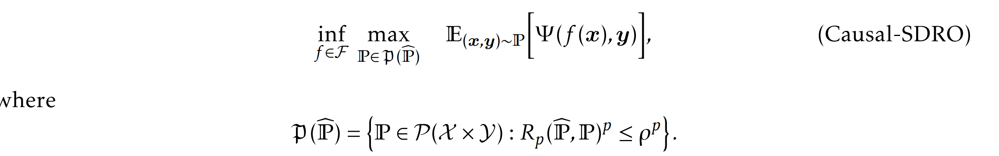
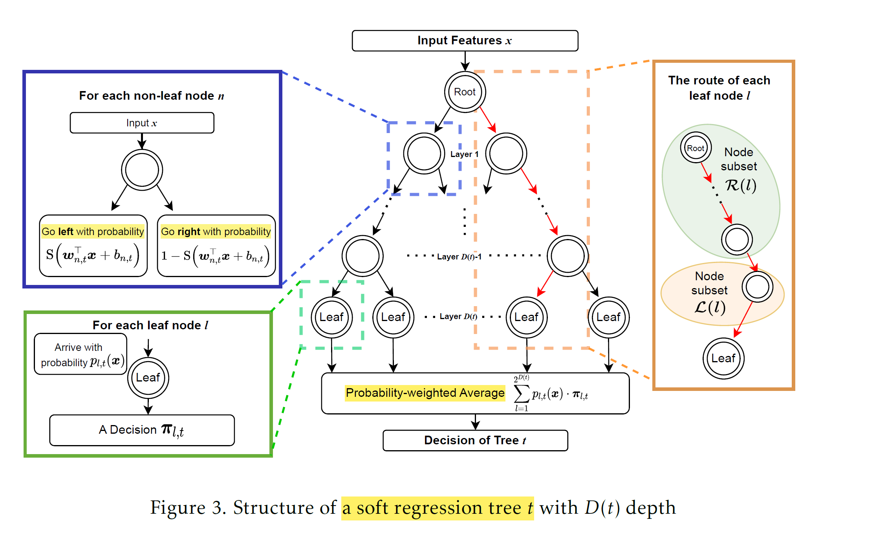

# Causal Sinkhorn DRO

本文将 Sinkhorn Distance 引入 Contextual DRO，称为 **Causal Sinkhorn DRO**。保留 Sinkhorn DRO 对连续分布的偏好，并且 preserve the causal consistency 因果一致性. 
为求解 infinite-dimensional policy optimization，采用 **Soft Regression Forest (SRF) decision rule**，以任意 measurable function 作为 policy 空间。SRF 的优点在于 interpretability / Traceability, 并且性质好 **computational tractability**。

本文主要解决 Contextual DRO 的两个问题：

- **Causal Consistency**：因果关系，**Future covariates** are conditionally independent of **historical uncertain parameters** given the **history covariate**. 例如过去的需求，不能影响未来的温度，因此这里存在 causal structure 因果结构，因此采用如下：

  Decision-making with side information: **A causal transport robust approach**. 

- **Continuity**: contextual distribution **通常是连续的**，如温度和需求，因此采用 Wasserstein distance 可能造成 overly conservative。因此采用 **Sinkhorn DRO** 

Sinkhorn DRO 的 infinite-dimensional nature of policy optimization 造成计算困难；如何提出 **decision rule 兼具 interpretability 和 computational tractability**， 成为重要问题。

- **the Soft Regression Forest (SRF)**: Tree-based models for decision rule optimization，结合了 **decision tree 的 interpretability**，又提供了 parametric，differentiable；可以用 gradient-based methods 求解。

## Causal Sinkhorn Distance

**Causal Transport Distance**: 考虑 historical uncertain parameters（如历史需求）和 newly observed covariates（如未来天气）之间的 conditional independence。

本文研究 **Decision-rule/Policy based CSO**: 其中 $\boldsymbol{x}$ 是 covariate, $\boldsymbol{y}$ 是 uncertain parameter, 而 $f\left(\boldsymbol{x}\right)$ 是 decision rule. 不同于Predict-then-Optimize的先预测$\boldsymbol{y}$

假设真实分布位于模糊集中，则决策是 **robust decision rule**:

### Causal Transport Distance

同时考虑 $(\widehat{X},\widehat{Y})$ 的分布，通常只考虑 $\widehat{Y}$ 的分布距离；其中重点在于，
$$
\boldsymbol{X}\perp\widehat{\boldsymbol{Y}}\mid\widehat{\boldsymbol{X}}.
$$
即 future random variable $\boldsymbol{X}$ is conditionally independent of $\widehat{\boldsymbol{Y}}$ given $\widehat{\boldsymbol{X}}$; 因此称作 causal transport distance. 

由于只考虑了 Wasserstein distance，因此最终分布可能是 discrete 的，因此引入 Causal Sinkhorn Discrepancy，即加入 Regularization:

这和传统 Sinkhorn Distance 不同的，主要在于

1.  参考分布是 $\mu\otimes\left(\nu_\mathcal{X}\otimes\nu_\mathcal{Y}\right)$ ，即双变量

2. $\Gamma_{\mathcal{C}}(\mathbb{P},\mathbb{Q})$ 是 **Causal Transport Plan Set**：区别在于，不假设 Conditional independence 时，transport plan 和 $\hat{y}$ 有关；

   

   而实际上由于 causal structure，因此 causal transport plan 和 $\hat{y}$ 无关，表现为 aggregate 的形式;

   

$\epsilon>0$ 通过惩罚可以得到 smooth transport plan，此时对应的 CSO 为：Causal Sinkhorn DRO

可以同时解决 continuous 和 causal structure 两个问题；

运用该 discrepancy 可解决 causal DRO 问题，并得到 **decision rule**;

### Soft Regression Forest Decision Rule

这是一种Non-linear Decision Rule，但不同于NN，Regression Tree是Interpretable，而Soft使之可以微分differentiable，便于训练。同时NN的缺点在于，最终解可能infeasible。

Soft Regression Forest来源于Soft Decision Tree和Ensemble Learning，其中soft是相对于传统的hard decision tree而言，优点在于：

- 是**Parametric, differentiable, and can be trained by gradient-based algorithms**. 并且还保留了interpretability：
- **Hierarchical structure**: decision tree保留了人类“if-then”的判断过程，但是是 **probabilistic** 的；
- 采用ensemble的优点是避免high variance和potential overfitting.

---

#### SRF结构

SRF包含了$T$个binary Soft Regression Tree (SRT)的ensemble，因此介绍每个SRT的结构：

- 每个leaf node代表一个policy $\boldsymbol{\pi}_{l,t}$, 不同于经典decision tree只有一个确定decision；每次分支都是**有概率**$\operatorname{S}(\boldsymbol{w}_{j,t}^\top\boldsymbol{x}+b_{j,t})$的，最终到达某个叶子节点的概率$p_{l,t}(x)$，是历次分支概率的累乘

  

  其中${i\in \mathcal{L}(l)}$就是路径中往左分支的节点，而$j{\in}\mathcal{R}(l)$是往右分支的节点；因此policy $\boldsymbol{\pi}_{l,t}$对应的选择概率是$p_{l,t}(x)$。**这里分支概率需要通过训练获得**。

- 对于SRF $t$，最终输出的policy是probability-weighted average: $2^{D(t)}$ 即为叶子节点的数目
  $$
  \sum_{l=1}^{2^{D(t)}}p_{l,t}(\boldsymbol{x})\cdot\boldsymbol{\pi}_{l,t}
  $$
  这是一颗SRF的输出，而所有ensemble tree的输出为ensemble average:
  $$
  \left[f_{\boldsymbol{\theta}}^{\mathrm{SRF}}(\boldsymbol{x})\right]_k:=\frac{1}{T}\sum_{t=1}^T\sum_{l=1}^{2^{D(t)}}p_{l,t}(\boldsymbol{x})\cdot\left[\boldsymbol{\pi}_{l,t}\right]_k,\quad\forall k\in[d_z],
  $$
   $k\in[d_z]$是决策的维度，所以一共有$k$个决策；这里参数$\boldsymbol{\theta}\in\Theta$包含了**所有需要训练的参数**$\{\boldsymbol{w}_{i,t},\boldsymbol{b}_{i,t},\boldsymbol{\pi}_{l,t}\}$，训练完成后只需要输入covariate便可得到policy. 

最终，只需要求解$\boldsymbol{\theta}\in\Theta\subseteq\mathbb{R}^{d_\theta}$，即可求解SDRO，即求解decision rule:
$$
\inf_{\boldsymbol{\theta}\in\Theta}\max_{\mathbb{P}\in\mathfrak{P}(\widehat{\mathbb{P}})}\quad\mathbb{E}_{(\boldsymbol{x},\boldsymbol{y})\sim\mathbb{P}}\left[\Psi(f_{\boldsymbol{\theta}}(\boldsymbol{x}),\boldsymbol{y})\right],
$$

#### Interpretability of SRF

SRF存在天然的可解释性，首先在于Asymptotic Consistency to Hard Regression Forest，即可以渐进收敛到传统的decision forest：即最终只有一个decision会被确定选择。即选择概率$\mathrm{S}\left((\boldsymbol{w}^\top\boldsymbol{x}+b)/\tau\right) \rightarrow 1$，最后decision选择概率只有$\{0,1\}$两种情况。

其次，SRF存在**Sparsity**，即通过aggregate，低概率的policy会vanish；因此高概率policy会dominate最终策略，因此SRF和传统decision tree一样可以反向追踪决策路径（**Traceability**）。

确切来说，通过对最终概率$p_{l,t}(x)$对covariate $\boldsymbol{x}\in\mathbb{R}^{d_x}$的每个分量求导，可以得知feature如何沿着决策路径影响最终决策：

- $i{\in}{\Lambda(l)}$即路径$l$上的所有节点，在每个节点，某个feature $x_j$的影响都可以拆分开来，得到where (at which node) and how (direction and magnitude) a feature contributes
  to the decision process.

  

不仅如此, SRF还保留了Lipschitz properties（mathematical smoothness），这使得决策更加stable和robust，不容易产生abrupt changes，因此也保留了interpretability.