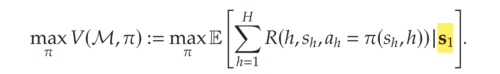
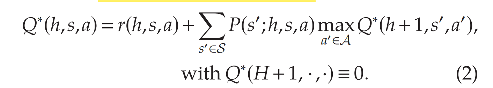
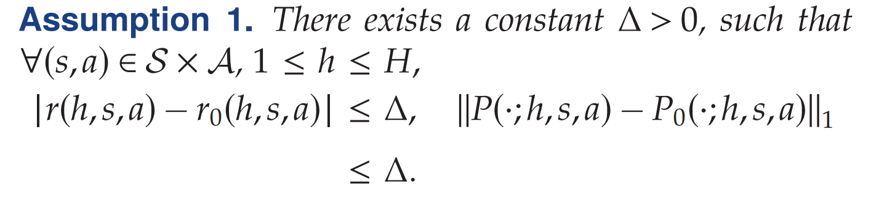
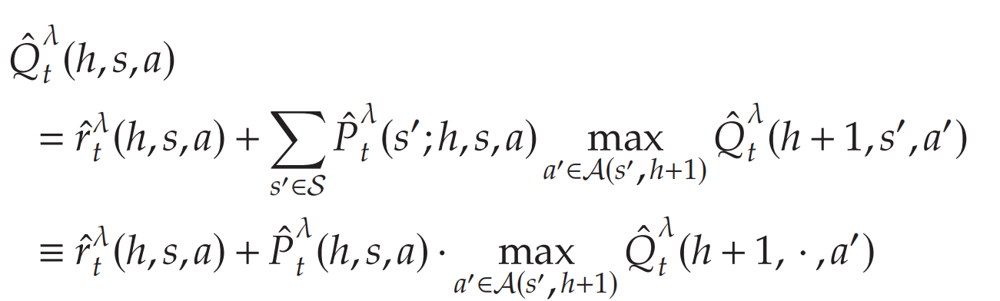
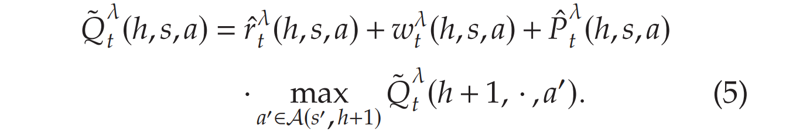
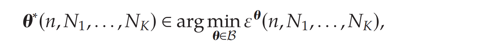

# Data Pooling

参考论文：

- Data-Pooling in Stochastic Optimization. Gupta, Kallus
- Small-Data, Large Scale LO with Uncertain Objectives, Gupta
- Data-Pooling RL
- **Mixture Policy**: 学习一个mixed policy，不需要某个具体policy，可以估计稳态分布stationary distribution，bias correction.

## Data-Pooling RL

本文考虑Multistage, dynamic decision-making problem in the online setting （即MDP）, with **uncertain model parameters**. 

传统estimate-then-optimize (ETO) 方法先估计MDP参数，再优化，当historical data和new data之间存在mismatch时，该方法可能不有效。例如新医院如何利用老医院的数据，进行transfer learning.

重点解决**small sample issue** in parameter estimation 小样本问题，本文提出了一种 **Data-pooling RL** 方法，考虑**decision quality**即RL Framework。相比于Bandit learning，*考虑decision对未来状态的影响*。

**Data Pooling RL**解决了三个问题：Small-data, Bias, Privacy, 

- **Data pooling with adaptive weights**: 动态结合历史数据和现在数据，weight由后续**decision quality** (regret) 决定
- **Model Free Design / No Parametric assumption**: 对模型没有预先假设，可以减少historical data 和 target data的bias问题
- **Data sharing via aggregating statistics**: 只需要传输统计特征，不需要private data.

---

**MDP**

考虑一个MDP问题$\mathcal{M}=(\mathcal{H},\mathcal{S},\mathcal{A},R,P)$：$\mathcal{H}$是horizon, $\mathcal{S}$是state set， $\mathcal{A}$是action set. $\mathcal{R}$是reward function, ${P}$是transition probability. 
当处于状态$(s,h)$时，选择action $a\in\mathcal{A}(s,h)\subset\mathcal{A}$最大化reward，其中reward定义为最大收益，即

**Optimal Policy $\pi$**最大化value function, $\mathcal{M}$即为target MDP. 对应的Bellman optimality condition为：

$Q^*(h,s,a)$即为从$h$ stage, $s$ state, $a$ action 往后的expected return，由于设定$R(h,s,a)$的均值为$r(h,s,a)$，故Q-function如图。

**$\begin{pmatrix} R,P \end{pmatrix}$未知**：由于$\begin{pmatrix} R,P \end{pmatrix}$未知，所以需要**online**搜集target data $\mathcal{D}$，更新对$\begin{pmatrix} R,P \end{pmatrix}$的估计。

**Transfer Learning**: 利用和$\mathcal{M}$相似的MDP 历史数据进行学习，即定义population $\mathcal{M}_0=(\mathcal{H},\mathcal{S},\mathcal{A},R_0,P_0)$，均有相同的$(\mathcal{H},\mathcal{S},\mathcal{A})$但是$(R_0,P_0)$不同，且参数是未知的。本文已知历史数据$\mathcal{D}_0$，并且$(R_0,P_0)$存在closeness相似性。

**注：这里是model free的，无需假设regression系数**；另外可以保护privacy, 因为只需要估计$(R_0,P_0)$，无需个人数据.

### Perturbed value iteration with weight

本文介绍algorithm $\mathrm{PVI-}\lambda$，权重为$\lambda$，可根据decision quality自适应

**核心思想：根据权重函数$\lambda(\cdot)$对数据$\mathcal{D}$和$\mathcal{D}_0$混合，并估计value function $\hat{Q}_t(h,s,a)$，添加扰动得到$\tilde{Q}_t(h,s,a)$，求得policy $\pi_t(s,h)$；然后循环该过程得到新数据$\mathcal{D}$ **

**Baseline Algorithm **： 假设权重$\lambda$已知

- **Step 1：Estimate state-action value function**   $Q^*(h,s,a)$ 

  根据$Q^*(h,s,a)$的公式，其实需要估计每个$\left(h,s,a\right)$对应的**mean reward** $r(h,s,a)$以及**transition probability** $P(s^{\prime};h,s,a)$. 

  - **$\lambda$-estimate**: 假设对于$\left(h,s,a\right)$，有$$N(h,s,a)$$个固定历史样本，以及$n_t(h,s,a)$个在线训练样本，当iteration $t$确定时，**权重**$\lambda=\lambda(n,N)$。则可以估计得到**mean reward** 以及**transition probability**：

  $$
  \hat{r}_t^\lambda:=\lambda\overline{r}_n+(1-\lambda)\overline{r}_0,\quad\hat{P}_t^\lambda:=\lambda\overline{P}_n+(1-\lambda)\overline{P}_0\quad(3)
  $$

  - 权重$\lambda$可以是常数，当$\lambda=1$即为no pooling; 也可以是**naive pooling**，即只按样本量占比进行分配，merge the data

  - 那么对应的Q-function即
    这里第二步是点乘，代表向量内积

- **Step 2: Perturbation** 增加扰动促进exploration-类似于uncertainty

  - 扰动为$\{w_t^\lambda(h,s,a)\}$，得到the perturbed version $\tilde{Q}_t^\lambda(\hat{h,s,a})$

  

  - 用$\tilde{Q}_t^\lambda$计算**estimate policy**，然后通过训练，apply estimate policy, Sample state and action，更新dataset $\mathcal{D}$；进入下一轮训练。

  

---

**如何获得权重$\lambda$和扰动$\{w_t^\lambda(h,s,a)\}$** - Decision quality based

用解的质量，指导权重的变化，而非数据的相似性。

---

**Extension to Multi-source Data / Contextual Information**

Target data set可以从$K$个不同的dataset中获取数据；因此首先要假设target，和each historical data都有closeness:

假设target data和Historical data的样本数量为$(n,N_1,\ldots,N_k)$，对应的混合权重 mixture weight 为$\boldsymbol{\theta}=(\theta_1,\ldots,\theta_k)$； 则Data-pooling estimator为：

对应可以得到，对应的决策质量的upper bound $\varepsilon^{\boldsymbol{\theta}}(n,N_1,\ldots,N_k)$；通过最小化upper bound，可以得到optimal weight $\boldsymbol{\theta}^*(n,N_1,\ldots,N_K)$

