# 1.6 Meeting

本次会议集中讨论的**核心问题是如何利用Multi-source Data学习**PTO:

一个中心决策者，**如何同时利用多个不同的local  data set**，通过knowledge sharing或regularization，达到优化的最佳效果。

- **创新点：之前的Regularization都研究的是Unconditional Setting，我们研究的是Conditional/Contextual Setting .** 

  **可以将原来对无Side Information DRO的结论迁移到Contextual DRO的情境下；例如Regularized NW estimator就是将Regularization首次引入 NW预测的CSO。**

以下是对不同选题的讨论，接下来会按照不同方向进行**文献综述**；通过总结讨论，得到不同方法的**本质差异**、**难度**和**可行性**；

- **任务：文献Survey，统一Notation，以Regularization为主线，思考如何采用Separate Data Set完成CSO，如何结合多个data set的多种预测，得到一个精确的local预测**。

- **识别技术路线：每个方法的优缺点，创新性，可行性；Contribution**

  | 方法/路线              | **创新性** |      |      | **可行性** |      |      | 备注                            |
  | ---------------------- | ---------- | ---- | ---- | ---------- | ---- | ---- | ------------------------------- |
  |                        | 高         | 中   | 低   | 高         | 中   | 低   |                                 |
  | Pooling                |            | ●    |      |            | ●    |      | 与文献重叠，写作要强调场景/机制 |
  | Decision-aware Pooling | ●          |      |      |            |      | ●    | 潜力高但无范式；设停损线        |
  | Regularzation          |            | ●    |      | ●          |      |      | **主线候选，最易闭环**          |
  | Satisficing            |            |      | ●    | ●          |      |      | 适合作benchmark/兜底            |
  
  Combining Forecasts from Multiple Experts for Multiple DataSets

博士论文的想法：DRO theory for Data with Special Structures 有特殊结构的数据

**问题范围限定：可以先把问题限定为只有一个target population**，然后其他都是historical data，即新店开业（新医院）; **然后迁移到多个target population**，那么问题就变成Cross-learning.

## Data Pooling 冲刺

回顾Data-Pooling的不同方法，参考Data Pooling笔记: **注意群体之间要存在相似性**，可以设定为模型参数$\beta$的关系；这篇文章也是Decision-aware Pooling

### Joint Estimator

**核心思想：使用Transfer Learning, 在Learning阶段对local regression进行LASSO Debias** 

Joint estimator**利用global regression的系数进行正则化Regularization**：

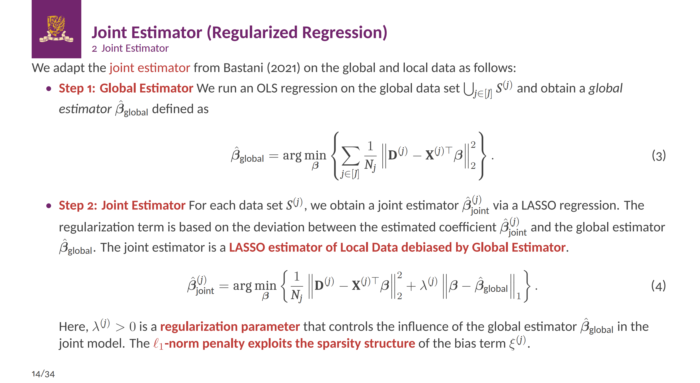

这里的原理是$\beta, \beta_{\text{global}}$相近，也就是利用**数据/模型相似性**进行迁移；

根据Berstimas and Kallus (2020)的方法，通过**数据的远近**进行加总：
$$
\widehat{y}\left(x^0\right)=\sum_{i=1}^nw\left(x^i,x^0\right)y^i,
$$
这里**权重$(x^i,x^0)$**根据feature point和$x^0$的距离确定的，常见的local ML method （即采用nonparametric weighted neighborhood的)方法有：

k-nearest neighbor，classification and regression trees (CART) 和kernel estimation，Nadaraya-Watson (NW) kernel estimation, random forest.

按这个思路，可以**将相似的店进行cluster**，再用相同的$\beta_{\text{cluster}}$进行调优

###  Mixture DRO/Model Combination

**核心思想：对预测出的分布，进行加权；权重可由Kernel Method得到，并允许Uncertainty； Regression + Aggregation + Uncertainty** 。

- 参考 1：Conditional Group DRO
- 参考 2： **Combining Forecasts** from Multiple Experts for Multiple Variables - Chen Zhi 结合多个预测，model aggregation；
- 参考 3：Separable Model 一个模型，结合多个子模型的预测；
- 参考 4：Regularized Kernel Regression **采用Kernel聚合原来样本, 再添加不确定性 equivalent to Phi-divergence DRO**

该方法是对Federate Learning中**Mixed Model**的应用，迁移到Contextual DRO部分：Conditional Group DRO用Kernel Method聚合的不是真实数据点，**而是预测样本（x，y_predict）**；因此这是一种model aggregation/combining，类似于bagging/random forest。

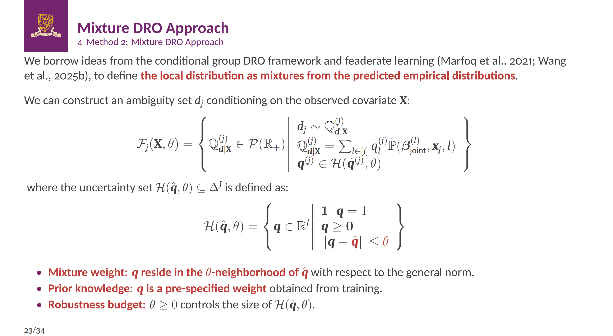

如何确定权重 **weight**，仍然按照不同分布的相似性进行mixing：

- **Kernel Method**: 参考*From Predictive to Prescriptive Analytics*， 张莲民的*Newsvendor Under Stochastic Dominance*，本质上都是根据数据的相似性进行加权，**权重由Kernel Method确定**。

- **扩展1：预测方法不同**：则Combining Forecasts from Multiple Experts for Multiple Distributions 结合多个分布的多种预测，得到一个精确的预测

- **扩展2：拓展到按时间划分的分布**：本文注重不同retailer的分布需求，实际上假如同一个运营商有12个月的需求数据，最终需求预测也可以用加权；Non-Stationary，因此也存在Distributional Shift
  $$
  \mathbb{P}_1,\mathbb{P}_2,\ldots,\mathbb{P}_{12}
  $$

- **扩展2：同时考虑时间和空间**：即考虑时间$t$和retailer $j$的划分，再通过某种权重聚合，复杂度升高
  $$
  \mathbb{Q}_{\boldsymbol{d}|\mathbf{X}}^{(j,t)}=\sum_{l\in[J\times T]}\boldsymbol{q}_{l}^{(j,t)}\hat{\mathbb{P}}
  $$

- **扩展 3：Kernel 决定混合权重**： **实际上是Regression+Kernel的聚合**：先用Regression确定各local residual distribution，**再根据原有数据分布的相似性进行聚合**。

  即比Bertsimas多了一步Regression的过程，再聚合，**最后考虑权重的uncertainty set**；**增加一些不确定性**。
  $$
  \text{mixure DRO} \Rightarrow \text{Kernel+Uncertainty}
  $$

  $$
  \widehat{y}\left(x^0\right)=\sum_{i=1}^n w\left(x^i,x^0\right)y^i, w \in \mathcal{W}
  $$

  重点参考[NW kernel regression](C:\Users\lipei\Desktop\Missing Data\Idea梳理\26-1.10 Variance-based Regularization+NW kernel regression.md)，思考能否Kernel + Uncertainty in CSO；可能等价于Kernel+Regularization.

  答：可以，**Kernel+Uncertainty等价于Phi-divergence DRO**, 因为mixture DRO相当于降级版的**Phi-divergence模糊集**；

  

  注意，假如我们确定一个reference mixture distribution $P_0$，只要
  $$
  P_0:=\sum_{g=1}^G\pi_g\widehat{P}_g,\quad\pi_g>0. (\text{Reference Mixture Distribution})
  $$
  则Phi-divergence可以被定义，
  $$
  D_\phi(P\|P_0)=\int_{\mathcal{X}}\phi\left(\frac{dP}{dP_0}\right)dP_0 \quad (\text{Phi-Divergence})\\ 
  P:=\sum_{g=1}^G q_g\widehat{P}_g \quad (\text{Phi-Divergence})
  $$
  **因此建立的Phi-divergence DRO也相当于Mixture DRO**; 但是包含的更广，可用reference mixture distribution $P_0$为中心建立Phi-divergence模糊集，而reference即为**model aggregation**。
  
  此处重点在于**聚合权重**，再考虑Uncertainty; Phi-divergence可考虑换成Sinkhorn Distance，鼓励连续分布. 

- **扩展4重点： Integrated Estimation and Optimization** 权重的决定是由the decision (measured by regret）quality决定的，而不由预测精度决定；后续权重再加上Uncertainty, 或者混合分布加上统计距离即为Conditional Group DRO.

- **扩展5： Linear combination of loss function**: 如果考虑**Mixed Regression**，则在Regression阶段就要确定权重，那么**对应的loss function会更加复杂**，最终loss function是原来loss function的和

  

  即local model for $j$-th client is a **convex combination of estimators**.

### Decison-Aware Pooling

即**考虑后续决策质量的数据混合，权重依赖于后续决策质量**，重点参考：

- [Adaptive Data Pooling](C:\Users\lipei\Desktop\Missing Data\Idea梳理\26-1.31 Data Pooling.md): 决策质量影响权重
- [Decision-aware Optimal Transport](C:\Users\lipei\Desktop\Missing Data\Idea梳理\26-2.24 Decision-aware Optimal Transport.md): 决策质量影响统计距离

## Regularization for CSO 主线

**核心思想：将Regularization扩展到CSO部分，CSO+Regularization；**
**Regularization相当于the Lagrangian relaxation of hard constraint 约束松弛，允许约束违反**

- 参考 1：[Regularization in DRO](C:\Users\lipei\Desktop\Missing Data\2-Distribution shift- Tranfer learning\1.6 Regularization for Wasserstein Distance.md)

模仿conditional standard deviation regularization scheme, 这里先用了NW estimator，然后用Regularization

### Cost function Regularization- Fairness

- **用cost function在分布上的variation loss进行调优**

这种通过Variation loss进行Regularize的解释比较模糊，不好定义。

- **用Cost difference进行Regularization：**

$$
\min_{z_j} \mathbb{E}_{d \sim \mathbb{P}_j} [C(z_j,d) + \lambda |C(z_j,d) - \hat{C}_{\text{global}}(z_j)|
\\
$$

这相当于**Fairness**的概念，加上一个**Lagrange Multiplier**，控制任意两个估计的cost之间不会偏差太多。在这里，是控制local cost和global cost不要相差太多。

**优点：量纲相同，意义明确，Fairness好**

**缺陷：不太出彩，也许可以推广成Multi-source PTO+Regularization的问题**；即有reference cost的PTO

---

- **Cost Function + Distribution Distance Regularization **

$$
\min_{z_j} \mathbb{E}_{d \sim \mathbb{P}_j} [C(z_j,d)] + \rho \Delta(\mathbb{P}_j, \mathbb{P}_{\text{global}})
\\
$$

相当于$\mathbb{P}_j$和$\mathbb{P}_{\text{global}}$存在Misspecification，在第二步应该进行调整；这里参考**Model Misspecification**。考虑DRO的形式即为：

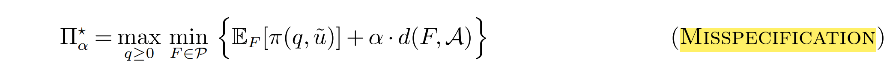

那么，这等价于**Lagrangian Relaxation of DRO问题**，

1. **Misspecification**: 考虑分布距离Regularize的问题，又允许偏移
   $$
   \min_{x\in\mathcal{X}} \ \{ \mathbb{E}_\mathbb{P}[f(\boldsymbol{x},\tilde{\boldsymbol{z}})] +\kappa(\Delta(\mathbb{P},\hat{\mathbb{P}}_{{local}})-\Gamma)^++\hat{\kappa}(\Delta({\mathbb{P}},\hat{\mathbb{P}}_{global})-\hat{\Gamma})^+ ) \mid \forall\mathbb{P}\in\mathcal{P}_0(\mathcal{Z}) \}
   $$
   该问题等价于某种**Distribution Transform**; 

2. **Robust Satisficing**: 最小化Regularization系数
   $$
   \begin{aligned}
   \min \quad & \kappa \\
    & f(\boldsymbol{x},\boldsymbol{z})-\tau\leq\kappa(\Delta(\mathbb{P},\hat{\mathbb{P}}_{{local}})-\Gamma)^++\hat{\kappa}(\Delta({\mathbb{P}},\hat{\mathbb{P}}_{global})-\hat{\Gamma})^+ \\
    & \qquad \qquad \qquad \qquad \qquad \forall\mathbb{P}\in\mathcal{P}_{0}\left(\mathcal{Z}\right)\quad
   \end{aligned}
   $$
   

###  Distribution Distance Regularization

- 参考 1：**Sinkhorn DRO - Regularzed Distance** **直接影响模糊集**

  

- 参考 2：**Distribution Transform** **模糊集的分布有偏移**，$T_\varphi[\cdot]:\mathcal{P}\mapsto\mathcal{P}_0$；可额外考虑noise function

- $$
  \min_{G{\in}\mathcal{A}}\mathbb{E}_{T_{\varphi_{\alpha}}[G]}[\pi(q,\tilde{\upsilon})] \Rightarrow \min_{F\in\mathcal{P}}\left\{\mathbb{E}_F[\pi(q,\tilde{u})]+\alpha\cdot d(F,\mathcal{A})\right\}
  $$

- 参考 3：Contextual DRO with Causal and Continuous Structure 即Causal Sinkhorn DRO，

考虑采用Entropic Regularize的**Sinkhorn Distance**: **结合不同的统计距离，成为一种距离**；在transportation cost加入惩罚

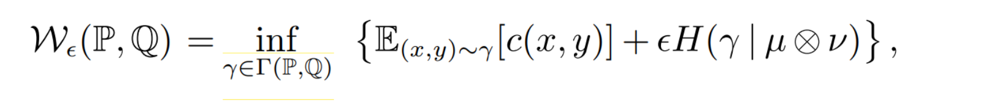

但原问题引**入Entropy Regularization**是为了使整个分布更平滑，而不是为了本文的$\mathbb{P}_{\text{local}}$和$$\mathbb{P}_{\text{global}}$$更近，**要查清楚Entropic的作用**；可以扩展到Phi-divergence。

Wang Jie研究的是Decision Rule，我们可以发扬Predict-then-Optimize的方法。

- **Idea: 修改reference measure为$\left(\hat{\mathbb{P}}_{\text{local}},\hat{\mathbb{P}}_{\text{global}}\right)$，即$H(\gamma\mid \hat{\mathbb{P}}_{\text{local}}\otimes \hat{\mathbb{P}}_{\text{global}})$**: 我们研究$\mathcal{W}_\epsilon(\widehat{\mathbb{P}},\mathbb{P})$，并且要求$\mathbb{P} << \hat{\mathbb{P}}_{\text{global}}$，此时Regularization为
  $$
  \begin{aligned}
  H(\gamma\mid \hat{\mathbb{P}}_{\text{local}}\otimes \hat{\mathbb{P}}_{\text{global}})   = &H(\gamma\mid\mu\otimes\nu) \\ & +\mathbb{E}_{x\sim\hat{\mathbb{P}}}\left[\operatorname{log}\left(\frac{\mathrm{d}\mu(x)}{\mathrm{d}\hat{\mathbb{P}}_{\text{local}}(x)}\right)\right]+\mathbb{E}_{y\sim\mathbb{P}}\left[\operatorname{log}\left(\frac{\mathrm{d}\nu(y)}{\mathrm{d} \hat{\mathbb{P}}_{\text{global}}(y)}\right)\right].
  \end{aligned}
  $$
  此时后两项应该相当于常数，注意需要满足$\hat{\mathbb{P}}_{\text{local}} \ll\mu$ 且 $\hat{\mathbb{P}}_{\text{global}} \ll\nu$ ，可以选择足够广的$\mu$和$\nu$使之成立.

  于是采用$H(\gamma\mid \hat{\mathbb{P}}_{\text{local}}\otimes \hat{\mathbb{P}}_{\text{global}}) $的Sinkhorn Distance为：
  $$
  \mathcal{W}_R\left(\widehat{\mathbb{P}}_{\text{local}},\mathbb{P}\right)=\inf_{\gamma\in\Gamma(\mathbb{P},\mathbb{Q})}\left\{\mathbb{E}_{(X,Y)\sim\gamma}[c(X,Y)]+ \epsilon H(\gamma\mid \hat{\mathbb{P}}_{\text{local}}\otimes \hat{\mathbb{P}}_{\text{global}}) \right\}
  $$
  对应的Hard Constraint Version为：
  $$
  \mathcal{W}_R  \left(\widehat{\mathbb{P}}_{\text{local}},\mathbb{P}\right)=\inf_{\gamma\in\Gamma(\mathbb{P},\mathbb{Q})}\left\{\mathbb{E}_{(X,Y)\sim\gamma}[c(X,Y)]:    
  H(\gamma\mid \hat{\mathbb{P}}_{\text{local}}\otimes \hat{\mathbb{P}}_{\text{global}}) \leq R\right\},
  $$

- **Idea 2 重要**: Regularization采用$H(\gamma\mid\hat{\mathbb{P}}_\mathrm{global}\otimes\nu)$，只惩罚和global的距离，此时必须满足$\hat{\mathbb{P}}_{\text{local}} \ll \hat{\mathbb{P}}_{\text{global}}$，这样仍然可以让worst-case与连续的$\nu(y)$对应，分布在entire $\mathbb{R}^{d}.$

  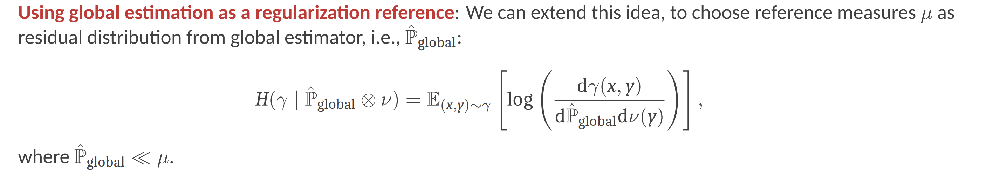

##  **Model Misspecification** - Distribution Shift / Noise Data  保底

**核心思想：CSO+DRO，考虑2个分布距离，CSO+Regularization $\Rightarrow$  CSO+DRO，通过扩大模糊集考虑更多分布；类似于Satisficing**

既然都是要扩大Wasserstein模糊集，则可以通过**Model Misspecification**的原理，在原来的模糊集上再添加一族分布用来校正;  the training set and the test set do not follow the same underlying data distribution. 分布偏移

这个思路类似于**Regularization**，但更**注重于区分不确定性，扩大分布集合**；

- 参考 1：Newsvendor under Ambiguity and **Misspecification** - Chen Zhi
- 参考 2：Holistic robust data-driven decisions - Bennouna, A., & Van Parys, B.
- 参考 3： The Analytics of Robust Satisficing
- 参考 4： Making decisions under model misspecification.

**Regularization = Wasserstein DRO**; 因此某种意义上，以上Regularized Wasserstein Distance和以下的两种距离不大于某个值，**是等价的。**

### **Newsvendor under Ambiguity and Misspecification** - Satisificing

另外参考： Globalized distributionally robust counterpart - IJOC

本文区分未知分布的ambiguity和misspecification，考虑两部分不确定性来源：

- **Ambiguity**：统计特征的模糊性，如mean/variance是共用的；
- **Misspecification**: Estimation error and/or **Distribution shift**

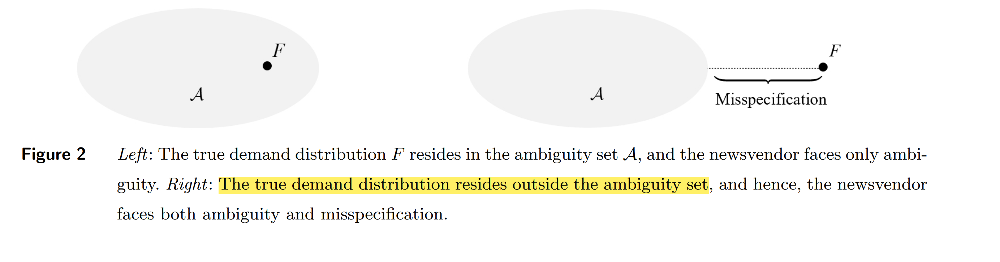

**核心思想：Mean-Variance Ambiguity Set+Regularization**: 在模糊集基础上，考虑misspecification造成的transport cost （total variation).

- **Mean-Variance Ambiguity Set**: 由于使用estimated mean和variance，因此可能misspecified; 即真实分布不处于模糊集中

  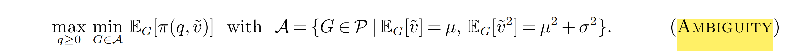

- **考虑Misspecification**: **即在DRO中加入正则项，真实分布和模糊集的距离**；$\alpha$是misspecification aversion，当$\alpha\to\infty$即恢复为DRO，当$\alpha\to0$，则退化成。

  
  其中$d(F,\mathcal{A})=\min_{G\in\mathcal{A}}d(F,G)$是分布$F$和模糊集$\mathcal{G}$的距离：
  $$
  \begin{aligned}
   & d(F,G)=\min_{\Gamma\in\mathcal{W}(F,G)}\int_{\mathbb{R}_+\times\mathbb{R}_+}|u-v|^2\mathrm{d}\Gamma(u,v),
  \end{aligned}
  $$
  这里$d(F,G)$即为Optimal transport; $\sqrt{d(F,G)}$即为 type-2 Wasserstein distance。
  
  

- **视角 1：本质上都和Robust Satisficing一样**：接受额外的loss作为Regularization，允许misspecification。 

  **Globalized Distributionally Robust Counterpart**
  
  **Misspecification**: **将$\hat{\mathbb{P}}$扩展为模糊集$\mathcal{A}$**即为文中的建模；
  
  $k$确定，最小化$\tau$
  $$
  \begin{aligned}
  \tau_{\kappa} & =\min\quad \tau \\
   &\mathrm{s.t.}\quad  \mathbb{E}_\mathbb{P}[f(\boldsymbol{x},\tilde{\boldsymbol{z}})] +k\Delta(\mathbb{P},\hat{\mathbb{P}}) \leq \tau \quad\forall\mathbb{P}\in\mathcal{P}_0(\mathcal{Z})
  \end{aligned}
  $$
  **Robust Satisficing**: 不最小化cost，**而是最小化fragility**；
  
  $\tau$确定，最小化$k$
  $$
  \begin{aligned}
  \kappa_{\tau} & =\min\quad k \\
   &\mathrm{s.t.}\quad  \tau - \mathbb{E}_\mathbb{P}[f(x,\tilde{z})]\leq k\Delta(\mathbb{P},\hat{\mathbb{P}})\quad\forall\mathbb{P}\in\mathcal{P}_0(\mathcal{Z})
  \end{aligned}
  $$
  
  
  因此同样都可把一个距离换成两个$({\mathbb{P}},\hat{\mathbb{P}}_{global}), ({\mathbb{P}},\hat{\mathbb{P}}_{local})$. 

- **视角2: Distribution Tranform** 假如参考分布是模糊集，可写成

  

  这里$G{\in}\mathcal{A}， F{\in}\mathcal{P}$的优化可以交换，这里相当于一个Distribution Tranform，**即模糊集根据映射$T_\varphi[\cdot]:\mathcal{A}\mapsto\mathcal{P}$ 产生偏移**；

  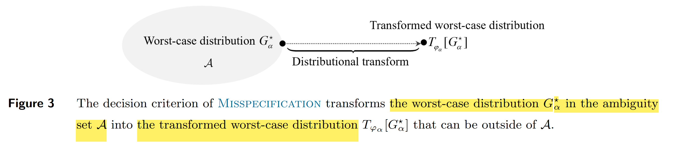

  相当于$T_\varphi[\cdot]$ 将原本的$G{\in}\mathcal{A}$ 进行transform，因此**原问题等价于**
  $$
  \min_{F\in\mathcal{P}}\left\{\mathbb{E}_F[\pi(q,\tilde{u})]+\alpha\cdot d(F,\mathcal{A})\right\} =
  \min_{G{\in}\mathcal{A}}\mathbb{E}_{T_{\varphi_{\alpha}}[G]}[\pi(q,\tilde{\upsilon})].
  $$
  即通过某种变形，该Regularization作用于模糊集，变成一个transformed worst-case distribution。

  将$\mathbb{E}_{[G]}$变成 $\mathbb{E}_{T_{\varphi_{\alpha}}[G]}$，即允许$G{\in}\mathcal{A}$在模糊集外面，这样做的好处是可以得到Analytical Solution；并且可以做灵敏度分析。

  

- **视角3：the Lagrangian relaxation of WDRO**：对DRO进行放松，允许部分的worst-case分布不在模糊集里。

  

  

---

### **Holistic Robust Data Driven Decisions**

Holistic Robust是指同时考虑**抽样statistical error**，**以及noise和misspecification**；所以要考虑两种分布距离。
本文同时使用Kullback-Leibler and Lévy-Prokhorov距离；

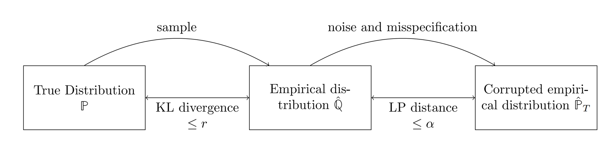

**因此DRO中同时考虑KL-DRO和LP-DRO**，增加Robustness：

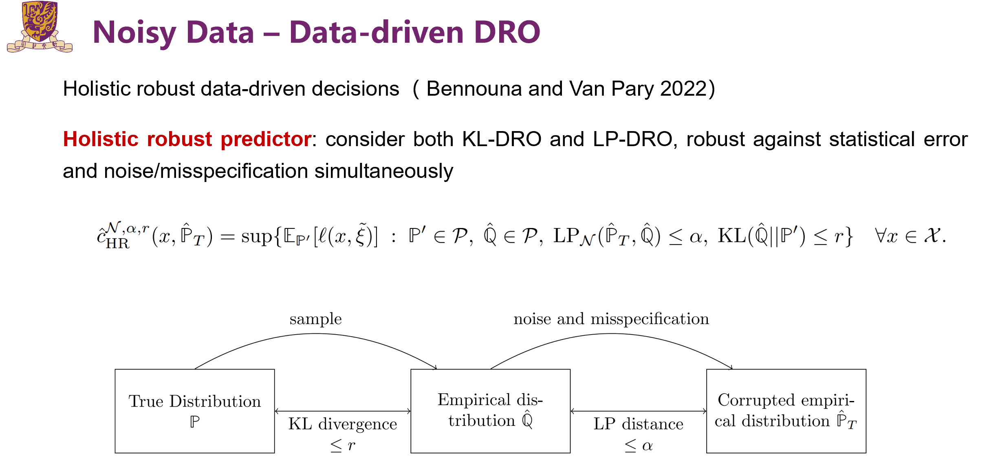

**区别：这里已知的分布只有$\hat{\mathbb{P}}_{\text{T}}$**, 但我们的问题中$\hat{\mathbb{P}}_{\text{local}}$和$\hat{\mathbb{P}}_{\text{global}}$都已知，那么$\hat{\mathbb{P}}_{\text{local}}$和$\hat{\mathbb{P}}_{\text{global}}$的距离是确定的；这样只要控制一个距离$\Delta({\mathbb{P}},\hat{\mathbb{P}}_{global})$，一样能控制$\Delta({\mathbb{P}},\hat{\mathbb{P}}_{local})$。这个方法需要再想想。

---

我们可以考虑将$\hat{\mathbb{P}}_{\text{global}}$视为通用的分布，其他分布$\hat{\mathbb{P}}_{\text{local}}$和$\hat{\mathbb{P}}_{\text{global}}$存在misspecification; **分布距离可以不同，考虑Wasserstein或其他**：

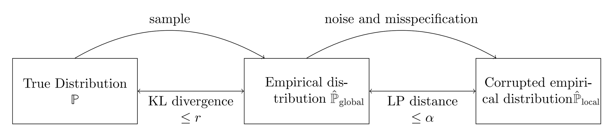

**由于$\hat{\mathbb{P}}_{\text{local}}$和$\hat{\mathbb{P}}_{\text{global}}$** 不一定绝对连续, 考虑只采用Wasserstein距离：

- **同时采用2个Wasserstein距离**： 
  $$
  \begin{aligned}
  \sup\{\mathbb{E}_{\mathbb{P}}[f(x,z)]:\mathbb{P}\in\mathcal{P},\hat{\mathbb{Q}}\in\mathcal{P},\Delta(\hat{\mathbb{P}},\hat{\mathbb{P}}_{global})\leq\alpha,\Delta({\mathbb{P}},\hat{\mathbb{P}}_{\text{local}})\leq r\}\quad\forall x\in\mathcal{X}.
  \end{aligned}
  $$
  写成Robust Satisficing形式

$$
f(\boldsymbol{x},\boldsymbol{z})-\tau\leq\kappa(\Delta(\mathbb{P},\hat{\mathbb{P}}_{{local}})-\Gamma)^++\hat{\kappa}(\Delta({\mathbb{P}},\hat{\mathbb{P}}_{global})-\hat{\Gamma})^+ \\
\qquad \qquad \qquad \qquad \qquad \forall\mathbb{P}\in\mathcal{P}_{0}\left(\mathcal{Z}\right)\quad (3)
$$

但是只采用Wassertein和普通的Wasserstein没有区别；**考虑是否Phi-divergence或LP distance是有用的**。