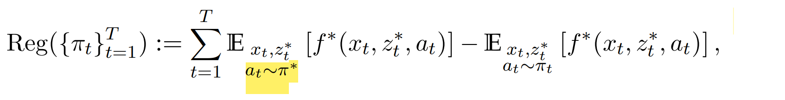
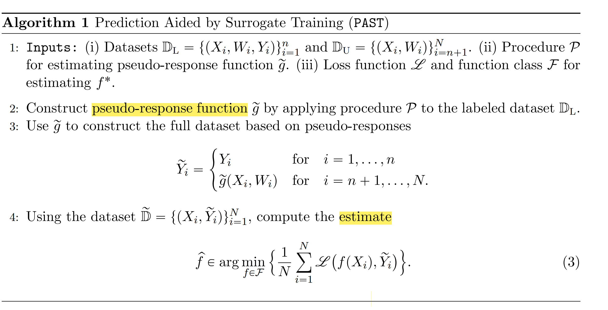
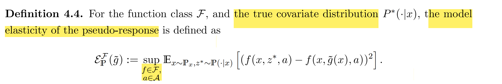
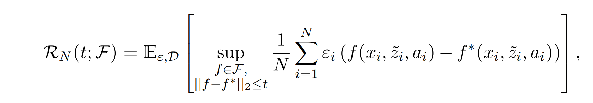
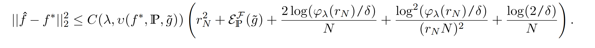
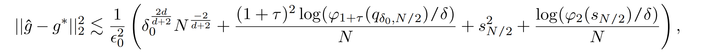
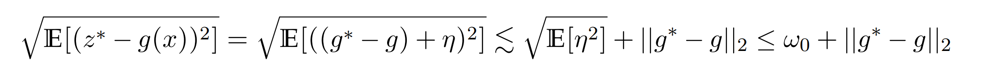

# Pre-Trained AI Model Assisted Online Decision-Making under Missing Covariates

**核心问题**：利用Pre-trained AI model**预测真实Covariate**，减少potential bias和miscalibration，从而提高decision-making精度。

**Abstract**：本文研究 **sequential contextual decision-making problem**，covariate信息丢失但是可以用pre-trained AI模型进行推测。本文从理论上研究，AI模型的存在对决策结果的影响：引入*model elasticity*，可以反映当true covariate和imputed covariate产生偏差时，目标函数对covariate的灵敏度。

在**missing at random**条件下，可以利用orthogonal statistical learning和 doubly robust regression**在线训练AI模型**，该模型有出色的regret guarantees。

决策者有部分context信息以及Pre-trained AI model，可以提供context的预测信息，将AI model融入决策过程对结果的影响。

- **Online Learning/ Contextual Bandits:** 决策者观察covariates (context)，做出决策动作并获得feedback，获得reward。整个过程需要学习 learn a policy that balances **exploration** and **exploitation** while **adapting to the contextual information over time** 自适应变化。
- **Missing/Censored Covariate/Data 信息不全**: contextual features is partially observed, for example, customers’ demographic or behavioral information (**privacy**); incomplete records in healthcare; failure in record covariates. **由于隐私保护、记录不缺、记录有误，导致covariates信息不全**；biased learning and degraded performance 有偏估计
  - 在ML中称为Learning with missing data
  - 在OR中称为Censored/Unobserved Data
- **Surrogate/Proxies/Auxiliary Prediction:** **利用代理信息进行预测**，例如动态定价平台，使用顾客的点击率和停留时间，推测用户的群体特征。

## **启示-Offline Setting**

- **Offline learning with Missing Covariates**: 本文在Contextual Bandits在线学习背景下，研究了AI模型预测missing covariate的应用。

  - 研究transfer learning在downstream decision making的影响；

  - **两阶段回归2SLS-先预测Covariate，再预测Random Outcome**: 通常Random covariate-Random outcome $(\tilde{\boldsymbol{u}},\tilde{\boldsymbol{v}})$ 只考虑Random outcome的预测存在偏差，而covariate是真实观测的。

    **这里的covariate和random outcome都有随机性，都需要预测。**

    **STEP 1**:假设有historical samples $\{(x_i,y_i)\}_{i=1}^M$，可以预测$y$；当$x$对最终response $v$有相关性和外生性时，其实$x$是一个工具变量。
    $$
    \small
    \text{Observed Covariate } \tilde{x}{\sim}\mathbb{P}_x \Rightarrow \text{Unobserved Covariate } \tilde{y}{\sim}\mathbb{P}(\cdot|x) 
    $$
    **STEP 2**: 假设有historical samples$\{(u_i,v_i)\}_{i=1}^N$，可以预测$v$。
    $$
    \small \text{Covariate } \tilde{u}=(\tilde{x},\tilde{y}){\sim}\mathbb{P}_u \Rightarrow \text{Random Response } \tilde{v}{\sim}\mathbb{P}(\cdot|u)
    $$
    补全缺失的covariate之后，再进行优化，第二步可省略；Random Response可以在decision之前、之后确定。

  - **Double Machine learning: 先估计missing mechanism，再预测covariate;**

- **Extension to DRO**: 即使预测了missing covariate，产生的随机优化问题，可以拓展到DRO；

  - **Group DRO**:  **Ensemble Pre-trained Model / Ambiguity Set**， 类似于随机森林，采用多个AI model的ensemble model提高整体预测能力; 此时模糊集可以用$\theta_l$作为权重，$\sum_{l\in[L]} \theta_l=1$. 

    Uncertainty set as **mixtures of conditional outcome distributions** from the source domains. 多个预测条件分布的混合，Conditional Group Robust Distribution.
    $$
    \theta^*=\arg\min_{
    \begin{array}
    {c}\theta
    \end{array}}\max_{
    \begin{array}
    {c}\mathbb{T}\in\mathcal{C}
    \end{array}}\mathbb{E}_{(X,Y)\sim\mathbb{T}}\ell(X,Y,\theta). \\
    \mathcal{C}=\left\{(\mathbb{Q}_X,\mathbb{T}_{Y|X}):\mathbb{T}_{Y|X}=\sum_{l=1}^L\gamma_l\mathbb{P}_{Y|X}^{(l)},\mathrm{~with~}\gamma\in\Delta^L\right\}
    $$
    如果是缺少Covariate information，可以利用条件分布写成：
    $$
    \mathcal{C}=\left\{(\mathbb{Q}_Y,\mathbb{T}_{X|Y}):\mathbb{T}_{X|Y}=\sum_{l=1}^L\gamma_l\mathbb{P}_{X|Y}^{(l)},\mathrm{~with~}\gamma\in\Delta^L\right\}
    $$

  - **Integrated Learning and Optimization**

    与其最优化covariate的预测性能，不如损失一部分最优性，令covariate的预测使解最优：即不最小化**empirical risk**：
    $$
    \hat{g}:=\underset{g\in\mathcal{G}_{\delta_0}}{\operatorname*{\operatorname*{argmin}}}\frac{2}{N}\sum_{i=N/2+1}^N\frac{b_i(b_iz_i^*-g(x_i))^2}{\hat{e}(x_i)}.
    $$
    选择最小化Model Elasticity,Regret/目标函数的预测模型；
    $$
    \hat{g}:=\underset{g\in\mathcal{G}_{\delta_0}}{\operatorname*{\operatorname*{argmin}}} {\operatorname{Reg}(\{\pi_t (g) \}_{t=1}^T)}.
    $$
    **Min Sup Model elasticity**: reward function估计时，选择可以最小化最差期望的函数；
    $$
    \inf _{
    \begin{array}
    {c}g\in\mathcal{G}
    \end{array}}\sup_{\mathbb{P} \in \mathcal{P}} \mathbb{E}_{x\sim\mathbb{P}_x,z^*\sim\mathbb{P}(\cdot|x)}\left[((f(x,z^*,a)-f(x,\tilde{g}(x),a))^2\right].
    $$
    由于预测/随机误差，最终的优化结果有optimality loss, 加入robustness.

  - **Surrogate Prediction+Robust Regression+Optimization 三步预测，将Empirical Regression优化问题拓展为Robust Regression**: -  **STEP 1 Surrogate Prediction** :   补全数据, 本文相当于预测出$z_i$后，用$\hat{\mu}_{v|u}$进行优化，类似于residual-based SAA.**本质上，是建立了$(x,z)$的经验分布$\hat{\mathbb{P}}_D$，用预测补全经验分布，在此分布上用经验优化。**
    $$
    \hat{\theta}_{\mathrm{ERM}}:=\arg\min_{\theta\in\Theta}\mathbb{E}_{(x,y)\thicksim\hat{P}}[\ell(\theta;(x,y))],
    $$
    **STEP 2 Robust Regression**:  可以对**增广预测数据集Augmented data set** $\mathcal{D}=\left\{\left(x_i,b_i,\tilde{z}_i,a_i,r_i\right)\right\}_{i=1}^N$建立residual-based模糊集，包括AI模型的预测结果$\tilde{z}_i$, 以及random outcome，相当于有两个回归的residual；在数据模糊集上选择最小化loss function: 等价于regularized regression: **Reward function**
    $$
    \hat{f}=\min_{f\in\mathcal{F}}\sup_{\mathbb{P}:\mathcal{W}_p(\mathbb{P},\mathbb{P}_n)\leq\rho}\mathbb{E}_{z\sim\mathbb{P}}[f(z)]
    $$
    **Pre-trained Model Class**: 
    $$
    \begin{aligned} \mathcal{G}_{\delta_0}=\{g\in\mathcal{G}:|g-\tilde{g}|_2\leq\delta_0\} \end{aligned}
    $$
    **Algorithm 2对应的Empirical Risk Minimization/SAA为**
    $$
    \hat{g}:=\underset{g\in\mathcal{G}_{\delta_0}}{\operatorname*{\operatorname*{argmin}}} \mathbb{E}_{\hat{\mathbb{P}}} \left[ g(\mathcal{D})\right].
    $$
    那么可以进一步写出对应的**robust optimization**: 其中$\ell(\mathcal{D})$是对应数据的loss function.
    $$
    \min_{g\in\mathcal{G}_{\delta_0}} \sup_{\mathbb{P}:\mathcal{W}_p(\mathbb{P},\mathbb{P}_n)\leq\rho}\mathbb{E}_{\mathcal{D} \sim\mathbb{P}}[g(\mathcal{D})]
    $$
    **Missing Mechanism Estimation**: 也从ERM改为DRO优化 $\hat{e}$
    $$
    \min_{\theta\in\Theta}\left\{\mathcal{R}(\theta):=\sup_{Q\in\mathcal{Q}}\mathbb{E}_{(x,y)\sim Q}[\ell(\theta;(x,y))]\right\}.
    $$
    注意这里的DRO等价于appropriate regularization 正则化

  - **STEP 3 Robust Optimization : 不确定性来源有surrogate prediction, estimation error以及distributional ambiguity**. 如果第二步不进行robust regression, 则可以考虑模糊集$g\in \mathcal{G},f \in \mathcal{F},\mathbb{P} \in \mathcal{P}$；
    $$
    c(\boldsymbol{x},\boldsymbol{z})\leq\tau+\kappa \Delta(\mathbb{P},\hat{\mathbb{P}})+\hat{\kappa}\hat{\Delta}(\boldsymbol{g},\hat{\boldsymbol{g}})+\bar{\kappa}\bar{\Delta}(\boldsymbol{f},\hat{\boldsymbol{f}})\quad\forall\boldsymbol{z}\in\mathcal{Z},\boldsymbol{\zeta}\in\hat{\mathcal{Z}}
    $$
    或者模糊集考虑三种距离
    $$
    \inf \sup \mathbb{E}_{\mathbb{P} \in\mathcal{P}}[c(\boldsymbol{x},\boldsymbol{z})]:\\
    \mathcal{P}=\{ \mathbb{P} \in \mathcal{P}_0(\Xi) \mid \mathcal{W}_p(\mathbb{P},\hat{\mathbb{P}}_f)\leq\rho, \|f-\hat{f}\| \leq \sigma,  \|g-\hat{g}\| \leq \theta \}
    $$
    
    
    

## Problem Setting

**注意：本文的context和covariate不同，context指常用的covariate，而covariate指直接输入优化的random outcome**。$(x_t,z_t^*)$是context-covariate pair，其中$x_t$是一定能被观测到的，$z_t$可能未知，用$x_t$预测$z_t$；而在定价问题中需求$z_t$一定是未知的，因此与contextual DRO处理方法没有区别。

- 假设有$T$个时期，每个时期$t \in [T]$，**决策者都能观测到context vector** $x_t\in\mathcal{X}$, 从未知分布$\mathbb{P}_x$中i.i.d. 采样；决策者还能观测到auxiliary covariate $\mathcal{Z}\subset\mathbb{R}$，$z_t^*$从$\mathbb{P}_{z*}$中i.i.d.采样，可能不被观测。若$b_t=1$说明covariate观测到，否则没有观测到。

- **Reward**: 选定action $a_t \in \mathcal{A}=\{a_1,\cdots,a_K\}$，对应reward为
  $$
  r_t=f^*(x_t,z_t^*,a_t)+\xi_t,
  $$
  其中$\xi_t \in [-\lambda,\lambda]$是random-noise, 均值为0. 假设reward function class $f^*\in\mathcal{F}$是已知的。

- **Prediction Surrogate**: 由于$z_t^*$不一定被观察，决策者用AI model $z=\tilde{g}(x)$预测出对应的side information; 这里$\tilde{g}$是surrogate function

- **Policy **$\pi(\cdot\mid x,z):\mathcal{X}\times\mathcal{Z} \mapsto \Delta(\mathcal{A})$ 将covariate映射为概率单纯形，每次动作从$\pi_t$中选择的。对应的Regret即为采用最优决策$\pi^*$ 和当前决策$\pi$ 的reward差值：

  

  动作选择概率为**inverse gap weighting (IGW) policy**，每次先求出能让reward最大的动作$\begin{aligned} \hat{a}_{x,z} & :=\mathrm{~argmax}_{a\in\mathcal{A}}\hat{f}(x,z,a) \end{aligned}$。每个动作都有被选择的概率，按照对应reward和最优reward的gap倒数，和最优reward越接近，则被选择概率越高。这种策略可以平衡exploration和exploitation.

  

现在回答以下三个问题：

### 1. 如何将AI模型的预测加入决策？

假设数据集合是$\mathcal{D}=\{(x_i,b_i,\tilde{z}_i,a_i,r_i)\}_{i=1}^N.$，是i.i.d. 抽样的，对应的真实分布为$\mathbf{P}_{\mathcal{D}}$。由于部分$\begin{pmatrix} x_t,z_t^* \end{pmatrix}$无法完全观测，直接用$\tilde{g}(x)$进行替换；则数据集可以分成两部分：
$$
\mathcal{D}=\left\{\left(x_i,b_i,\tilde{z}_i,a_i,r_i\right)\right\}_{i=1}^N=\left\{\left(x_i,1,z_i^*,a_i,r_i\right)\right\}_{i=1}^m\cup\left\{\left(x_i,0,\tilde{g}(x_i),a_i,r_i\right)\right\}_{i=m+1}^n
$$
其中$m$个covariate是可以观测的，$n$个是missing的covariate。写成一个公式：
$$
\mathcal{D}=\left\{\left(x_i,b_i,b_iz_i^*+(1-b_i)\tilde{g}(x_i),a_i,r_i\right)\right\}_{i=1}^N
$$
**将该数据集当做真实数据集进行优化**，包括拟合Reward function以及动作选择。**本质上，是建立了$(x,z)$的预测分布$\hat{\mathbb{P}}_D$，在此基础上优化。**

- **STEP 1: 将整个T时期划分成s个epoch** $0=\beta_0<\beta_1<\beta_2<\cdots$，每个epoch长度都是之前epoch的两倍 $\beta_s=2^s$。
- **STEP 2: 采用上一个Epoch的Dataset**，先拟合reward function $\hat{f}_s=\operatorname{Alg}_{\mathsf{Erm}}(\mathcal{D}_{s-1})$;
- **STEP 3: 在每一个时期t选择动作，更新Dataset**: 根据拟合的reward function，观测context $x_t$以及$z_t$，如果无法观测$z_t$则用$\tilde{g}(x)$进行替换。策略选择服从IGW policy。

本文用的策略和Prediction Aided by Surrogate Training相同：即采用pseudo-response估计出response，再直接进行优化。本文的covariate等价于response, context等价于helper covariate。

### 2. AI模型的预测结果如何影响决策? 

直接代入AI模型的预测很方便，但是需要考虑AI预测的covariate $\tilde{g}(x)$对决策的影响。本文引入**model elasticity**，定义为reward function对missing covariate误差的敏感性。如果model elasticity很大，说明轻微的covariate变动会导致reward大幅偏离；如果不是，则说明reward function是robust的。

类似于Regret定义，model elasticity定义为在真实covariate $z^*$情况下，采用$\tilde{g}(x)$对reward的影响；

### 3. 如何估计reward function? -- Empirical Risk Minimization

由于$\hat{f}_s=\operatorname{Alg}_{\mathsf{Erm}}(\mathcal{D}_{s-1})$ reward function未知，因此需要用历史数据集$\mathcal{D}=\{(x_i,b_i,\tilde{z}_i,a_i,r_i)\}_{i=1}^N$拟合；即令Empirical risk minimization，让拟合的reward和历史reward最小，类似于最小二乘法。
$$
\hat{f}\in\underset{f\in\mathcal{F}}{\operatorname*{\mathrm{argmin}}}\left\{\frac{1}{N}\sum_{i=1}^{N}\left(f(x_i,\tilde{z}_i,a_i)-r_i\right)^2\right\}.
$$
这里function class都是已知的，需要满足一些假设. 

根据empirical process theory (研究经验分布和真实分布的收敛性)，定义function class $\mathcal{F}$的Local Rademacher Complexity，可以反映function class的学习难度。

- **Local Rademacher Complexity**： 给定数据分布$\mathbb{P}_{\mathcal{D}}$，任意正数$t$，则定义$\mathcal{R}_N(t,\mathcal{F})$，反映函数集合对随机噪声的拟合能力，local指$||f-f^{*}||_{2}\leq t$范围。$\varepsilon_{i}$是随机变量，有1/2的几率为1或-1. 

  

  Complexity越小，说明泛化性能越好。

- **Critical Radius**: $r_N=\mathrm{argmin}\left\{t:\frac{t}{16}\geq\frac{\mathcal{R}_N(t;\mathcal{F})}{t}\right\}$ 代表有$N$个样本时能达到的最优oracle risk

可以证明，预估的$\hat{f}$和真实$f^*$的差距，对任意的$\delta\in \{0,1\}$，都有不小于$1-4\delta$的概率小于：

### 

显然这个bound包含3项，第一部分是$r_N$，代表标准估计误差；第二部分是$\sqrt{\mathcal{E}_{\mathbb{P}}^{\mathcal{F}}(\tilde{g})}$，是因为使用模型预测covariate引入的误差，反映了**covariate misspecification**的大小；最后一项是高阶波动。

当训练模型越来越准确时，第二项会趋近于0，得到near-optimal的学习率。在该reward function条件下，算法的Regret bound如下：

同样第一部分是估计reward function的统计误差；第二部分$\sqrt{\mathcal{E}_{\mathbb{P}}^{\mathcal{F}}\left(\tilde{g}\right)}\cdot T$反映the quality of pseudo-response imputation，即由于使用AI 模型预测covariate的损失；最后两部分是估计reward function的高阶误差。

这里由于$\sqrt{\mathcal{E}_{\mathbb{P}}^{\mathcal{F}}\left(\tilde{g}\right)}\cdot T$会随$T$线性增长，不是很理想，因此接下来用调优方法让regret降低。

### 3. 如何在线calibrate AI模型? 

AI model是提前训练好的，可不可以在线调优，让整个决策的regret降低，这是可以的。

**Missing at Random (MAR)**: 假设missing indictor $b\in \begin{Bmatrix} 0,1 \end{Bmatrix}$ 只依赖于observed context $x$， 而不依赖于$z$，且概率服从于函数$e^*(x)=\mathbb{P}(b=1|x)$。该函数属于已知函数集合$\mathcal{T} :\mathcal{X}\mapsto
\begin{bmatrix}
\epsilon_0,1
\end{bmatrix}$，是可以学习的，即missing mechanism一定是可以从数据中估计的。
$$
\exists e^*\in\mathcal{T},\text{such that P}(b=1|x)=e^*(x).
$$
另外，还需要保证真实的covariate function ${g}^*$，和预估的covariate function $\hat{g}$，同属于一个函数集合$\mathcal{G}$，并且需要满足一些假设:

- **例如$||\tilde{g}-g^{*}||_{2}\leq \delta_0$，说明真实模型和预估模型的L2距离不超过常数;**
- 真实covariate可以表达为$z^*=g^*(x)+\eta,$ 并且$\eta$为random noise，范围已知；
- $\mathcal{G}$是1-uniformly bounded，并且满足$\log\mathcal{N}(\epsilon,\mathcal{G},||\cdot||_2)\lesssim\left(\frac{1}{\epsilon}\right)^d.$

对函数集合做出假设以后，就可以得到调优程序，结合了orthogonal statistical learning，以及double machine learning。

- **STEP 1：Cross-fitting，将数据计划分成同样大小的两部分**$\mathcal{D}_1,\mathcal{D}_2$

- **STEP 2：**对于$\mathcal{D}_1$数据，估计missing mechanism $e^*$，最小化预测误差
  $$
  \hat{e}:=\underset{e\in\mathcal{T}}{\operatorname*{\operatorname*{argmin}}}\frac{2}{N}\sum_{i=1}^{N/2}(e(x_i)-b_i)^2.
  $$

- **STEP 3：**对于$\mathcal{D}_2$数据，估计模型$\hat{g}$；用原本训练好的模型${g}$为中心建立集合：$\mathcal{G}_{\delta_0}=\left\{g\in\mathcal{G}:|g-\tilde{g}|_2\leq\delta_0\right\}.$

  代入STEP 2估计的$\hat{e}$，可以得到新的训练模型$\hat{g}$：
  $$
  \hat{g}:=\underset{g\in\mathcal{G}_{\delta_0}}{\operatorname*{\operatorname*{argmin}}}\frac{2}{N}\sum_{i=N/2+1}^N\frac{b_i(b_iz_i^*-g(x_i))^2}{\hat{e}(x_i)}.
  $$

Calibration的Statistical Guarantee，估计的训练模型也有理论保证：

这里$s_N$是函数集合$\mathcal{T}$的critical radius。最重要的第一项，$\delta_0$代表预测模型质量$||\tilde{g}-g^{*}||_{2}\leq \delta_0$，$N$是样本数量。当$\delta_{0}\to0$，预测模型更加准确，估计误差减小。这说明，先验预测模型越准确，则形成的$\mathcal{G}_{\delta_0}$越简单，收敛速度越快。

把调优过程融入算法，增加一步：其他步骤不变

- **STEP 4**: 利用model calibration procedure $\mathrm{Alg}_{\mathsf{Cal}}(\mathcal{D}_{s-1})$得到$\hat{e}_s,\hat{g}_s.$

经过调优后，整个算法的Regret bound更小；其中和Covariate预测有关的项是：

可以看到，即使pre-trained model和真实model一致，仍然存在噪声无法消除。

经过调优后，原本存在的线性项消除，得到了更好的regret bound，例如function class都是parametric条件下：

这里$\delta_0$是pre-trained model的性能保证，$w_0$是random noise的二阶矩上线。因此pre-trained model的准确性对算法性能影响很大。