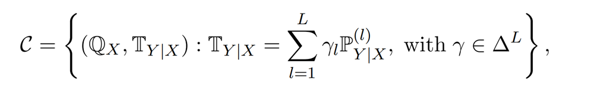
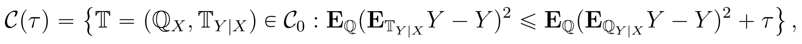
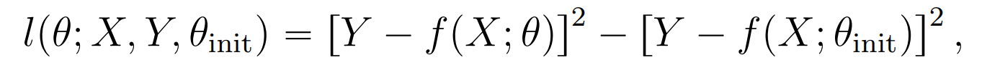
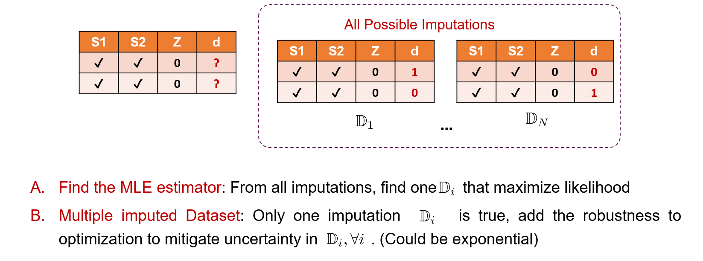
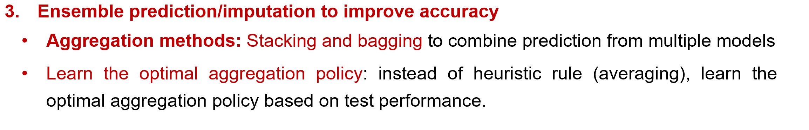
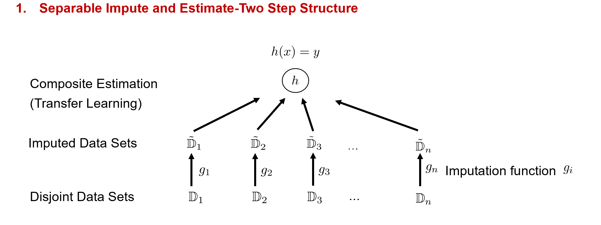

#  Inventory Management with Missing Data

## 阅读文献方法

- **渐进式阅读**：将文献拆分成一个个的小点记忆，**掌握整个方向的发展脉络**
  
  - 理论部分：**掌握最基础的算法和证明**。理解改进版本的方法和基础方法的区别，改进目的，再掌握证明的改动。对比已经掌握的理论，哪些一致，那些不一致
  - 实验部分：.
  
- **从泛读到精读**：以最经典的模型为圆心，泛读文章，**搞清楚不同的模型和setting**，应用场景；从最经典/好的文章做区分梳理。细化**model setting**到可以写出**数学模型**，以及**清晰的Data Structure结构图**，例如：P10, P25

  - 从简单的纸笔，到PPT、latex文件都可以

  

## Inventory Management with Missing Data

假设一个Central Planner需要为不同地方的仓库供货，例如沃尔玛不同地区的超市。现在需要考虑不同warehouse的随机需求$y_i$，以及对应的covariate $x_i$。现在的问题在于不同地点的$(X_i, Y_i)$**数据完整程度不同，记录的数据不一样**。

Central Planner需要考虑所有仓库的补货；这里的$(X_i,Y_i)$可能分布情况也不同。这是一个Multi-warehouse Inventory Management，而且和**Demand forecasting for new products**强相关。

需要将该问题建立成DRO问题，可以用的方法有：

- **Transfer Learning**/Multi-source Learning （不同仓库/产品之间的特征可以学习）

  某些文章假设各产品需求独立，这会导致一些数据无法使用，考虑到产品特征相互关联，可以知识迁移；Leverage aggregate (category) sales information for individual product demand prediction. 先将数据aggregate/grouping，再处理

  - **Conditional Group DRO**：若其他data set完整，可利用其他data set的$\mathbb{P}_{Y|X}$ 建立CG-DRO; Hypothesis set

    

  - **Trans DRO**:  认为CG-DRO过于保守，假设target distribution为$\mathbb{Q}:=(\mathbb{Q}_X,\mathbb{Q}_{Y|X})$，进一步要求**Prediction error**不能超过某个阈值$\tau$:

    

    Loss function设为和benchmark $\theta_{init}$的差值：
    

    - **Sequential Trans DRO**：heuristic，将每个retailer分别作为target domain，求解CG-DRO，这样可以解决多仓库库存问题

  - **Clustering**: exploiting the similarity between new products and existing ones 将具有相似需求特征的产品聚类起来，将同一cluster中的产品demand/sales一起用来预测demand; **降低单个产品缺少数据的损失**。

    **Too many clusters** would result in  **insufficient data per group, leading to high variance**  in our estimates. Conversely, **too few clusters** would  force us to group products with substantially different  price models, **introducing significant bias.**

    - Clustering based on **demand patterns** 按需求聚类；参考[需求聚类定价](C:\Users\lipei\Desktop\Missing Data\1-Missing Data\2022-POMS Low sales聚类定价-Context-based dynamic pricing with online clustering.pdf), 以及[需求可分模型](C:\Users\lipei\Desktop\Missing Data\2-Problem Setting\需求定价可分模型.md)，
      1. 参考[Simchi先聚类后预测](C:\Users\lipei\Desktop\Missing Data\1-Missing Data\2016-MSOM Simchi聚类并预测lost sale-Analytics for an Online Retailer Demand Forecasting and Pricing.pdf)：先把产品分成K组，估计每组的需求曲线；对于sold out product (censored demand)，采用最接近的需求曲线进行需求预测；
    - Clustering based on **features** 按特征聚类，但是可能出现特征相似，需求完全不同的情况；例如按照categorical 聚类；或者按照**Substitutable/Complementary 产品聚类**

  - **Data Pooling**: 利用聚合数据推测单个商品需求，利用different aggregation level的data; 先聚类，再按照份额分配得到；

    参考[Data Pooling需求预测](C:\Users\lipei\Desktop\Missing Data\2-Distribution shift- Tranfer learning\2024-MSOM Max-Data Pooling需求预测-pooling-and-boosting-for-demand-prediction-in-retail-a-transfer-learning-approach.pdf)

    

- **Data Imputation 先填充后决策**

  - **Robust Imputation**: 当结果是离散的时候，可以将所有可能结果都考虑，再建立模糊集; Data Imputation for Long Tail Products.

    
    
  - **Imputation from past data (clustering)**: 将过去的历史数据作为proxy data, 利用相近的数据进行impute; 

  - missing data的情况：部分covariate有信息，部分没有，例如page views；填充方式：可以从历史数据里聚类后，例如回归树用相近数据填充，Local Regressing；再进行回归

- **Ensemble Learning**: multiple weak learning algorithms  work collectively to obtain better predictive performance.

  - Zhang C, Ma Y (2012) Ensemble Machine Learning: Methods and Applications (Springer, New York)
  - Decision forest: A nonparametric approach  to modeling irrational choice

  

  - **Model Selection**: 参考可分模型，选择何种$f \in \mathcal{F}$集合；例如**boosting imputation**，不同data用多个模型；

    

    $g = \sum_{\ell\in[t]}\alpha_\ell g_\ell(\mathbf{x}_j)$, 其中$\alpha_\ell$是权重； 这里采用Gradient Boosting Tree，则loss function为

    

    其中$\Psi_\ell,\gamma_\ell$是Tree partition和predictive rule.
    
    顺着这个思路，还有对Data-driven model formulation的选择，即Meta model Selection

- **Meta Model Selection/Satisficing**: 与其确定一种data-driven的建模方式，再确定概率保证，可以反过来：先确定可接受概率保证范围  **guarantee acceptable out-of-sample performance**，再确定对应的最优模型 **optimal formulation** 
  - Van Parys et al. From data to decisions: Distributionally robust optimization is optimal. Management Science 2020
  - Van Parys et al.  Learning and decision-making with data : optimal formulations and phase transitions 2025
  - Robust Satisficing: 这里采用Target Satisficing，是否可以换成Out-of-sam

- **Separable Model/Ensemble Model**: 将Price和Feature对需求的影响分开来，即将模型分成两个submodel；每个submodel可加入**Domain knowledge**，例如$g_1$ decreasing function，每个submodel处理不同features

  **Motivation**: Data multimodality，不同feature有不同子模型；

  - **Additive Separable Model**: 

    

  - **Multiplicative Separable Model**:

    

  - **Challenge**: 无法识别sub model各自的影响，并且可能存在*risk of model mis-specification*的影响

  

## Learning Method

- **Quantile Regression** (Ye et al.: Contextual Stochastic Optimization for Omnichannel Order Fulfillment)

  - Data-Driven Policies for Distribution Systems with Demand Covariates

- **Kernel density estimation** ：Estimate demand density

  - 2018-OR-决策规则学习 The Big Data Newsvendor- Practical Insights from Machine Learning

- **Non Parametric  Regression-tree-based model**: random forest regressor,  regression trees with **bagging** (更好解释),  LightGBM regressor (efficiency), CatBoost  regressor ( categorical features); regularized gradient boosting trees

  尤其适用于新产品推出，但不利于优化建模

- **AI model**: deep neural networks
