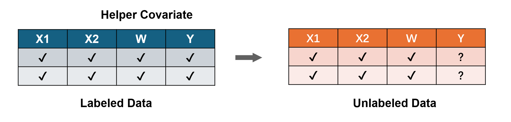
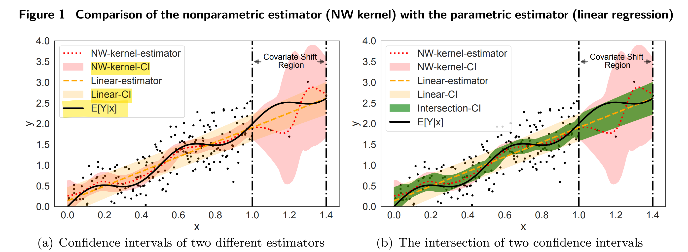
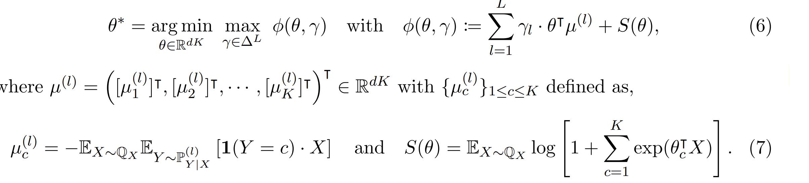
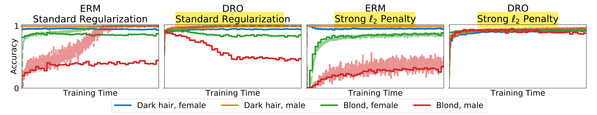
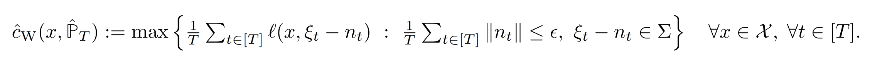
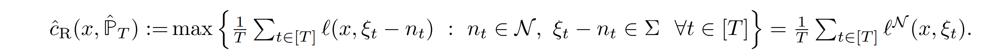
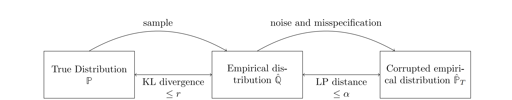
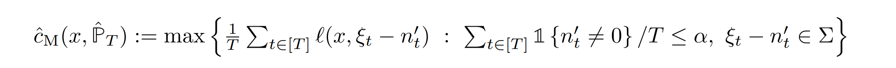
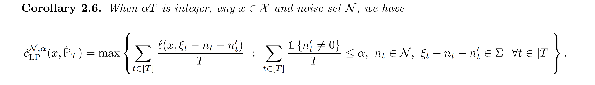

# Survey on Data Shift

Contextual Optimization的决策为$z \in\mathcal{Z}$，random response (label) $v \in \mathcal{V}$为问题的uncertain parameter，在决策时未知。已知covariate vector $u \in \mathcal{U}$，可以提供$v \in \mathcal{V}$的信息，即预测边缘分布$\mu_{v\mid u}$,。由于真实分布未知，**理想情况下有i.i.d. clean data of covariates and response variables** ( The idealized clean world)，根据历史样本$\{(u_i,v_i)\}_{i=1}^N$，**可以预测$v$的分布$\hat{\mu}_{v|u}$**并求解对应随机优化。
$$
\min_{z \in\mathcal{Z}}\mathbb{E}_{\hat{\mu}_{v|u}}\left[c(z,\tilde{v})\right] \Rightarrow \min_{z \in\mathcal{Z}}\mathbb{E}_{\hat{\mu}_{v|\boldsymbol{x},\boldsymbol{y}}}\left[c(z,\tilde{v})\right]  \\
\boldsymbol{u}=(\boldsymbol{x},\boldsymbol{y}) \Rightarrow\min_{z \in\mathcal{Z}}\mathbb{E}_{\hat{\mathbb{P}}}\left[c(z,\tilde{v}(\tilde{\boldsymbol{x}},\tilde{\boldsymbol{y}}))\right]
$$
DRO则设定一个 $\mu\in\mathcal{A}$，$\mathcal{A}=\{\mu:\mathcal{W}_p(\mu,\hat{\mu}_{Y|x})\leq\varepsilon\}$要求
$$
\min_{z\in\mathcal{Z}}\sup_{
\begin{array}
{c}\mu\in\mathcal{A}
\end{array}}\mathbb{E}_{Y\thicksim\mu}[c(z,v)]. \\
$$
然而数据不一定是完整的，数据信息可能不准确。除了**样本量过少**，预测误差有许多来源，都会造成预估分布$\hat{\mu}$ biased不准确或者overfitting (high-variance)。Prediction/Estimation error is composed of **bias and variance**. Training our estimator on the true outcomes alone yields an unbiased but high variance estimator. On the other hand, training our estimator on the proxy outcomes alone yields a biased but low-variance estimator.

- **样本量过少 poor-data**，样本是真实的，但是过少以至于泛化性很差；
- 可能是变量缺失**omitted variable bias**，即部分$(x_t,y_t)=\emptyset$，**missing covariate/response**，缺少重要记录；
- 可能是**censored data** 记录不全，即超过某个边界的数据未知，损坏fragmented；例如需in求数据，以及病人诊断记录，只有诊断的病人才有数据； Historical data are **biased samples** of the true demands.
- 可能是**noisy data/corrupted data** 隐私保护/记录有误，即数据分布杂糅了噪声 $\mathbb{P}+\varepsilon \mathbb{Q}$，需要学习出真实$\mathbb{P}$；biased but low variance
- **Covariate Shift**:  the training and test data were from different distributions. **训练集和测试集不在一个分布上，或者可用的训练分布和最终分布不同** High variance

注意这都是针对训练集training data而言的，**在DRO setting中除了考虑inherent random noise，还要考虑这些additional uncertainty**。可以用double machine learning (or double robustness) estimator减少误差。

**例1**.以动态定价为例，假设有$T$个时期，$t$时期顾客到来，**$x_t$是点击率、停留时间、日期、天气、购物车、相似商品需求等可观测信息**，而$z_t$ contexts（例如年龄、地址、购买记录、信用分数）有些不可观测。**真正关心的是顾客的随机需求函数$y_t=\phi(x_t,p_t)\in\mathbb{R}^d$，需要用点击率作为proxy response辅助预测**。在观测到$x_t$之后，需要做价格决策$p_t\in[0,1]$，决策者需要最大化期望收益$\mathbb{E}[\sum_{t=1}^Tp_ty_t].$

## **1. Online/Offline learning with Partially-observed/Censored Data**

### **Partially-observed/Censored Data**：

**随机样本来源于真实分布，但是观测数据$\{(u_i,v_i)\}_{i=1}^N$不全；既有covariate不全，也有response不全**。此时可以将数据集分成labeled set完整数据集和unlabeled set不完整数据集，这就是Semi-supervised learning。
$$
\mathbb{D}_{\mathrm{L}} =\{(X_i,W_i,Y_i)\}_{i=1}^n  \quad   \mathbb{D}_{\mathrm{U}} =\{(X_{n+i},W_{n+i})\}_{i=1}^m,
$$
$D_L$包含covariate $x$，proxy covariate $w$以及response $y$；$D_U$就不包含response. **当covariate不全时，可以分成以下两类**；
$$
\mathbb{D}_{\mathrm{L}} =\{(X_i,W_i,Y_i)\}_{i=1}^n  \quad   \mathbb{D}_{\mathrm{U}} =\{(W_{n+i},Y_{n+i})\}_{i=1}^m,
$$
当数据集不完整时，可以求助**surrogate/proxy prediction**补全，既可以补全$x$，也可以用$w$直接预测response $y$。现实中往往proxy data比true data数量要多，结合使用两种数据,**Transfer Learning**.

- Linear bandits with **partially observable features**. 

  **部分Covariate不可观测**，在online learning的背景下，只存在feature而不存在response. 本文提出算法：

  - **Feature augmentation**, 将reward分成两部分，一部分投影到observed feature的row space，另一部分就在orthogonal complement中。对observed feature space添加正交基增强
  - **Doubly Robust Estimator**: 由于augmented feature仍然有estimation error，假如DR estimator增加robustness.

  

- **Pre-Trained AI Model Assisted Online Decision-Making under Missing Covariates**

  **缺少Covariate, 没有response(或者Covariate视作response)**: $\{(x_i,y_i)\}_{i=1}^M$中的Covariate $y$ 数据不全，**利用可观测的helper covariate $x$推测出$y$**，建立$\hat{\mu}_u$，在该$\hat{\mu}_u$上进行优化。若不考虑response variable，这个等价于Predict-then-Optimize，即$\tilde{v}(x,y)=(x,y)$ random response就是covariate。

  

  **两阶段回归2SLS-先预测补全Covariate/Response，再预测Random Outcome**: 通常Random covariate-Random outcome $(\tilde{\boldsymbol{u}},\tilde{\boldsymbol{v}})$ 只考虑Random outcome的预测存在偏差，而covariate是真实观测的。**这里的covariate和random outcome都有随机性，都可能需要预测。**

  - **STEP 1**:假设有historical samples $\{(x_i,y_i)\}_{i=1}^M$，可以预测$y$；当$x$对最终response $v$有相关性和外生性时，其实$x$是一个工具变量。

  $$
  \small
  \text{Observed/Proxy Covariate } \tilde{x}{\sim}\mathbb{P}_x \Rightarrow \text{Unobserved Covariate } \tilde{y}{\sim}\mathbb{P}(\cdot|x)
  $$

  - **STEP 2**: 假设有historical samples$\{(u_i,v_i)\}_{i=1}^N$，可以预测$v$。

  $$
  \small \text{Covariate } \tilde{u}=(\tilde{x},\tilde{y}){\sim}\mathbb{P}_u \Rightarrow \text{Random Response } \tilde{v}{\sim}\mathbb{P}(\cdot|u)
  $$

  补全缺失的covariate之后，再进行优化，第二步可省略；**直接用Proxy covariate预测response variable**：
  $$
  \small \text{Surrogate Covariate } \tilde{x}{\sim}\mathbb{P}_x \Rightarrow \text{Random Response } \tilde{v}{\sim}\mathbb{P}(\cdot|u)
  $$
  Random Response可以在decision之前、之后确定。

  

- **Offline Prediction Aided by Surrogate Training**: Pseudo-Response 

  **缺少true response**: 假设label set的Covariate为$x$，response为$y$，unlabeled dataset只有$x$，没有$y$ ;  此时引入**helper covariate** $w$帮助预测$y$，类似于transfer learning。建立数据集$\tilde{\mathbb{D}}=\{(X_i,\tilde{Y}_i)\}_{i=1}^N$之后最小化loss function

  

  对**预测数据集Augmented data set $\mathbb{D}$** 建立模糊集进行estimate; 与residual-based DRO区别，使用补全的empirical distribution，而非完全预测的distribution。

- **Predicting with Proxies: Transfer Learning in High Dimension** 

  **同时missing covariate和response**, 本文用proxy model来近似真实model，类似于covariate shift，即分布不同。例如**用顾客点击率、浏览时间和添加购物车**代替**顾客购买行为**；用其他医院的病人数据代替本医院的病人数据。**这里的重点在于两个回归模型的系数$\beta$要基本一致，否则不起效。**

  **提出一种two-step estimator**，用真实数据gold data对proxy model进行debias，这样最终预测模型的variance和bias都会降低。
  $$
  \begin{aligned} y_{gold} & =\mathrm{x}^\top\beta_{gold}^*+\varepsilon_{gold}, \\ y_{proxy} & =\mathrm{x}^\top\beta_{proxy}^*+\varepsilon_{proxy}
  \end{aligned}
  $$
  一共有$n_{gold}$个$(\mathbf{X}_{gold},\mathbf{Y}_{gold})$; 以及$n_{proxy}$个$(\mathbf{X}_{proxy},\mathbf{Y}_{proxy})$; 其中真实样本数量远少于proxy样本数量$n_{gold}\ll n_{proxy}$。

  **需要假设proxy和真实model的系数接近，即：$\beta_{gold}^*=\beta_{proxy}^*+\delta^*$**; 并且$\delta^*$是sparse，即非零元素很少$\|\delta^*\|_0=s\ll d$

  - **STEP 1**：对proxy data做OLS回归
    $$
    \hat{\beta}_{proxy}=\arg\min_\beta\left\{\frac{1}{n_{proxy}}\|\mathbf{Y}_{proxy}-\mathbf{X}_{proxy}\beta\|_2^2\right\}
    $$

  - **STEP 2**：对gold data做LASSO回归，以$\hat{\beta}_{proxy}$为基准，降低bias.
    $$
    \hat{\beta}_{joint}(\lambda)=\arg\min_{\beta}\left\{\frac{1}{n_{gold}}\|\mathbf{Y}_{gold}-\mathbf{X}_{gold}\beta\|_{2}^{2}+\lambda\|\beta-\hat{\beta}_{proxy}\|_{1}\right\}.
    $$
    $\lambda$小的时候等价于gold OLS estimator; $\lambda$大的时候等价于Proxy estimator; 根据sparse假设可得$\hat{\beta}_{joint}(\lambda)=\hat{\delta}(\lambda)+\hat{\hat{\beta}}_{proxy},$

- **Group DRO:** Fairness without Demographics through Adversarially Reweighted Learning (Offline)，与distributional shift关联

  Fairness Without Demographics in Repeated Loss Minimization

  **在训练集和测试集都缺少隐私covariate** 隐私数据如性别、种族不出现在数据集中，it is not feasible to collect or use protected features. 本文希望提出一种group DRO方法，在训练集/测试集都未知feature的情况下，可以提高某个未观测族群的worst-case fairness.

  

  假设每个group $s$的数据是$\mathcal{D}_s:=\{(x_i,y_i):s_i=s\}_{i=1}^n$，但是group $s$未知，目标函数是max-min fairness:
  $$
  h_{\max}^*=\arg\min_{h\in H}\max_{s\in S}L_{\mathcal{D}_s}(h) \\
  L_{\mathcal{D}_s}(h)=\mathbb{E}_{(x_i,y_i)\thicksim\mathcal{D}_s}[\ell(h(x_i),y_i]
  $$
  其中$L_{\mathcal{D}_s}(h)$是loss function；这个问题可以写成一个**zero-sum game**。假设存在决策者希望选择最小化loss function的$h$，另一个决策者选择最大化loss的group $s$。为了使每个组$s$的风险受到控制，对分布进行限制：
  $$
  \mathcal{R}_\mathrm{dro}(\theta;r):=\sup_{Q\in\mathcal{B}(P,r)}\mathbb{E}_Q[\ell(\theta;Z)].
  $$
  这里模糊集采用$\chi$-square $\mathcal{B}(P,r):=\bar{\{}Q\ll P:D_{\chi^2}\left(Q\|P\right)\leq r\}.$  

  DRO可以限制每个group最差的risk，$\mathcal{R}_k(\theta)\leq \mathcal{R}_\mathrm{dro}(\theta;r_k)$；**这里robustness半径$r_k$与每个group的占比成反比，占比越小半径越大**，增加robustness $r_k:=\left(1/\alpha_k-1\right)^2$。当$\alpha_{\min}\leq\min_{k\in[K]}\alpha_{k},$，可以得到loss function的上界。

  

---

**Censored Data**: **random response不完整**：即$\{(u_i,v_i)\}_{i=1}^M$的$v$是censored，需要进行调整。some demand information is lost.

- [Offline Pricing and Demand Learning with Censored Data](C:\Users\lipei\Desktop\Shared Micromobility\Project\主题想法\10_25_Offline Pricing and Demand Learning with Censored Data.md) https://doi.org/10.1287/mnsc.2022.4382

  给定offline data (price, inventory, sales) ,设计data-driven算法达到near optimal性能，即以高概率接近最优期望成本。highly censored data无法达到，为此本文还需要考虑data的

- [Feature-Based Inventory Control with Censored Demand](C:\Users\lipei\Desktop\Shared Micromobility\Project\Model\3.4 Offline Feature-Based Pricing Under Censored Demand A  Causal Inference Approach.md)

  本文研究一个数据驱动的基于特征的定价问题，**需求有删减**，企业有一定库存，面临随机需求，需求依赖于定价和特征（产品、顾客等）. 本文从causal inference提出一个data-driven algorithm，采用**survival analysis和doubly robust estimation**，得到feature-based pricing rule.

### **Distribution/Covariate Shift**

The covariate distribution diverges between the training and test environments. 需要假设条件分布$\mu_{v|u}$在两个集合是一致的，否则学习将没有意义；这和Transfer Learning有关。learn information shared across multiple source domains and transfer such generalizable knowledge

- **交叉模糊集**：2025-Arxiv-Contextual Optimization under Covariate Shift - A Robust Approach by Intersecting Wasserstein Balls.pdf

  考虑两种估计方式的模糊集交集，non-parametric以及parametric，建立对应的$\mu_{v|u}$模糊集取交集，再求解对应的DRO问题. 可以利用两种预测方式的优势，并减小conservatism.
  $$
  \mathcal{A}_{\mathrm{IW}}=\{\mu:\mathcal{W}_p(\mu,\hat{\mu}_{\mathrm{NP}})\leq\varepsilon_{\mathrm{NP}},\mathcal{W}_p(\mu,\hat{\mu}_{\mathrm{P}})\leq\varepsilon_{\mathrm{P}}\}.
  $$
  

  **Ambiguity set本质上就是预测的置信区间；**

-  with Cross-Entropy Loss （重要：**缺少response data**)

  **缺少response: 从multiple-source data中做迁移学习**，分布不同，从多种来源数据中学习到generalizable predictive structure.

  

  本文提出一种**Conditional Group DRO**， 可以从不同sources的conditional outcome distributions的凸组合中，通过minimize worst-case cross-entropy loss学习到classifier模型.  Minmax模型通过Mirror Prox algorithm，以及Double Machine Learning estimator求解。

  假设有$L$个data source $\{X_i^{(l)},Y_i^{(l)}\}_{1\leq i\leq n_l}$，每个数据都是从joint distribution $\mathbb{P}^{(l)}=(\mathbb{P}_X^{(l)},\mathbb{P}_{Y|X}^{(l)})$中i.i.d. 抽取。关心的target domain$\{X_i^\mathbb{Q}\}_{1\leq i\leq N}$ 是从$$\mathbb{Q}_X$$中抽取，对应的outcome分布未知。

  **Distribution Shift**: **允许source data和target data之间的covariate/outcome shift**。
  $$
  \mathbb{Q}_{X} \neq \left\{\mathbb{P}_X^{(l)}\right\}_{1\leq l\leq L},\mathbb{Q}_{Y|X} \neq \left\{\mathbb{P}_{Y|X}^{(l)}\right\}_{1\leq l\leq L}
  $$
  目标是从**multi-source data**获取transferable knowledge并适用于target domain. 为了保证$\mathbb{Q}_{Y|X}$ identifiable，设uncertainty set:
  $$
  \mathcal{C}=\left\{(\mathbb{Q}_X,\mathbb{T}_{Y|X}):\mathbb{T}_{Y|X}=\sum_{l=1}^L\gamma_l\mathbb{P}_{Y|X}^{(l)},\mathrm{~with~}\gamma\in\Delta^L\right\},
  $$
  其中$\Delta^L$是$L-1$维单纯形，即$\mathbb{Q}_{Y|X}$是source条件分布的凸组合。**假如知道混合分布的prior information**，还可以进一步限定为：
  $$
  \mathcal{C}_{\mathcal{H}}=\left\{\left(\mathbb{Q}_X,\mathbb{T}_{Y|X}\right):\mathbb{T}_{Y|X}=\sum_{l=1}^L\gamma_l\cdot\mathbb{P}_{Y|X}^{(l)},\gamma\in\mathcal{H}\right\}.
  $$
  则worst-case risk可以定义为：其中$\mathbb{T}$是从模糊集中取出，$\theta$
  $$
  \max_{\mathbb{T}\in\mathcal{C}}\mathbb{E}_{(X,Y)\sim\mathbb{T}}\ell(X,Y,\theta),
  $$
  **则最终的CG-DRO问题定义为：minimize worst-case loss function**
  $$
  \theta^*=\arg\min_{
  \begin{array}
  {c}\theta
  \end{array}}\max_{
  \begin{array}
  {c}\mathbb{T}\in\mathcal{C}
  \end{array}}\mathbb{E}_{(X,Y)\sim\mathbb{T}}\ell(X,Y,\theta).
  $$
  利用law of total expectation，可以将DRO写成：
  $$
  \theta^*=\arg\min_\theta\max_{\gamma\in\Delta^L}\sum_{l=1}^L\gamma_l\cdot\mathbb{E}_{X\sim\mathbb{Q}_X}\mathbb{E}_{Y\sim\mathbb{P}_{Y|X}^{(l)}}\ell(X,Y,\theta).
  $$
  相比于传统的Group DRO，额外考虑了covariate shift，即考虑$\mathbb{Q}_X$的分布之后，整体worst-case loss会降低。

  如果考虑cross-entropy loss:
  $$
  \begin{aligned}
  \ell(X,Y,\theta)=-\sum_{c=0}^K\mathbf{1}(Y=c)\log\left[\frac{\exp(\theta_c^\mathsf{T}X)}{1+\sum_{k=1}^K\exp(\theta_k^\mathsf{T}X)}\right],
  \end{aligned}
  $$
  那么整体CG-DRO model则简化为

  

- **Distributionally robust neural networks for group shifts**: On the importance of regularization for worst-case generalization

  首先将data set分成多个group，然后optimize worst-case loss over groups. 一个问题是有些模型的training loss为0，在average和worst-case training中都是最优的；然而在test data中并非最优，因此要加入regularization提高group DRO的worst-case accuracies.

  **Group DRO**: 假设data是multi-source，但是target data不存在，则target data的$(X,Y)$联合分布可假设为所有source distribution凸组合；
  $$
  \mathcal{C}_{\mathrm{GDRO}}=\left\{\mathbb{T}:\mathbb{T}=\sum_{l=1}^L\gamma_l\cdot\mathbb{P}^{(l)},\gamma\in\Delta^L\right\}.
  $$
  考虑如下的robust prediction model:
  $$
  \theta_{\mathrm{GDRO}}^*=\arg\min_{\theta\in\mathbb{R}^{dK}}\max_{\mathbb{T}\in\mathcal{C}_{\mathrm{GDRO}}}\mathbb{E}_{(X,Y)\sim\mathbb{T}}\ell(X,Y,\theta).
  $$
  由于LP的极值点出现在端点处，因此最优解一定出现在经验分布$\hat{\mathbb{P}}$：
  $$
  \hat{\theta}_{\mathrm{GDRO}}:=\underset{\theta\in\Theta}{\operatorname*{\arg\min}}\left\{\hat{\mathcal{R}}(\theta):=\underset{g\in\mathcal{G}}{\operatorname*{\max}}\mathbb{E}_{(x,y)\thicksim\hat{P}_g}\left[\ell(\theta;(x,y))\right]\right\},
  $$
  这只能让training loss减小，而不一定让test loss减小，generalization bound可能很大。因此加入**regularization technique**减少过拟合：即在$\theta\in\Theta$预测模型中，加入$\ell_2-norm$ $\lambda\|\theta\|_2^2$ ($\lambda$要远大于普通)降低training accuracy和generalization gap. 
  

  A different, implicit form of regularization is early stopping 减少训练轮数，也可以大大提高DRO的泛化能力。

  **Group Adjustment**: 考虑每个组的大小，group太小可能会过拟合；
  $$
  \hat{\theta}_{\mathrm{adj}}:=\arg\min_{\theta\in\Theta}\max_{g\in\mathcal{G}}\left\{\mathbb{E}_{(x,y)\sim\hat{P}_g}[\ell(\theta;(x,y))]+\frac{C}{\sqrt{n_g}}\right\}.
  $$
  
- Automatic debiased machine learning for covariate shifts. arXiv preprint arXiv:2307.04527, 2023

- **Fixed Design**: Covariate distribution $\mu_X$ is given but not identical, random outcome variable not i.i.d. Covariate是控制好的/设计好的

  Distributionally Robust Quantile Prediction with Fixed Design

### **Noisy Data**: 噪声数据

样本数据并非来源于真实分布，而是加入噪声的分布即$\mathbb{P}+\varepsilon Q$，样本量再多也无法消除bias。当数据量充足abundant但是noisy时，出现该情况。

例如随机变量为$\tilde{\xi}$，noisy data为$\tilde{\xi}+\tilde{n}\in\Sigma$，**假如已知噪声变量范围$\begin{Vmatrix} n \end{Vmatrix}\leq\epsilon$**，则可以考虑消除影响的随机变量$\xi-n\in\Sigma$。

另一种考虑评估inflated loss function $\ell^N$:

这里与ERM唯一不同的就是考虑$\xi_t-n_t$随机变量。即当sample去除noise之后，empirical distribution是准确的，真实分布和Empirical分布一样
$$
\small \mathbb{P}\in\left\{\sum_{t\in[T]}\delta_{\xi_t-n_t}/T:n_t\in\mathcal{N},\xi_t-n_t\in\Sigma \quad \forall t\in[T] \right\}
$$
**LASSO也是一种消除noise的方法**，惩罚系数$\lambda$可作为噪声变量范围：
$$
\small
\begin{aligned}
&\sqrt{\frac{1}{T}\sum_{t\in[T]}L(\theta,X_t,Y_t)}+\frac{\lambda}{\sqrt{T}}\|\theta\|_1\\
& =\max\left\{\sqrt{\frac{1}{T}\sum_{t\in[T]}L(\theta,X_t-n_t,Y_t)}:\|n_t\|_2\leq\lambda \quad \forall t\in[T]\right\}
\end{aligned}
$$
降低statistical error不一定会降低noise影响，例如KL-DRO就无法降低noise；W-DRO可以提供statistical error和noisy data的保证，但是**需要的robustness radius可能过大**。
$$
\begin{aligned}
\hat{c}_{\mathrm{W}}(x,\hat{\mathbb{P}}_T):=\sup\{\mathbb{E}_{\mathbb{P}^{\prime}}[\ell(x,\tilde{\xi})]:\mathbb{P}^{\prime}\in\mathcal{P},W(\hat{\mathbb{P}}_T||\mathbb{P}^{\prime})\leq\epsilon\}
\end{aligned}
$$
W-DRO在一定条件下等价于第一种noise控制方法，noise bounded in the norm. **Noise通常是在一个小的compact set中实现的，而不是变动很大**

- **Noisy data** 部分数据精度低； **Data Corrupted: Labeling errors**标签错误；

  [2025-Arxiv MIT-Holistic Robust Data-Driven Decisions.pdf](..\..\Data Driven DRO\2025-Arxiv MIT-Holistic Robust Data-Driven Decisions.pdf) 

  本文希望提出一种holistic robust predictor可以同时避免多种overfitting. 为了准确**反映noise以及corruption**，给定noise set $\mathcal{N}$，使用convex pseudo divergence metric ：当数据量足够大，忽略statistical error
  $$
  \mathrm{LP}_{\mathcal{N}}(\hat{\mathbb{P}}_{T},\mathbb{P}^{\prime})=\mathrm{inf}_{\gamma\in\Gamma(\hat{\mathbb{P}}_{T},\mathbb{P}^{\prime})}\int1(\xi-\xi^{\prime}\not\in\mathcal{N})\mathrm{d}\gamma(\xi,\xi^{\prime})
  $$
  假设有corrupted empirical distribution $\hat{\mathbb{P}}_T$，LP模糊集设定为：
  $$
  \{\mathbb{P}^{\prime}\in\mathcal{P},\mathrm{~LP}_{\mathcal{N}}(\hat{\mathbb{P}}_T,\mathbb{P}^{\prime})\leq\alpha\}
  $$
  即noise取值于$\mathcal{N}$，并且少于$\alpha{T}$的数据被污染。污染样本设定为：
  $$
  \tilde{\xi}^c=(\tilde{\xi}+\tilde{n})\mathbb{1}(\tilde{c}=0)+\tilde{\xi}_0\mathbb{1}(\tilde{c}=1)\in\Sigma
  $$
  **即不发生污染时，存在噪声；发生污染时则为$\xi_0$样本**。例如联合分布$\gamma$中，最多有$\alpha$概率质量在noise set $\mathcal{N}$之外，不超过$\alpha$的质量需要被运输。$\hat{\mathbb{P}}_T$已经考虑了noise，需要去除noise就是真实的分布。

  

  LP distance可以提供**robustness guarantee**，即污染样本不超过$\alpha$缺noise取值范围在$\mathcal{N}$中时，真实期望成本不超过
  $$
  \hat{c}_{\mathrm{LP}}^{\mathcal{N},\alpha}(x,\mathbb{P}^c)\geq \mathbb{E}_\mathbb{P}[\ell(x,\tilde{\xi})],\forall x\in\mathcal{X}.
  $$
  并且LP-DRO predictor相比其他DRO predictor更加有效：
  $$
  \hat{c}(x,\mathbb{Q})\geq\hat{c}_{\mathrm{LP}}^{\mathcal{N},\alpha}(x,\mathbb{Q}) \quad \forall\mathbb{Q}\in\mathcal{P},\forall x\in\mathcal{X}.
  $$
  对应的predictor可视为$(1-\alpha)$的噪声-inflated loss $\mathrm{CVaR}_{\hat{\mathbb{P}}_T}^\alpha(\ell^{\mathcal{N}}(x,\tilde{\xi}))$，以及$\alpha$比例的$\max_{\xi\in\Sigma}\ell(x,\xi)$，即污染样本统一使用最差的loss.

  

  **Statistical Error:** KL divergence可以减少statistical error，因此设定novel holistic robust DRO predictor：
  $$
  \small
  \hat{c}_{\mathrm{HR}}^{\mathcal{N},\alpha,r}(x,\hat{\mathbb{P}}_T):=\max\{\mathbb{E}_{\mathbb{P}^{\prime}}[\ell(x,\tilde{\xi})]:\mathbb{P}^{\prime}\in\mathcal{P},\mathbb{Q}^{\prime}\in\mathcal{P},\mathrm{LP}_{\mathcal{N}}(\hat{\mathbb{P}}_T,\mathbb{Q}^{\prime})\leq\alpha,\mathrm{KL}(\mathbb{Q}^{\prime}||\mathbb{P}^{\prime})\leq r\},
  $$
  同时考虑LP-metric以及KL-divergence，这样就**能增加对各种robustness的考虑**。HR ambiguity set比W-DRO更加有效

  

  如图，经验分布$\hat{\mathbb{Q}}$和真实分布$\mathbb{P}$的距离用KL-divergence衡量；而经验分布$\hat{\mathbb{Q}}$和Corrupted经验分布$\hat{\mathbb{P}}_T$ 的距离用LP距离衡量。 KL-DRO尽管在clean data的情况下能有较好性能，加上Optimal transport metric可以更好应对noise和corrupted data

  

- [Is Noisy Data a Blessing in Disguise? A Distributionally Robust Optimization Perspective](C:\Users\lipei\Desktop\Shared Micromobility\Contextual Online Decision-Making\Markdown file\Is Noisy Data a Blessing in Disguise.md)

- Efficient Data-Driven Optimization with Noisy Data - Van Parys

  

- **Privacy Protection**: 人为对数据加入噪声，防止反向推测**covariate和random outcome均不完整**；

  1. Private Optimal Inventory Policy Learning for Feature-Based Newsvendor with Unknown Demand
  2. **Privacy-Preserving Dynamic Personalized Pricing with Demand Learning**

### Contaminated/Corrupted Data数据污染

数据污染不同于噪声数据，*某些数据可能完全不携带任何信息*，即data poisoning。一小部分数据出现的波动极大，而这里认为部分数据被破坏。这个类似于missing covariate，毕竟被污染的数据可以认为是丢失的；随机变量为$\tilde{\xi}$，扰动量为$\tilde{n}$，要求出现扰动的数据比例不超过$\alpha$:

也就是要求去除扰动后，概率分布是正确的。同时考虑noise和misspecification时，要求noise $n_t \in \mathcal{N}$，而corruption $n'_t$ 比例不超过$\alpha$.

- **Model misspecification: $\epsilon$-contamination model** 需求只有$(1-\varepsilon)T$个时期是正常抽样，剩下的$\varepsilon T$个时期是outlier，概率模型没有参考价值；决策者未知$\varepsilon$以及outlier到达时间

  **需要考虑robust estimation and exploration**

  [2022-OR-数据噪声robust-dynamic-pricing-with-demand-learning-in-the-presence-of-outlier-customers.pdf](..\2022-OR-数据噪声robust-dynamic-pricing-with-demand-learning-in-the-presence-of-outlier-customers.pdf) 

- **A Robust Learning Approach for Regression Models** Based on Distributionally Robust Optimization

  The observed samples are potentially contaminated with adversarially corrupted outliers. 数据被故意污染

## **2. ML/AI-based Synthetic Data generation** 利用ML/AI模型生成可用数据

当真实数据获取很昂贵时，利用LLM可以生成pseudo-label数据，增加labeled dataset,从而提升low-resource or semi-supervised settings 监督学习的能力. pseudo-response imputation

- **Generative Model/LLM**：

  - Pseudo Labeling: 利用LLM对数据打标签；

    缺少response $\tilde{v}$数据，利用standard covariate和helper covariate进行预测，训练一个surrogate model可以产生pseudo-response。再用pseudo-response和standard covariate建立回归模型。

     [2024-Arxiv MIT-Prediction Aided by Surrogate Training.pdf](..\..\..\..\Downloads\2024-Arxiv MIT-Prediction Aided by Surrogate Training.pdf) 

  - Contextual thompson sampling via generation of missing data, 2025a. URL https://arxiv.org/abs/2502.07064.

  - The application of large language models in recommendation systems. arXiv preprint arXiv:2501.02178, 2025.

- **Quantile Regression**

- **Time Series/OLS 回归**：生成点估计

**3.AI-Assisted Decision-making under uncertainty**

